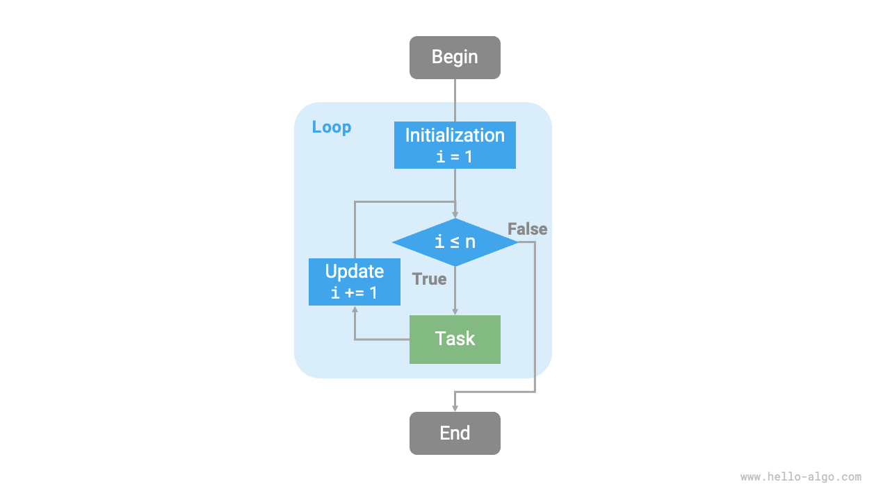
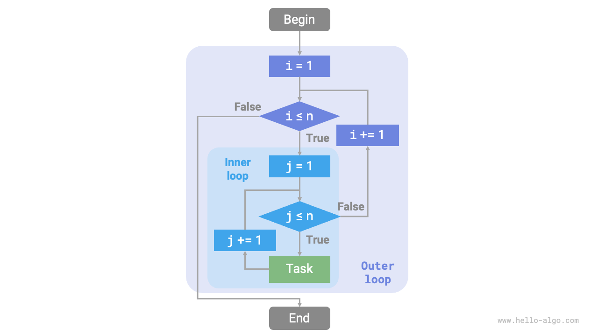
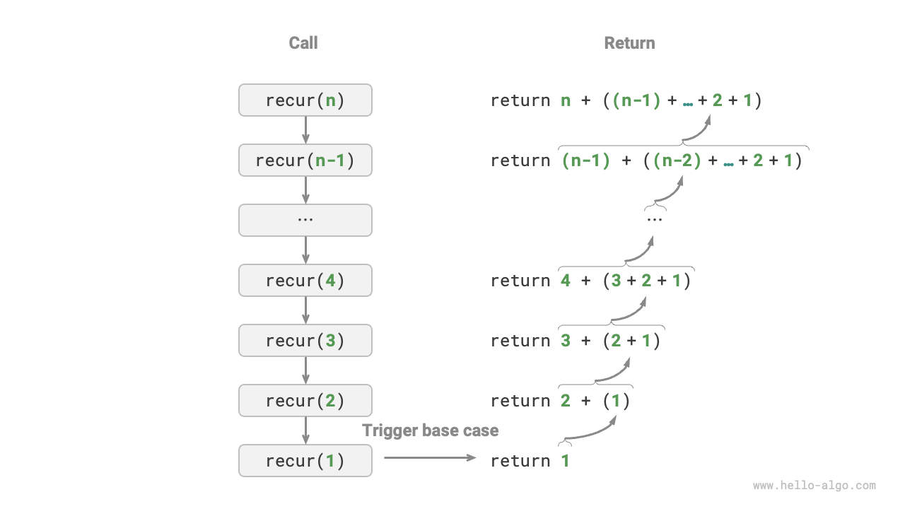
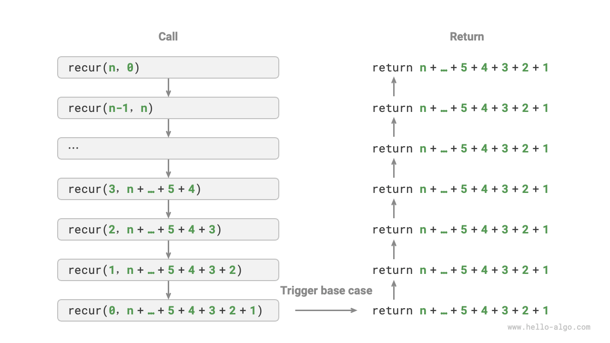
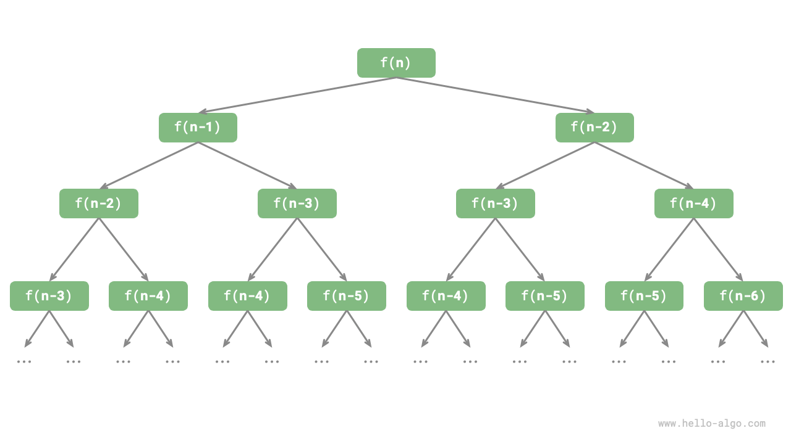

# Iteration and Recursion

In algorithms, repeatedly performing a task is quite common and closely linked to complexity analysis. Therefore, before diving into the details of time complexity and space complexity, let's first understand how to implement repetitive task execution in programming, focusing on two fundamental control structures: iteration and recursion.

## Iteration

"Iteration" is a control structure used to repeatedly execute a task. In an iterative process, a program repeatedly executes a block of code as long as a certain condition is met, ceasing once this condition is no longer satisfied.

### For Loops

The `for` loop is one of the most common forms of iteration, and **it's particularly suitable when the number of iterations is known in advance**.

The following function implements summation $1 + 2 + \dots + n$ using a `for` loop, with the sum being recorded in the variable `res`. Note that in Python, `range(a, b)` corresponds to a "left-closed, right-open" interval, meaning it includes numbers in the sequence from $a, a + 1, \dots$, up to $b-1$, but not $b$ itself.

```src
[file]{iteration}-[class]{}-[func]{for_loop}
```

Figure 2-1 shows the flowchart for this summation function.


<div align="center">Figure 2-1: Flowchart of the Summation Function</div>

The number of operations in this summation function is proportional to the size of the input data $n$, or in other words, it has a "linear relationship." In fact, this "linear relationship" is what time complexity describes. This topic will be discussed in more detail in the next section.

### While Loops

Similar to `for` loops, `while` loops are another approach for implementing iteration. In a `while` loop, the program checks a condition at the beginning of each iteration; if the condition is true, the execution continues, otherwise, the loop ends.

Next, let's use a `while` loop to implement the summation of $1 + 2 + \dots + n$.

```src
[file]{iteration}-[class]{}-[func]{while_loop}
```

**`While` loops provide more flexibility than `for` loops**, especially since they allow for custom initialization and modification of the condition variable at each step.

For example, in the following code, the condition variable $i$ is updated twice in each iteration, a scenario that would be less convenient to implement with a `for` loop

```src
[file]{iteration}-[class]{}-[func]{while_loop_ii}
```

Overall, **`for` loops tend to be more concise, while `while` loops offer more flexibility**. Both can be used to implement iterative structures, and the choice between them should be based on the specific requirements of the problem at hand.

### Nested Loops

Nested loops involve placing one loop structure within another. Taking `for` loops as an example:

```src
[file]{iteration}-[class]{}-[func]{nested_for_loop}
```

Figure 2-2 provides the flowchart for such a nested loop structure.


<div align="center">Figure 2-2: Flowchart of the Nested Loop</div>

In such cases, the number of operations of the function is proportional to $n^2$, meaning the algorithm's runtime and the size of the input data $n$ have a 'quadratic relationship.'

We can further increase the complexity by adding more nested loops, each level of nesting effectively "increasing the dimension," which raises the time complexity to "cubic," "quartic," and so on.

## Recursion

Recursion is an algorithmic strategy where a function solves a problem by calling itself. It primarily involves two phases:

1. **Recursive Descent**: This is where the program repeatedly calls itself, often with progressively smaller or simpler arguments, moving towards the "base case" or "termination point." This phase is characterized by the function venturing deeper into successive levels of recursion.
2. **Backtracking** or **Recursive Ascent**: After reaching the "base case," the function begins its ascent, retracing its steps back from the deepest level of recursion. During this phase, it consolidates or processes the results from each recursive call as it returns to the initial call.

From an implementation standpoint, recursive code typically includes three main elements:

1. **Base Case** or **Termination Condition**: This serves as the stopping criterion for the recursion, indicating when the function should cease deeper recursive calls and begin its ascent or backtracking.
2. **Recursive Invocation**: This aligns with the "Recursive Descent" phase, where the function continues to call itself, typically with altered parameters, delving deeper into the recursion.
3. **Result Propagation**: This is associated with the 'Backtracking' or 'Recursive Ascent' phase, where the outcome from each recursive depth is passed back up to the preceding level, ultimately culminating at the initial call.

Consider the following code, where simply calling the function `recur(n)` can compute the sum of $1 + 2 + \dots + n$:

```src
[file]{recursion}-[class]{}-[func]{recur}
```

Figure 2-3 illustrates the recursive process of this function.


<div align="center">Figure 2-3: The Recursive Process of the Summation Function</div>

While iteration and recursion can yield the same results from a computational standpoint, **they represent two distinct paradigms of thinking and problem-solving.**

- **Iteration**: This approach is 'bottom-up.' It starts with the most fundamental steps and then repeatedly applies or accumulates these steps until the task is complete. 
- **Recursion**: sThis method is 'top-down.' It breaks the original problem down into smaller subproblems, each resembling the original problem in form. These subproblems are further decomposed into even smaller parts, continuing until reaching the base case (whose solution is known).

Let's take the earlier example of the summation function, defined as $f(n) = 1 + 2 + \dots + n$.

- **Iteration**: In this approach, we simulate the summation process within a loop. Starting from $1$ and traversing to $n$, we perform the summation operation in each iteration to eventually compute $f(n)$.
- **Recursion**: Here, the problem is broken down into a subproblem: $f(n) = n + f(n-1)$. This decomposition continues recursively until reaching the base case, $f(1) = 1$, at which point the recursion terminates.

### Call The Stack

Each time a recursion function calls itself, the system allocates memory for the newly opened function to store local variables, call addresses, other information, and so on. This results in two things.

- The context data for a function is stored in an area of memory called "stack frame space" and is not freed until the function returns. As a result, **recursion is usually more memory-intensive than iteration**.
- Recursion calls to functions incur additional overhead. **Therefore recursion is usually less time efficient than loops**.

As shown in the figure below, before the termination condition is triggered, there are $n$ unreturned recursion functions at the same time, **with a recursion depth of $n$** .


In practice, the depth of recursion allowed by a programming language is usually limited, and too deep a recursion may result in a stack overflow error.

### Tail Recursion

Interestingly, **if a function makes a recursion call only at the last step before returning**, the function can be optimized by the compiler or interpreter to be comparable to iteration in terms of space efficiency. This situation is called "tail recursion tail recursion".

- **Ordinary recursion**: when a function returns to a function at a higher level, it needs to continue executing the code, so the system needs to save the context of the previous call.
- **tail recursion**: the recursion call is the last operation before the function returns, which means that the function does not need to continue with other operations after returning to the previous level, so the system does not need to save the context of the previous function.

In the case of calculating $1 + 2 + \dots + n$, for example, we can implement tail recursion by setting the result variable `res` as a function parameter.

```src
[file]{recursion}-[class]{}-[func]{tail_recur}
```

The execution of tail recursion is shown in the figure below. Comparing normal recursion and tail recursion, the execution point of the summation operation is different.

- **Ordinary recursion**: the summing operation is performed during the "return" process, and the summing operation is performed again after returning from each level.
- **Tail recursion**: the summing operation is performed in a "recursion" process, the "recursion" process simply returns in levels.



!!! tip

    Note that many compilers or interpreters do not support tail recursion optimization. For example, Python does not support tail recursion optimization by default, so even if a function is tail recursive, you may still encounter stack overflow problems.

### Recursion Tree

When dealing with algorithmic problems related to divide and conquer, recursion is often more intuitive and easier to read than iteration. Take the Fibonacci sequence as an example.

!!! question

    Given a Fibonacci series $0, 1, 1, 2, 3, 5, 8, 13, \dots$ , find the $n$th number of the series.

Let the $n$th number of the Fibonacci series be $f(n)$ , which leads to two easy conclusions.

- The first two numbers of the series are $f(1) = 0$ and $f(2) = 1$.
- Each number in the series is the sum of the previous two numbers, i.e. $f(n) = f(n - 1) + f(n - 2)$ .

Recursion code can be written by making recursion calls according to the recursion relationship, using the first two numbers as termination conditions. Call `fib(n)` to get the $n$th number of the Fibonacci series.

```src
[file]{recursion}-[class]{}-[func]{fib}
```

Looking at the above code, we have recursively called two functions within a function, **this means that from one call, two call branches are created**. As shown in the figure below, this recursion will result in a recursion tree with the number of levels $n$.



Essentially, recursion embodies the paradigm of "breaking down a problem into smaller sub-problems", and this divide and conquer strategy is essential.

- From an algorithmic point of view, many important algorithmic strategies such as searching, sorting algorithm, backtracking, divide and conquer, dynamic programming, etc. directly or indirectly apply this way of thinking.
- From a data structure point of view, recursion is naturally suited to problems related to linked lists, trees and graphs because they are well suited to be analyzed with the idea of partitioning.

## Compare The Two

To summarize the above, as shown in the table below, iteration and recursion differ in implementation, performance and applicability.

<p align="center"> Table <id> &nbsp; Comparison of iteration and recursion features </p>

|                     | iteration                                               | recursion                                                                                                                             |
| ------------------- | ------------------------------------------------------- | ------------------------------------------------------------------------------------------------------------------------------------- |
| implementation      | circular structure                                      | function call itself                                                                                                                  |
| time-efficient      | typically efficient, no function call overhead          | overhead on every function call                                                                                                       |
| Memory Usage        | Usually uses a fixed size of memory space               | Cumulative function calls may use a lot of stack frame space                                                                          |
| Applicable Problems | For simple cyclic tasks, code is intuitive and readable | For sub-problem decomposition, such as trees, graphs, divide and conquer, backtracking, etc., the code structure is concise and clear |

!!! tip

    If you find the following solutions difficult to understand, you can review them after reading the "Stack" chapter.

So what is the intrinsic connection between iteration and recursion? In the case of the recursive function described above, the summing operation takes place in the "return" phase of the recursion. This means that the function that is initially called is actually the last to complete its summing operation, **This mechanism works in the same way as the stack's "first in, last out" principle**.

In fact, recursion terms like "call stack" and "stack frame space" already imply a close relationship between recursion and the stack.

1. **Recursive**: When a function is called, the system allocates a new stack frame on the "call stack" for the function, which is used to store the function's local variables, parameters, return address, and other data.
2. **Return to**: When a function completes execution and returns, the corresponding stack frame is removed from the "call stack", restoring the function's previous execution environment.

Thus, **we can use an explicit stack to model the behavior of the call stack**, thus transforming recursion into an iteration form:

```src
[file]{recursion}-[class]{}-[func]{for_loop_recur}
```

Observing the code above, it becomes more complex when recursion is converted to iteration. Although iteration and recursion can be converted to each other in many cases, it is not always worth doing so for two reasons.

- The transformed code may be more difficult to understand and less readable.
- For some complex problems, simulating the behavior of the system call stack can be very difficult.

In short, **the choice of iteration or recursion depends on the nature of the particular problem**. In programming practice, it is crucial to weigh the advantages and disadvantages of both and choose the appropriate method based on the context.
