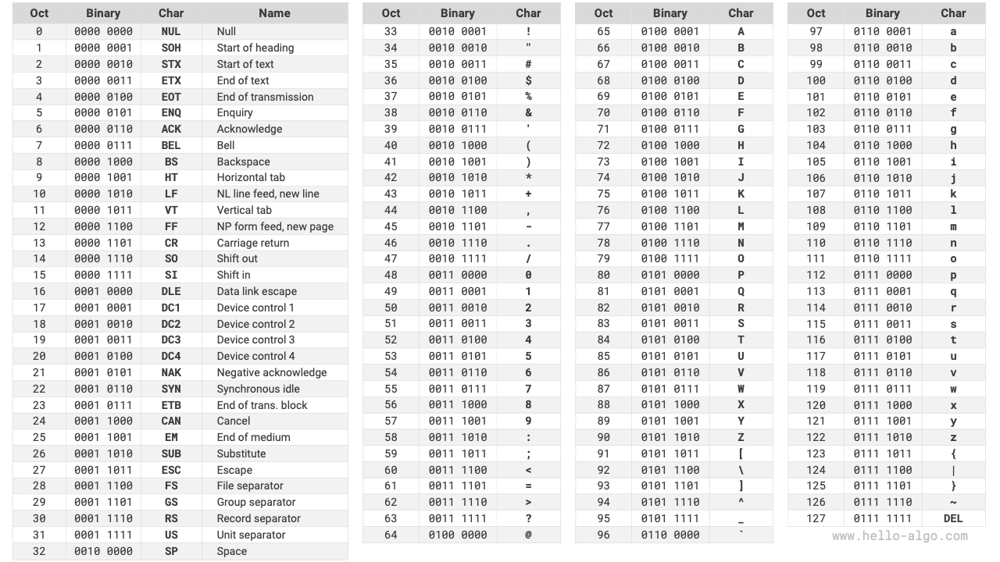
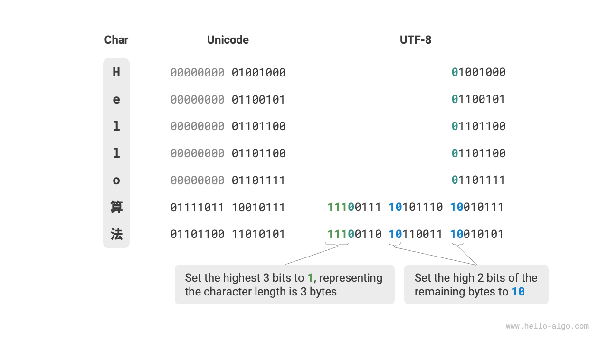

# Character Encoding *

In computers, all data is stored as binary numbers, and the character `char` is no exception. In order to represent the characters, we need to establish a set of "character set", the provisions of each character and the one-to-one correspondence between the binary number. With the character set, the computer can look up the table to complete the conversion of binary numbers to characters.

## Ascii Character Set

"ASCII" is the earliest character set known as "American Standard Code for Information Interchange". It uses a 7-bit binary number (i.e. the lower 7 bits of a byte) to represent a character, and can represent up to 128 different characters. As shown in the figure below, the ASCII code consists of the upper and lower case letters of the English alphabet, the numbers 0 ~ 9, some punctuation marks, and some control characters (such as line breaks and tabs).

However, **the ASCII code is only capable of representing the English language**. With the globalization of computers, a character set called "EASCII" was created that could represent more languages. It extends the 7-bit ASCII code to 8-bit and is capable of representing 256 different characters.

Around the world, there are a number of EASCII character sets that are applicable to different regions. The first 128 characters of these character sets are standardized as ASCII, and the last 128 characters are defined differently to meet the needs of different languages.

## Gbk Character Set

It was later discovered that **EASCII still could not meet the number of characters required for many languages**. For example, there are about 100,000 Chinese characters, and several thousand of them are used in daily life. In 1980, the General Administration of National Standards of China released the "GB2312" character set, which contains 6,763 Chinese characters and basically meets the needs of computer processing of Chinese characters.

However, GB2312 cannot handle some rare and traditional characters. The "GBK" character set is an extension of GB2312, which contains 21886 Chinese characters. In the GBK encoding scheme, ASCII characters are represented by one byte and Chinese characters are represented by two bytes.

## Unicode Character Set

With the booming development of computers, character sets and coding standards have blossomed, and this has created many problems. On the one hand, these character sets generally define only the characters of a particular language and cannot work properly in a multilingual environment. On the other hand, there are also multiple character set standards for the same language, so if two computers are installed with different encoding standards, the information will be garbled when transmitted.

Researchers of that era thought:**Wouldn't the problem of cross-linguistic environments and garbled codes be solved if a character set complete enough to include all the languages and symbols of the world was introduced**? Driven by this idea, Unicode, a large and complete character set, was created.

"Unicode" is the full name of "Unified Character Encoding", which can theoretically accommodate more than one million characters. It is committed to incorporating characters from all over the world into a unified character set, providing a common character set for processing and displaying various languages, and reducing the problem of garbled codes caused by different encoding standards.

Since its release in 1991, Unicode has been expanding with new languages and characters. As of September 2022, Unicode contains 149,186 characters, including characters, symbols, and even emoticons for various languages. Within the large Unicode character set, commonly used characters take up 2 bytes, and some obscure characters take up 3 or even 4 bytes.

Unicode is a character set standard that essentially assigns a number (called a "code point") to each character, **but it doesn't dictate how those code points are stored in a computer**. One wonders: how does the system resolve characters when Unicode code points of multiple lengths appear in the same text at the same time? For example, given a code of 2 bytes in length, how does the system recognize whether it is one 2-byte character or two 1-byte characters?

A straightforward solution to the above problem **is to store all characters as equal length encodings**. As shown in the figure below, each character in "Hello" occupies 1 byte and each character in "algorithm" occupies 2 bytes. We can encode all the characters in "Hello Algo" as 2 bytes by filling the high bit with zero. This way, the system can parse a character every 2 bytes and recover the content of the phrase.

However, ASCII code has already proved to us that it takes only 1 byte to encode English. If we use the above scheme, the size of the English text will be twice the size of the ASCII encoding, which is a waste of memory space. Therefore, we need a more efficient way to encode Unicode.

## Utf-8 Encoding

Currently, UTF-8 has become the most widely used Unicode encoding method internationally. It is a variable-length encoding that uses between 1 and 4 bytes to represent a character, depending on the complexity of the character. 1 byte is needed for ASCII characters, 2 bytes for Latin and Greek alphabets, 3 bytes for commonly used Chinese characters, and 4 bytes for some other rare characters.

The encoding rules for UTF-8 are not complicated and are divided into the following two cases.

- For characters 1 byte long, set the highest bit to $0$ and the remaining 7 bits to Unicode code points. It is worth noting that ASCII characters occupy the first 128 code points in the Unicode character set. In other words, **UTF-8 encoding is backward compatible with ASCII**. This means that we can use UTF-8 to solve old ASCII text.
- For characters of length $n$ bytes (where $n > 1$), set the high $n$ bits of the first byte to $1$ and the $n + 1$ bits to $0$; from the second byte onwards, set the high 2 bits of each byte to $10$; and all the rest of the bits are used to fill in the Unicode code point of the character.

The figure below shows the UTF-8 encoding of "Hello Algo". It is observed that since the highest $n$ bits are set to $1$, the system can read the number of the highest $1$ bits to parse out the length of the character as $n$.

But why set the high 2 bits of all the rest of the bytes to $10$? In fact, this $10$ serves as a check digit. Assuming that the system starts parsing the text from an incorrect byte, the $10$ in the byte header can help the system to quickly recognize the exception.

The reason why $10$ is used as a check digit is because under the UTF-8 encoding rules, it is impossible for any character to have the highest two digits as $10$. This conclusion can be proved by the inverse method: suppose the highest two bits of a character are $10$, that means the length of the character is $1$, which corresponds to the ASCII code. The highest bit of ASCII code should be $0$, which contradicts the assumption.

In addition to UTF-8, there are two other common encodings.

- **UTF-16 encoding**: 2 or 4 bytes are used to represent a character. All ASCII characters and common non-English characters are represented by 2 bytes; a few characters require 4 bytes. For 2-byte characters, UTF-16 encoding is equivalent to Unicode code points.
- **UTF-32 encoding**: each character uses 4 bytes. This means that UTF-32 will take up more space than UTF-8 and UTF-16, especially for text with a high proportion of ASCII characters.

From a storage space point of view, using UTF-8 to represent English characters is very efficient because it takes only 1 byte; using UTF-16 to encode some non-English characters (e.g., Chinese) is more efficient because it takes only 2 bytes, whereas UTF-8 may take 3 bytes.

From a compatibility standpoint, UTF-8 is the most versatile, and many tools and libraries prioritize UTF-8 support.

## Character Encoding For Programming Languages

For most of the programming languages in the past, the strings in the running program are encoded in UTF-16 or UTF-32 encoding of equal length. With equal-length encoding, we can treat strings as arrays, which has the following advantages.

- **Random access**: UTF-16 encoded strings can be easily randomized. UTF-8 is a variable-length encoding, and to find the first $i$ character, we need to traverse from the beginning of the string to the first $i$ character, which takes $O(n)$ time.
- **Character Count**: Similar to random access, calculating the length of a UTF-16 string is an $O(1)$ operation. However, calculating the length of a UTF-8 encoded string requires traversing the entire string.
- **String Operations**: Many string operations (e.g., splitting, concatenation, insertion, deletion, etc.) are easier to perform on UTF-16 encoded strings. Performing these operations on UTF-8 encoded strings usually requires additional computation to ensure that invalid UTF-8 encodings are not produced.

In fact, the design of character encoding schemes for programming languages is an interesting topic that involves many factors.

- Java's `String` type uses UTF-16 encoding and takes up 2 bytes per character. This is because when the Java language was first designed, it was assumed that 16 bits would be enough to represent all possible characters. However, this was an incorrect judgment. The Unicode specification was later extended beyond 16 bits, so characters in Java may now be represented by a pair of 16-bit values (called a "proxy pair").
- JavaScript and TypeScript strings are UTF-16 encoded for similar reasons to Java. When the JavaScript language was first introduced by Netscape in 1995, Unicode was in its relatively early stages, and a 16-bit encoding was sufficient to represent all Unicode characters.
- C# uses UTF-16 encoding, primarily because the .NET platform was designed by Microsoft, and many of Microsoft's technologies, including the Windows operating system, make extensive use of UTF-16 encoding.

Due to the underestimation of the number of characters in the above programming languages, they have had to resort to "proxy pairs" to represent Unicode characters longer than 16 bits. This is a last resort. On the one hand, a character in a string containing a proxy pair may take up 2 or 4 bytes, thus losing the advantage of equal-length encoding. On the other hand, handling proxy pairs requires additional code, which increases programming complexity and Debugging difficulty.

For these reasons, some programming languages have proposed a number of different coding schemes.

- `str` in Python uses Unicode encoding and a flexible string representation where the length of the stored characters depends on the largest Unicode code point in the string. Each character takes 1 byte if the string is entirely ASCII, 2 bytes if there are characters outside the ASCII range but all within the Basic Multilingual Plane (BMP), and 4 bytes if there are characters outside the BMP.
- Go's `string` type is internally encoded in UTF-8. Go also provides the `rune` type, which is used to represent a single Unicode code point.
- The str and String types of the Rust language are internally encoded in UTF-8. Rust also provides the `char` type for representing individual Unicode code points.

Note that the above discussion is all about how strings are stored in a programming language, **this is a different issue from how strings are stored in a file or transmitted over a network**. In file storage or network transmission, we usually encode strings in UTF-8 format for optimal compatibility and space efficiency.
