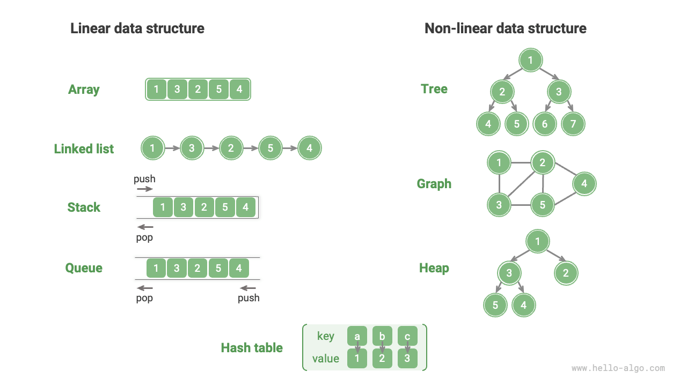

# Classification Of Data Structures

Common data structures include arrays, linked lists, stacks, queues, hash tables, trees, heaps, and graphs, which can be categorized in terms of both "logical structure" and "physical structure" dimensions.

## Logical Structures: Linear And Nonlinear

**Logical structures reveal logical relationships between data elements**. In arrays and linked lists, data are arranged sequentially in order, reflecting the linear relationship between data; while in trees, data are arranged hierarchically from the top down, showing the derived relationship between ancestors and descendants; and graphs are composed of nodes and edges, reflecting the complex network relationship.

As shown in the figure below, logical structures can be categorized into "linear" and "non-linear". Linear structures are more intuitive, meaning that the data are arranged linearly in terms of logical relationships; non-linear structures, on the other hand, are arranged non-linearly.

- **Linear data structures**: arrays, linked lists, stacks, queues, hash tables.
- **Nonlinear data structures**: trees, heaps, graphs, hash tables.

Nonlinear data structures can be further categorized into tree and graph structures.

- **Linear structures**: arrays, linked lists, queues, stacks, hash tables, with one-to-one sequential relationships between elements.
- **Tree structure**: tree, heap, hash table with one-to-many relationships between elements.
- **Graph**: graph with many-to-many relationships between elements.

## Physical Structure: Continuous vs. Dispersed

In computers, memory and hard disk are the two main storage hardware devices. Hard disks are used primarily for long-term data storage, and are larger (usually up to the terabyte degree) and slower. Memory is used for temporary storage of data while running a program, and is faster, but has a smaller capacity (usually at the GB level).

**During the operation of the algorithm, the relevant data are stored in memory**. The figure below shows a computer memory stick where each black square contains a block of memory space. We can think of the memory as a giant Excel sheet in which each cell can store data of a certain size, and in which all data is stored while the algorithm is running.

**The system accesses the data at the target location by means of a memory address**. As shown in the figure below, the computer assigns numbers to each cell in the table according to specific rules, ensuring that each memory space has a unique memory address. With these addresses, the program can access the data in memory.

Memory is a shared resource for all programs, and when a block of memory is occupied by one program, it cannot be used by other programs at the same time. **Therefore, memory resources are an important consideration in the design of data structures and algorithms**. For example, the peak memory occupied by an algorithm should not exceed the remaining free memory of the system; if there is a lack of consecutive large chunks of memory space, then the data structure chosen must be able to be stored in a decentralized memory space.

As shown in the figure below, **Physical structure reflects the way data is stored in computer memory and can be categorized into continuous space storage (arrays) and distributed space storage (linked lists)**. The physical structure determines from the bottom up the methods of accessing, updating, adding, deleting, and other operations on the data, while presenting complementary characteristics in terms of time efficiency and space efficiency.

**It is worth stating that all data structures are implemented based on arrays, linked lists, or a combination of the two**. For example, stacks and queues can be implemented using both arrays and linked lists; and implementations of hash tables may contain both arrays and linked lists.

- **Based on arrays can be realized**: stacks, queues, hash tables, trees, heaps, graphs, matrices, tensors (arrays of dimension $\geq 3$), and so on.
- **Can be implemented based on linked lists**: stacks, queues, hash tables, trees, heaps, graphs, etc.

Data structures based on arrays are also known as "static data structures", which means that they are not changeable in length after initialization. In contrast, data structures based on linked lists are called "dynamic data structures", meaning that their length can be adjusted during program execution after initialization.

!!! tip

    If you find it difficult to understand the physical structure, it is recommended that you read the next chapter, "Arrays and Linked Lists," before reviewing this section.
