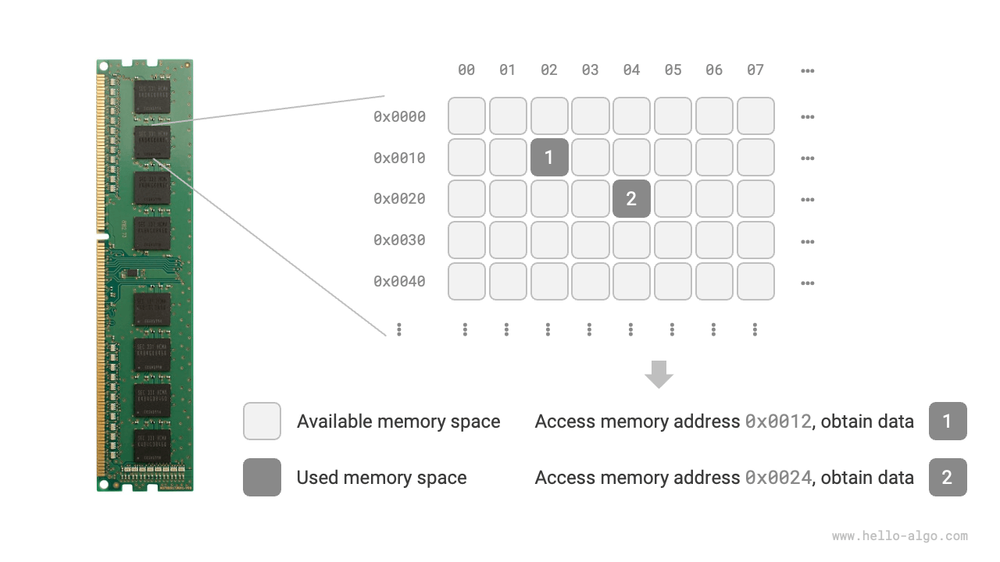
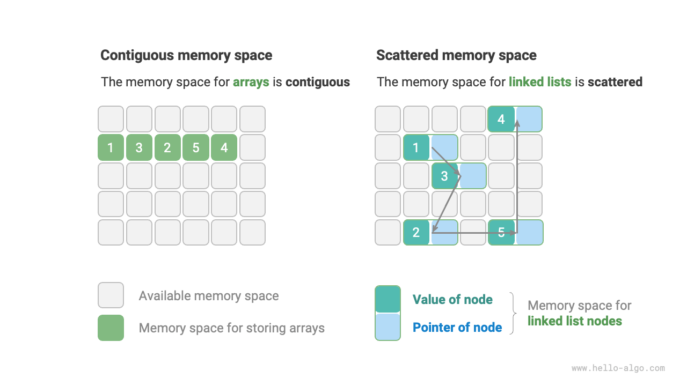

# Classification Of Data Structures

Common data structures include arrays, linked lists, stacks, queues, hash tables, trees, heaps, and graphs. They can be divided into two categories: logical structure and physical structure.

## Logical Structures: Linear And Non-linear

**Logical structures reveal logical relationships between data elements**. In arrays and linked lists, data are arranged in a sequential order, reflecting the linear relationship between data; while in trees, data are arranged hierarchically from the top down, showing the derived relationship between ancestors and descendants; and graphs are composed of nodes and edges, reflecting the complex network relationship.

As shown in the figure below, logical structures can further be divided into "linear data structure" and "non-linear data structure". Linear data structures are more intuitive, meaning that the data are arranged linearly in terms of logical relationships; non-linear data structures, on the other hand, are arranged non-linearly.

- **Linear data structures**: arrays, linked lists, stacks, queues, hash tables.
- **Nonlinear data structures**: trees, heaps, graphs, hash tables.

Non-linear data structures can be further divided into tree and graph structures.

- **Linear structures**: arrays, linked lists, queues, stacks, hash tables, with one-to-one sequential relationship between elements.
- **Tree structure**: tree, heap, hash table, with one-to-many relationship between elements.
- **Graph**: graph with many-to-many relationship between elements.

## Physical Structure: Continuous vs. Dispersed

**When an algorithm is running, the data being processed is stored in memory**. The figure below shows a computer memory module where each black square represents a memory space. We can think of the memory as a giant Excel sheet in which each cell can store data of a certain size.

**The system accesses the data at the target location by means of a memory address**. As shown in the figure below, the computer assigns a unique identifier to each cell in the table according to specific rules, ensuring that each memory space has a unique memory address. With these addresses, the program can access the data in memory.

!!! tip

    It is worth noting that comparing memory to the Excel sheet is a simplified analogy. The actual memory working mechanism is more complicated, involving the concepts of address, space, memory management, cache mechanism, virtual and physical memory.

Memory is a shared resource for all programs, and when a block of memory is occupied by one program, it cannot be used by other programs at the same time. **Therefore, memory resources are important consideration in the design of data structures and algorithms**. For example, the algorithm's peak memory usage should not exceed the remaining free memory of the system; if there is a lack of contiguous memory blocks, then the data structure chosen must be able to be stored in non-contiguous memory blocks.

As shown in the figure below, **Physical structure reflects the way data is stored in computer memory and it can be divided into consecutive space storage (arrays) and distributed space storage (linked lists)**. The physical structure determines how data is accessed, updated, added, deleted, etc. Logical and physical structure complement each other in terms of time efficiency and space efficiency.

**It is worth stating that all data structures are implemented based on arrays, linked lists, or a combination of the two**. For example, stacks and queues can be implemented using both arrays and linked lists; and implementations of hash tables may contain both arrays and linked lists.

- **Array-based structures**: stacks, queues, hash tables, trees, heaps, graphs, matrices, tensors (arrays of dimension $\geq 3$), and so on.
- **Linked list-based structures**: stacks, queues, hash tables, trees, heaps, graphs, etc.

Data structures based on arrays are also known as "static data structures", which means that such structures' length remains fixed after initialization. In contrast, data structures based on linked lists are called "dynamic data structures", meaning that their length can be adjusted during program execution after initialization.

!!! tip

    If you find it difficult to understand the physical structure, it is recommended that you read the next chapter, "Arrays and Linked Lists," before reviewing this section.
