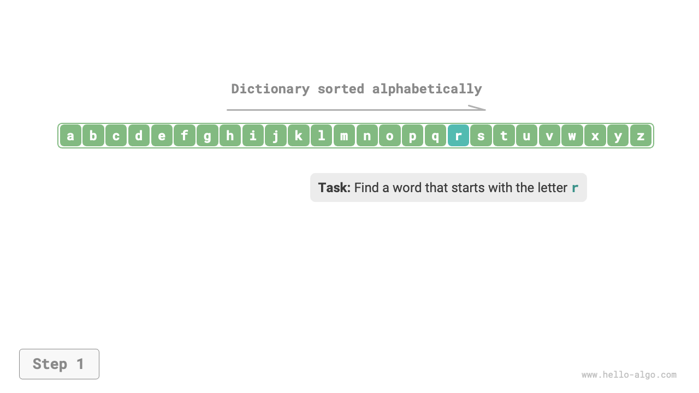

# Algorithms Are Everywhere

When we hear the word "algorithm", we naturally think of math. In reality, however, many algorithms do not involve complex math, but rely more on basic logic, which can be found in our daily lives.

Before formally exploring algorithms, there is an interesting fact worth sharing:**You have already learned many algorithms without realizing it and are used to applying them in your daily life**. Below, I will give a few concrete examples to confirm this.

**Example 1: Consulting the dictionary**. In a dictionary, each Chinese character corresponds to a Pinyin character, and the dictionary is organized by Pinyin alphabetical order. Suppose we need to look up a character whose pinyin initial letter is $r$, we usually realize it as shown in the figure below.

1. Go through about half of the pages of the dictionary to see what the first letter of the page is, assuming the first letter is $m$ .
2. Since $r$ comes after $m$ in the pinyin alphabet, the first half of the dictionary is excluded and the search is narrowed down to the second half.
3. Repeat step `1.` and step `2.` until you find the page number with the initial letter $r$.

=== "<1>"
    

=== "<2>"
    

=== "<3>"
    

=== "<4>"
    

=== "<5>"
    

Looking up the dictionary, a necessary skill for elementary school students, is actually the famous binary search algorithm. From the data structure point of view, we can regard the dictionary as a sorting algorithm, and from the algorithm point of view, we can regard the above series of operations as "binary search".

**Example 2: Organize Poker**. When we play poker, we need to organize the playing cards so that they are arranged from smallest to largest in each game, the implementation process is shown in the figure below.

1. Divide the playing cards into "ordered" and "unordered" parts, and assume that the leftmost card in the initial state is already ordered.
2. Draw a playing card from the unordered section and insert it into the correct position in the ordered section; when finished, the leftmost 2 playing cards are in order.
3. Keep cycling through the steps `2.` , inserting a playing card from the unordered part to the ordered part each round until all cards are in order.

The above method of organizing playing cards is essentially an "insertion sort" algorithm, which is very efficient when dealing with small data sets. Insertion sort can be found in the sorting library functions of many programming languages.

**Example 3: Currency change**. Suppose we purchased $69$ yuan of goods at the supermarket and gave the cashier $100$ yuan, then the cashier needs to find us $31$ yuan. He will naturally complete the thinking shown in the figure below.

1. Options are currencies with smaller denominations than $31$ yuan, including $1$ yuan, $5$ yuan, $10$ yuan, $20$ yuan.
2. Take the largest $20$ dollars from the available options, leaving $31 - 20 = 11$ dollars.
3. Take the largest $10$ from the remaining available options, leaving $11 - 10 = 1$.
4. Take the largest $1$ from the remaining available options, leaving $1 - 1 = 0$.
5. Complete the change and the solution is $20 + 10 + 1 = 31$.

In each of the above steps, we take the best option available at the time (using as large a denomination of currency as possible) and end up with a feasible solution for finding change. From a data structure and algorithm perspective, this approach is essentially a "greedy algorithm".

Algorithms are essential to the solution of almost any problem, from cooking a dish to interstellar voyages. The advent of computers has allowed us to program data structures to be stored in memory while writing code that calls the CPU and GPU to execute algorithms. In this way, we are able to transfer the problems of our lives to computers and solve all kinds of complex problems in a more efficient way.

!!! tip

    If you still feel half-aware of concepts such as data structures, algorithms, arrays, and binary searches, read on as this book will guide you through the halls of knowledge of data structures and algorithms.
