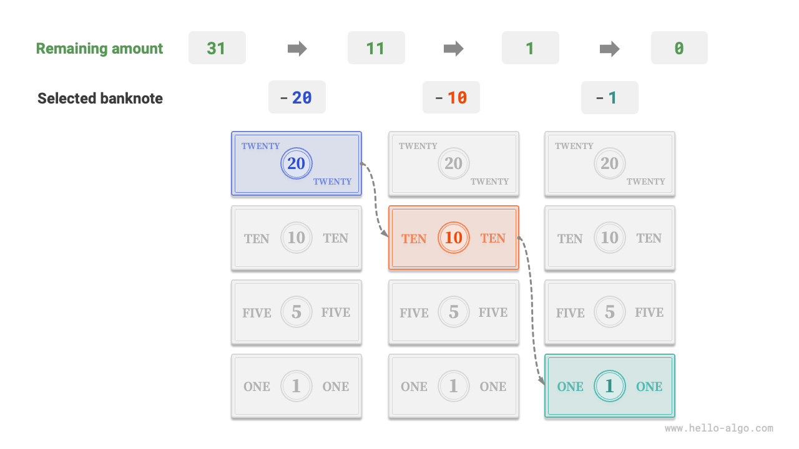

# Algorithms Are Everywhere

When we hear the word "algorithm", we naturally think of mathematics. However, many algorithms do not involve complex mathematics but rely more on basic logic, which is ubiquitous in our daily lives.

Before we formally discuss algorithms, an interesting fact is worth sharing: **you have already learned many algorithms unconsciously and have become accustomed to applying them in your daily life**. Below, I will give a few specific examples to prove this point.

**Example 1: Looking Up a Dictionary**. In a dictionary, each Chinese character corresponds to a pinyin, and the dictionary is arranged in alphabetical order of pinyin. Suppose we need to find a character whose pinyin starts with the letter $r$. This is usually achieved in the following way:

1. Open the dictionary to about halfway and check the first letter on the page, assuming it is $m$.
2. Since $r$ comes after $m$ in the pinyin alphabet, we exclude the first half of the dictionary and narrow the search to the second half.
3. Repeat steps `1.` and `2.` until you find the page where the pinyin starts with $r$.

=== "<1>"
    

=== "<2>"
    

=== "<3>"
    

=== "<4>"
    

=== "<5>"
    

The skill of looking up a dictionary, essential for elementary school students, is actually the famous binary search algorithm. From the perspective of data structures, we can view the dictionary as a sorted "array"; from the perspective of algorithms, the series of operations in looking up a dictionary can be seen as "binary search".

**Example 2: Organizing Playing Cards**. When playing cards, we need to arrange the cards in ascending order each game, as shown in the following process.

1. Divide the playing cards into "ordered" and "unordered" parts, assuming initially that the leftmost card is already ordered.
2. Take out a card from the unordered part and insert it into the correct position in the ordered part; after this, the leftmost two cards are in order.
3. Continue looping step `2.`, each round inserting one card from the unordered part into the ordered part, until all cards are ordered.

The above method of organizing playing cards is essentially the "insertion sort" algorithm, which is very efficient for small datasets. Many programming languages' sorting library functions include insertion sort.

**Example 3: Making Change**. Suppose we buy goods worth $69$ at a supermarket and give the cashier $100$, then the cashier needs to give us $31$ in change. They would naturally complete the thought process as shown below.

1. The options are currencies smaller than $31$, including $1$, $5$, $10$, and $20$.
2. Take out the largest $20$ from the options, leaving $31 - 20 = 11$.
3. Take out the largest $10$ from the remaining options, leaving $11 - 10 = 1$.
4. Take out the largest $1$ from the remaining options, leaving $1 - 1 = 0$.
5. Complete the change-making, with the solution being $20 + 10 + 1 = 31$.

In the steps above, we make the best choice at each step (using the largest denomination possible), ultimately arriving at a feasible change-making solution. From the perspective of data structures and algorithms, this method is essentially a "greedy" algorithm.

From cooking a dish to interstellar travel, almost all problem-solving is inseparable from algorithms. The advent of computers allows us to store data structures in memory and write code to call CPUs and GPUs to execute algorithms. In this way, we can transfer problems from life to computers, solving various complex issues more efficiently.

!!! tip

    If you still feel only partially informed about concepts like data structures, algorithms, arrays, and binary search, please continue reading. This book will guide you into the hall of knowledge of data structures and algorithms.
