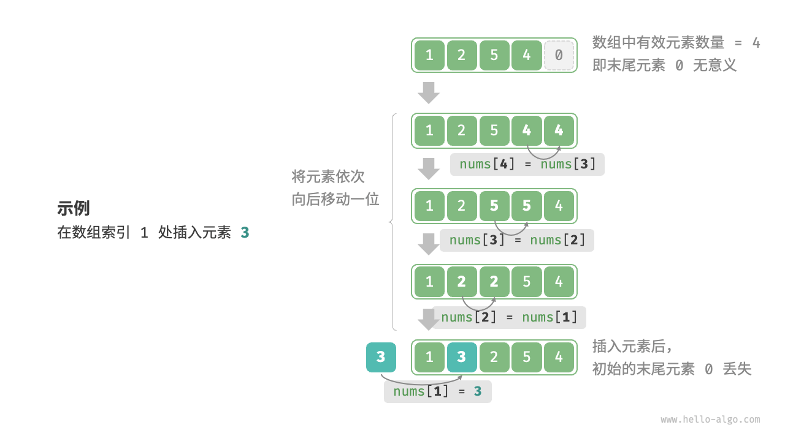

# 数组

「数组 Array」是一种线性数据结构，其将相同类型元素存储在连续的内存空间中。我们将元素在数组中的位置称为元素的「索引 Index」。


**数组初始化**。通常有无初始值和给定初始值两种方式，我们可根据需求选择合适的方法。在未给定初始值的情况下，数组的所有元素通常会被初始化为默认值 $0$ 。

=== "Java"

    ```java title="array.java"
    /* 初始化数组 */
    int[] arr = new int[5]; // { 0, 0, 0, 0, 0 }
    int[] nums = { 1, 3, 2, 5, 4 };
    ```

=== "C++"

    ```cpp title="array.cpp"
    /* 初始化数组 */
    // 存储在栈上
    int arr[5];
    int nums[5] { 1, 3, 2, 5, 4 };
    // 存储在堆上
    int* arr1 = new int[5];
    int* nums1 = new int[5] { 1, 3, 2, 5, 4 };
    ```

=== "Python"

    ```python title="array.py"
    # 初始化数组
    arr: List[int] = [0] * 5  # [ 0, 0, 0, 0, 0 ]
    nums: List[int] = [1, 3, 2, 5, 4]  
    ```

=== "Go"

    ```go title="array.go"
    /* 初始化数组 */
    var arr [5]int
    // 在 Go 中，指定长度时（[5]int）为数组，不指定长度时（[]int）为切片
    // 由于 Go 的数组被设计为在编译期确定长度，因此只能使用常量来指定长度
    // 为了方便实现扩容 extend() 方法，以下将切片（Slice）看作数组（Array）
    nums := []int{1, 3, 2, 5, 4}
    ```

=== "JS"

    ```javascript title="array.js"
    /* 初始化数组 */
    var arr = new Array(5).fill(0);
    var nums = [1, 3, 2, 5, 4];
    ```

=== "TS"

    ```typescript title="array.ts"
    /* 初始化数组 */
    let arr: number[] = new Array(5).fill(0);
    let nums: number[] = [1, 3, 2, 5, 4];
    ```

=== "C"

    ```c title="array.c"
    int arr[5] = { 0 }; // { 0, 0, 0, 0, 0 }
    int nums[5] = { 1, 3, 2, 5, 4 };
    ```

=== "C#"

    ```csharp title="array.cs"
    /* 初始化数组 */
    int[] arr = new int[5]; // { 0, 0, 0, 0, 0 }
    int[] nums = { 1, 3, 2, 5, 4 };
    ```

=== "Swift"

    ```swift title="array.swift"
    /* 初始化数组 */
    let arr = Array(repeating: 0, count: 5) // [0, 0, 0, 0, 0]
    let nums = [1, 3, 2, 5, 4]
    ```

=== "Zig"

    ```zig title="array.zig"
    // 初始化数组
    var arr = [_]i32{0} ** 5; // { 0, 0, 0, 0, 0 }
    var nums = [_]i32{ 1, 3, 2, 5, 4 };
    ```

=== "Dart"

    ```dart title="array.dart"
    /* 初始化数组 */
    List<int> arr = List.filled(5, 0); // [0, 0, 0, 0, 0]
    List<int> nums = [1, 3, 2, 5, 4];
    ```

=== "Rust"

    ```rust title="array.rs"

    ```

## 数组优点

**在数组中访问元素非常高效**。由于数组元素被存储在连续的内存空间中，因此计算数组元素的内存地址非常容易。给定数组首个元素的地址和某个元素的索引，我们可以使用以下公式计算得到该元素的内存地址，从而直接访问此元素。


```shell
# 元素内存地址 = 数组内存地址 + 元素长度 * 元素索引
elementAddr = firtstElementAddr + elementLength * elementIndex
```

!!! question "为什么数组元素的索引要从 $0$ 开始编号呢？"

    观察上图，我们发现数组首个元素的索引为 $0$ ，这似乎有些反直觉，因为从 $1$ 开始计数会更自然。
    
    然而，从地址计算公式的角度看，**索引本质上表示的是内存地址的偏移量**。首个元素的地址偏移量是 $0$ ，因此索引为 $0$ 也是合理的。

访问元素的高效性带来了诸多便利。例如，我们可以在 $O(1)$ 时间内随机获取数组中的任意一个元素。

=== "Java"

    ```java title="array.java"
    [class]{array}-[func]{randomAccess}
    ```

=== "C++"

    ```cpp title="array.cpp"
    [class]{}-[func]{randomAccess}
    ```

=== "Python"

    ```python title="array.py"
    [class]{}-[func]{random_access}
    ```

=== "Go"

    ```go title="array.go"
    [class]{}-[func]{randomAccess}
    ```

=== "JS"

    ```javascript title="array.js"
    [class]{}-[func]{randomAccess}
    ```

=== "TS"

    ```typescript title="array.ts"
    [class]{}-[func]{randomAccess}
    ```

=== "C"

    ```c title="array.c"
    [class]{}-[func]{randomAccess}
    ```

=== "C#"

    ```csharp title="array.cs"
    [class]{array}-[func]{randomAccess}
    ```

=== "Swift"

    ```swift title="array.swift"
    [class]{}-[func]{randomAccess}
    ```

=== "Zig"

    ```zig title="array.zig"
    [class]{}-[func]{randomAccess}
    ```

=== "Dart"

    ```dart title="array.dart"
    [class]{}-[func]{randomAccess}
    ```

=== "Rust"

    ```rust title="array.rs"
    [class]{}-[func]{random_access}
    ```

## 数组缺点

**数组在初始化后长度不可变**。由于系统无法保证数组之后的内存空间是可用的，因此数组长度无法扩展。而若希望扩容数组，则需新建一个数组，然后把原数组元素依次拷贝到新数组，在数组很大的情况下，这是非常耗时的。

=== "Java"

    ```java title="array.java"
    [class]{array}-[func]{extend}
    ```

=== "C++"

    ```cpp title="array.cpp"
    [class]{}-[func]{extend}
    ```

=== "Python"

    ```python title="array.py"
    [class]{}-[func]{extend}
    ```

=== "Go"

    ```go title="array.go"
    [class]{}-[func]{extend}
    ```

=== "JS"

    ```javascript title="array.js"
    [class]{}-[func]{extend}
    ```

=== "TS"

    ```typescript title="array.ts"
    [class]{}-[func]{extend}
    ```

=== "C"

    ```c title="array.c"
    [class]{}-[func]{extend}
    ```

=== "C#"

    ```csharp title="array.cs"
    [class]{array}-[func]{extend}
    ```

=== "Swift"

    ```swift title="array.swift"
    [class]{}-[func]{extend}
    ```

=== "Zig"

    ```zig title="array.zig"
    [class]{}-[func]{extend}
    ```

=== "Dart"

    ```dart title="array.dart"
    [class]{}-[func]{extend}
    ```

=== "Rust"

    ```rust title="array.rs"
    [class]{}-[func]{extend}
    ```

**数组中插入或删除元素效率低下**。如果我们想要在数组中间插入一个元素，由于数组元素在内存中是“紧挨着的”，它们之间没有空间再放任何数据。因此，我们不得不将此索引之后的所有元素都向后移动一位，然后再把元素赋值给该索引。



=== "Java"

    ```java title="array.java"
    [class]{array}-[func]{insert}
    ```

=== "C++"

    ```cpp title="array.cpp"
    [class]{}-[func]{insert}
    ```

=== "Python"

    ```python title="array.py"
    [class]{}-[func]{insert}
    ```

=== "Go"

    ```go title="array.go"
    [class]{}-[func]{insert}
    ```

=== "JS"

    ```javascript title="array.js"
    [class]{}-[func]{insert}
    ```

=== "TS"

    ```typescript title="array.ts"
    [class]{}-[func]{insert}
    ```

=== "C"

    ```c title="array.c"
    [class]{}-[func]{insert}
    ```

=== "C#"

    ```csharp title="array.cs"
    [class]{array}-[func]{insert}
    ```

=== "Swift"

    ```swift title="array.swift"
    [class]{}-[func]{insert}
    ```

=== "Zig"

    ```zig title="array.zig"
    [class]{}-[func]{insert}
    ```

=== "Dart"

    ```dart title="array.dart"
    [class]{}-[func]{insert}
    ```

=== "Rust"

    ```rust title="array.rs"
    [class]{}-[func]{insert}
    ```

删除元素也类似，如果我们想要删除索引 $i$ 处的元素，则需要把索引 $i$ 之后的元素都向前移动一位。值得注意的是，删除元素后，原先末尾的元素变得“无意义”了，我们无需特意去修改它。


=== "Java"

    ```java title="array.java"
    [class]{array}-[func]{remove}
    ```

=== "C++"

    ```cpp title="array.cpp"
    [class]{}-[func]{remove}
    ```

=== "Python"

    ```python title="array.py"
    [class]{}-[func]{remove}
    ```

=== "Go"

    ```go title="array.go"
    [class]{}-[func]{remove}
    ```

=== "JS"

    ```javascript title="array.js"
    [class]{}-[func]{remove}
    ```

=== "TS"

    ```typescript title="array.ts"
    [class]{}-[func]{remove}
    ```

=== "C"

    ```c title="array.c"
    [class]{}-[func]{removeItem}
    ```

=== "C#"

    ```csharp title="array.cs"
    [class]{array}-[func]{remove}
    ```

=== "Swift"

    ```swift title="array.swift"
    [class]{}-[func]{remove}
    ```

=== "Zig"

    ```zig title="array.zig"
    [class]{}-[func]{remove}
    ```

=== "Dart"

    ```dart title="array.dart"
    [class]{}-[func]{remove}
    ```

=== "Rust"

    ```rust title="array.rs"
    [class]{}-[func]{remove}
    ```

总结来看，数组的插入与删除操作有以下缺点：

- **时间复杂度高**：数组的插入和删除的平均时间复杂度均为 $O(n)$ ，其中 $n$ 为数组长度。
- **丢失元素**：由于数组的长度不可变，因此在插入元素后，超出数组长度范围的元素会丢失。
- **内存浪费**：我们可以初始化一个比较长的数组，只用前面一部分，这样在插入数据时，丢失的末尾元素都是我们不关心的，但这样做同时也会造成内存空间的浪费。

## 数组常用操作

**数组遍历**。以下介绍两种常用的遍历方法。

=== "Java"

    ```java title="array.java"
    [class]{array}-[func]{traverse}
    ```

=== "C++"

    ```cpp title="array.cpp"
    [class]{}-[func]{traverse}
    ```

=== "Python"

    ```python title="array.py"
    [class]{}-[func]{traverse}
    ```

=== "Go"

    ```go title="array.go"
    [class]{}-[func]{traverse}
    ```

=== "JS"

    ```javascript title="array.js"
    [class]{}-[func]{traverse}
    ```

=== "TS"

    ```typescript title="array.ts"
    [class]{}-[func]{traverse}
    ```

=== "C"

    ```c title="array.c"
    [class]{}-[func]{traverse}
    ```

=== "C#"

    ```csharp title="array.cs"
    [class]{array}-[func]{traverse}
    ```

=== "Swift"

    ```swift title="array.swift"
    [class]{}-[func]{traverse}
    ```

=== "Zig"

    ```zig title="array.zig"
    [class]{}-[func]{traverse}
    ```

=== "Dart"

    ```dart title="array.dart"
    [class]{}-[func]{traverse}
    ```

=== "Rust"

    ```rust title="array.rs"
    [class]{}-[func]{traverse}
    ```

**数组查找**。通过遍历数组，查找数组内的指定元素，并输出对应索引。

=== "Java"

    ```java title="array.java"
    [class]{array}-[func]{find}
    ```

=== "C++"

    ```cpp title="array.cpp"
    [class]{}-[func]{find}
    ```

=== "Python"

    ```python title="array.py"
    [class]{}-[func]{find}
    ```

=== "Go"

    ```go title="array.go"
    [class]{}-[func]{find}
    ```

=== "JS"

    ```javascript title="array.js"
    [class]{}-[func]{find}
    ```

=== "TS"

    ```typescript title="array.ts"
    [class]{}-[func]{find}
    ```

=== "C"

    ```c title="array.c"
    [class]{}-[func]{find}
    ```

=== "C#"

    ```csharp title="array.cs"
    [class]{array}-[func]{find}
    ```

=== "Swift"

    ```swift title="array.swift"
    [class]{}-[func]{find}
    ```

=== "Zig"

    ```zig title="array.zig"
    [class]{}-[func]{find}
    ```

=== "Dart"

    ```dart title="array.dart"
    [class]{}-[func]{find}
    ```

=== "Rust"

    ```rust title="array.rs"
    [class]{}-[func]{find}
    ```

## 数组典型应用

数组是最基础的数据结构，在各类数据结构和算法中都有广泛应用。

- **随机访问**：如果我们想要随机抽取一些样本，那么可以用数组存储，并生成一个随机序列，根据索引实现样本的随机抽取。
- **排序和搜索**：数组是排序和搜索算法最常用的数据结构。例如，快速排序、归并排序、二分查找等都需要在数组上进行。
- **查找表**：当我们需要快速查找一个元素或者需要查找一个元素的对应关系时，可以使用数组作为查找表。例如，我们有一个字符到其 ASCII 码的映射，可以将字符的 ASCII 码值作为索引，对应的元素存放在数组中的对应位置。
- **机器学习**：神经网络中大量使用了向量、矩阵、张量之间的线性代数运算，这些数据都是以数组的形式构建的。数组是神经网络编程中最常使用的数据结构。
- **数据结构实现**：数组可以用于实现栈、队列、哈希表、堆、图等数据结构。例如，邻接矩阵是图的常见表示之一，它实质上是一个二维数组。
