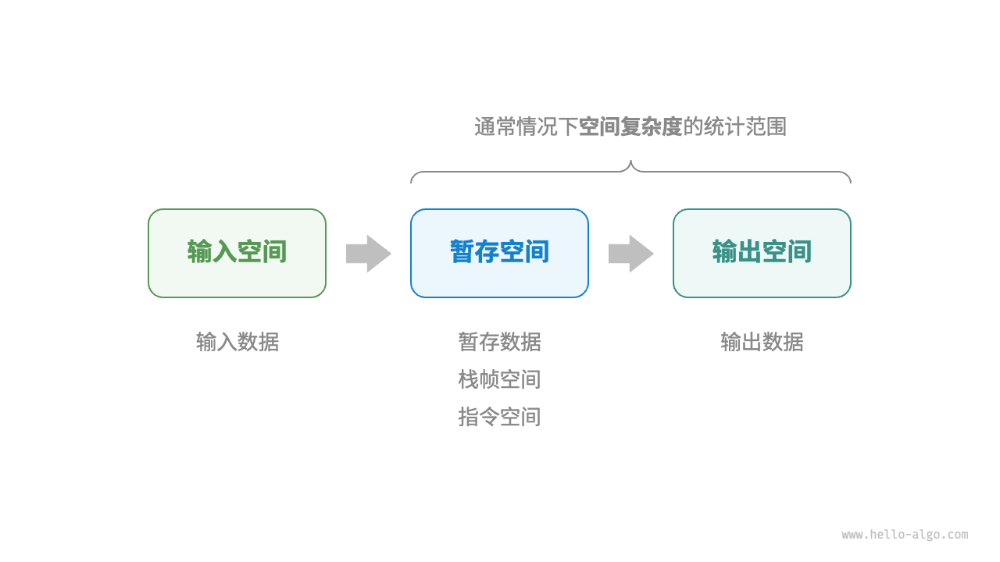
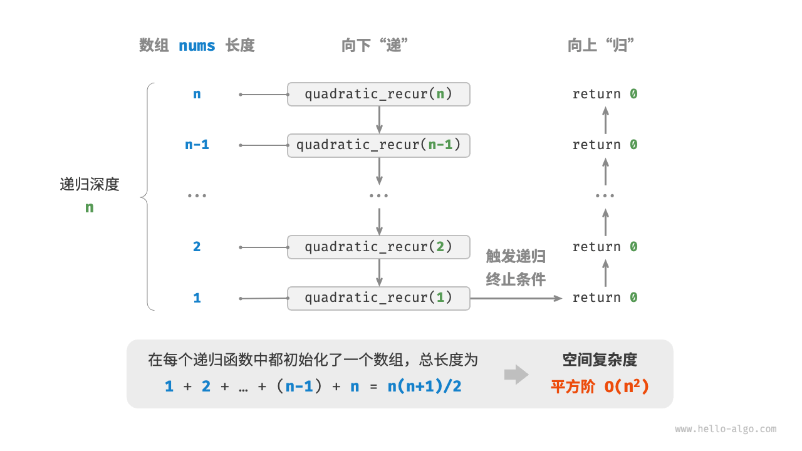

# 空间复杂度

「空间复杂度 Space Complexity」统计 **算法使用内存空间随着数据量变大时的增长趋势** 。这个概念与时间复杂度很类似。

## 算法相关空间

算法运行中，使用的内存空间主要有以下几种：

- 「输入空间」用于存储算法的输入数据；
- 「暂存空间」用于存储算法运行中的变量、对象、函数上下文等数据；
- 「输出空间」用于存储算法的输出数据；

!!! tip

    通常情况下，空间复杂度统计范围是「暂存空间」+「输出空间」。

暂存空间可分为三个部分：

- 「暂存数据」用于保存算法运行中的各种 **常量、变量、对象** 等。
- 「栈帧空间」用于保存调用函数的上下文数据。系统每次调用函数都会在栈的顶部创建一个栈帧，函数返回时，栈帧空间会被释放。
- 「指令空间」用于保存编译后的程序指令，**在实际统计中一般忽略不计**。



<p align="center"> Fig. 算法使用的相关空间 </p>

=== "Java"

    ```java title=""
    /* 类 */
    class Node {
        int val;
        Node next;
        Node(int x) { val = x; }
    }
    
    /* 函数（或称方法） */
    int function() {
        // do something...
        return 0;
    }
    
    int algorithm(int n) {        // 输入数据
        final int a = 0;          // 暂存数据（常量）
        int b = 0;                // 暂存数据（变量）
        Node node = new Node(0);  // 暂存数据（对象）
        int c = function();       // 栈帧空间（调用函数）
        return a + b + c;         // 输出数据
    }
    ```

=== "C++"

    ```cpp title=""
    /* 结构体 */
    struct Node {
        int val;
        Node *next;
        Node(int x) : val(x), next(nullptr) {}
    };

    /* 函数（或称方法） */
    int func() {
        // do something...
        return 0;
    }

    int algorithm(int n) {        // 输入数据
        const int a = 0;          // 暂存数据（常量）
        int b = 0;                // 暂存数据（变量）
        Node* node = new Node(0);  // 暂存数据（对象）
        int c = func();       // 栈帧空间（调用函数）
        return a + b + c;         // 输出数据
    }
    ```

=== "Python"

    ```python title=""
    """ 类 """
    class Node:
        def __init__(self, x):
            self.val = x      # 结点值
            self.next = None  # 指向下一结点的指针（引用）

    """ 函数（或称方法） """
    def function():
        # do something...
        return 0

    def algorithm(n):     # 输入数据
        b = 0             # 暂存数据（变量）
        node = Node(0)    # 暂存数据（对象）
        c = function()    # 栈帧空间（调用函数）
        return a + b + c  # 输出数据
    ```

=== "Go"

    ```go title=""

    ```

=== "JavaScript"

    ```js title=""

    ```

=== "TypeScript"

    ```typescript title=""

    ```

=== "C"

    ```c title=""

    ```

=== "C#"

    ```csharp title=""

    ```

## 推算方法

空间复杂度的推算方法和时间复杂度总体类似，只是从统计 “计算操作数量” 变为统计 “使用空间大小” 。与时间复杂度不同的是，**我们一般只关注「最差空间复杂度」**。这是因为内存空间是一个硬性要求，我们必须保证在所有输入数据下都有足够的内存空间预留。

**最差空间复杂度中的 “最差” 有两层含义**，分别为输入数据的最差分布、算法运行中的最差时间点。

- **以最差输入数据为准。** 当 $n < 10$ 时，空间复杂度为 $O(1)$ ；但是当 $n > 10$ 时，初始化的数组 `nums` 使用 $O(n)$ 空间；因此最差空间复杂度为 $O(n)$ ；
- **以算法运行过程中的峰值内存为准。** 程序在执行最后一行之前，使用 $O(1)$ 空间；当初始化数组 `nums` 时，程序使用 $O(n)$ 空间；因此最差空间复杂度为 $O(n)$ ；

=== "Java"

    ```java title=""
    void algorithm(int n) {
        int a = 0;                   // O(1)
        int[] b = new int[10000];    // O(1)
        if (n > 10)
            int[] nums = new int[n]; // O(n)
    }
    ```

=== "C++"

    ```cpp title=""
    void algorithm(int n) {
        int a = 0;               // O(1)
        vector<int> b(10000);    // O(1)
        if (n > 10)
            vector<int> nums(n); // O(n)
    }
    ```

=== "Python"

    ```python title=""
    def algorithm(n):
        a = 0               # O(1)
        b = [0] * 10000     # O(1)
        if n > 10:
            nums = [0] * n  # O(n)
    ```

=== "Go"

    ```go title=""

    ```

=== "JavaScript"

    ```js title=""

    ```

=== "TypeScript"

    ```typescript title=""

    ```

=== "C"

    ```c title=""

    ```

=== "C#"

    ```csharp title=""

    ```

**在递归函数中，需要注意统计栈帧空间。** 例如函数 `loop()`，在循环中调用了 $n$ 次 `function()` ，每轮中的 `function()` 都返回并释放了栈帧空间，因此空间复杂度仍为 $O(1)$ 。而递归函数 `recur()` 在运行中会同时存在 $n$ 个未返回的 `recur()` ，从而使用 $O(n)$ 的栈帧空间。

=== "Java"

    ```java title=""
    int function() {
        // do something
        return 0;
    }
    /* 循环 O(1) */
    void loop(int n) {
        for (int i = 0; i < n; i++) {
            function();
        }
    }
    /* 递归 O(n) */
    void recur(int n) {
        if (n == 1) return;
        return recur(n - 1);
    }
    ```

=== "C++"

    ```cpp title=""
    int func() {
        // do something
        return 0;
    }
    /* 循环 O(1) */
    void loop(int n) {
        for (int i = 0; i < n; i++) {
            func();
        }
    }
    /* 递归 O(n) */
    void recur(int n) {
        if (n == 1) return;
        return recur(n - 1);
    }
    ```

=== "Python"

    ```python title=""
    def function():
        # do something
        return 0

    """ 循环 O(1) """
    def loop(n):
        for _ in range(n):
            function()

    """ 递归 O(n) """
    def recur(n):
        if n == 1: return
        return recur(n - 1)
    ```

=== "Go"

    ```go title=""

    ```

=== "JavaScript"

    ```js title=""

    ```

=== "TypeScript"

    ```typescript title=""

    ```

=== "C"

    ```c title=""

    ```

=== "C#"

    ```csharp title=""

    ```

## 常见类型

设输入数据大小为 $n$ ，常见的空间复杂度类型有（从低到高排列）

$$
\begin{aligned}
O(1) < O(\log n) < O(n) < O(n^2) < O(2^n) \newline
\text{常数阶} < \text{对数阶} < \text{线性阶} < \text{平方阶} < \text{指数阶}
\end{aligned}
$$


<p align="center"> Fig. 空间复杂度的常见类型 </p>

!!! tip

    部分示例代码需要一些前置知识，包括数组、链表、二叉树、递归算法等。如果遇到看不懂的地方无需担心，可以在学习完后面章节后再来复习，现阶段先聚焦在理解时间复杂度含义和推算方法上。

### 常数阶 $O(1)$

常数阶常见于数量与输入数据大小 $n$ 无关的常量、变量、对象。

需要注意的是，在循环中初始化变量或调用函数而占用的内存，在进入下一循环后就会被释放，即不会累积占用空间，空间复杂度仍为 $O(1)$ 。

=== "Java"

    ```java title="space_complexity_types.java"
    /* 常数阶 */
    void constant(int n) {
        // 常量、变量、对象占用 O(1) 空间
        final int a = 0;
        int b = 0;
        int[] nums = new int[10000];
        ListNode node = new ListNode(0);
        // 循环中的变量占用 O(1) 空间
        for (int i = 0; i < n; i++) {
            int c = 0;
        }
        // 循环中的函数占用 O(1) 空间
        for (int i = 0; i < n; i++) {
            function();
        }
    }
    ```

=== "C++"

    ```cpp title="space_complexity_types.cpp"
    /* 常数阶 */
    void constant(int n) {
        // 常量、变量、对象占用 O(1) 空间
        const int a = 0;
        int b = 0;
        vector<int> nums(10000);
        ListNode* node = new ListNode(0);
        // 循环中的变量占用 O(1) 空间
        for (int i = 0; i < n; i++) {
            int c = 0;
        }
        // 循环中的函数占用 O(1) 空间
        for (int i = 0; i < n; i++) {
            func();
        }
    }
    ```

=== "Python"

    ```python title="space_complexity_types.py"
    """ 常数阶 """
    def constant(n):
        # 常量、变量、对象占用 O(1) 空间
        a = 0
        nums = [0] * 10000
        node = ListNode(0)
        # 循环中的变量占用 O(1) 空间
        for _ in range(n):
            c = 0
        # 循环中的函数占用 O(1) 空间
        for _ in range(n):
            function()
    ```

=== "Go"

    ```go title="space_complexity_types.go"

    ```

=== "JavaScript"

    ```js title="space_complexity_types.js"

    ```

=== "TypeScript"

    ```typescript title="space_complexity_types.ts"

    ```

=== "C"

    ```c title="space_complexity_types.c"

    ```

=== "C#"

    ```csharp title="space_complexity_types.cs"

    ```

### 线性阶 $O(n)$

线性阶常见于元素数量与 $n$ 成正比的数组、链表、栈、队列等。

=== "Java"

    ```java title="space_complexity_types.java"
    /* 线性阶 */
    void linear(int n) {
        // 长度为 n 的数组占用 O(n) 空间
        int[] nums = new int[n];
        // 长度为 n 的列表占用 O(n) 空间
        List<ListNode> nodes = new ArrayList<>();
        for (int i = 0; i < n; i++) {
            nodes.add(new ListNode(i));
        }
        // 长度为 n 的哈希表占用 O(n) 空间
        Map<Integer, String> map = new HashMap<>();
        for (int i = 0; i < n; i++) {
            map.put(i, String.valueOf(i));
        }
    }
    ```

=== "C++"

    ```cpp title="space_complexity_types.cpp"
    /* 线性阶 */
    void linear(int n) {
        // 长度为 n 的数组占用 O(n) 空间
        vector<int> nums(n);
        // 长度为 n 的列表占用 O(n) 空间
        vector<ListNode*> nodes;
        for (int i = 0; i < n; i++) {
            nodes.push_back(new ListNode(i));
        }
        // 长度为 n 的哈希表占用 O(n) 空间
        unordered_map<int, string> map;
        for (int i = 0; i < n; i++) {
            map[i] = to_string(i);
        }
    }
    ```

=== "Python"

    ```python title="space_complexity_types.py"
    """ 线性阶 """
    def linear(n):
        # 长度为 n 的列表占用 O(n) 空间
        nums = [0] * n
        # 长度为 n 的哈希表占用 O(n) 空间
        mapp = {}
        for i in range(n):
            mapp[i] = str(i)
    ```

=== "Go"

    ```go title="space_complexity_types.go"

    ```

=== "JavaScript"

    ```js title="space_complexity_types.js"

    ```

=== "TypeScript"

    ```typescript title="space_complexity_types.ts"

    ```

=== "C"

    ```c title="space_complexity_types.c"

    ```

=== "C#"

    ```csharp title="space_complexity_types.cs"

    ```

以下递归函数会同时存在 $n$ 个未返回的 `algorithm()` 函数，使用 $O(n)$ 大小的栈帧空间。

=== "Java"

    ```java title="space_complexity_types.java"
    /* 线性阶（递归实现） */
    void linearRecur(int n) {
        System.out.println("递归 n = " + n);
        if (n == 1) return;
        linearRecur(n - 1);
    }
    ```

=== "C++"

    ```cpp title="space_complexity_types.cpp"
    /* 线性阶（递归实现） */
    void linearRecur(int n) {
        cout << "递归 n = " << n << endl;
        if (n == 1) return;
        linearRecur(n - 1);
    }
    ```

=== "Python"

    ```python title="space_complexity_types.py"
    """ 线性阶（递归实现） """
    def linearRecur(n):
        print("递归 n =", n)
        if n == 1: return
        linearRecur(n - 1)
    ```

=== "Go"

    ```go title="space_complexity_types.go"

    ```

=== "JavaScript"

    ```js title="space_complexity_types.js"

    ```

=== "TypeScript"

    ```typescript title="space_complexity_types.ts"

    ```

=== "C"

    ```c title="space_complexity_types.c"

    ```

=== "C#"

    ```csharp title="space_complexity_types.cs"

    ```


<p align="center"> Fig. 递归函数产生的线性阶空间复杂度 </p>

### 平方阶 $O(n^2)$

平方阶常见于元素数量与 $n$ 成平方关系的矩阵、图。

=== "Java"

    ```java title="space_complexity_types.java"
    /* 平方阶 */
    void quadratic(int n) {
        // 矩阵占用 O(n^2) 空间
        int [][]numMatrix = new int[n][n];
        // 二维列表占用 O(n^2) 空间
        List<List<Integer>> numList = new ArrayList<>();
        for (int i = 0; i < n; i++) {
            List<Integer> tmp = new ArrayList<>();
            for (int j = 0; j < n; j++) {
                tmp.add(0);
            }
            numList.add(tmp);
        }
    }
    ```

=== "C++"

    ```cpp title="space_complexity_types.cpp"
    /* 平方阶 */
    void quadratic(int n) {
        // 二维列表占用 O(n^2) 空间
        vector<vector<int>> numMatrix;
        for (int i = 0; i < n; i++) {
            vector<int> tmp;
            for (int j = 0; j < n; j++) {
                tmp.push_back(0);
            }
            numMatrix.push_back(tmp);
        }
    }
    ```

=== "Python"

    ```python title="space_complexity_types.py"
    """ 平方阶 """
    def quadratic(n):
        # 二维列表占用 O(n^2) 空间
        num_matrix = [[0] * n for _ in range(n)]
    ```

=== "Go"

    ```go title="space_complexity_types.go"

    ```

=== "JavaScript"

    ```js title="space_complexity_types.js"

    ```

=== "TypeScript"

    ```typescript title="space_complexity_types.ts"

    ```

=== "C"

    ```c title="space_complexity_types.c"

    ```

=== "C#"

    ```csharp title="space_complexity_types.cs"

    ```

在以下递归函数中，同时存在 $n$ 个未返回的 `algorihtm()` ，并且每个函数中都初始化了一个数组，长度分别为 $n, n-1, n-2, ..., 2, 1$ ，平均长度为 $\frac{n}{2}$ ，因此总体使用 $O(n^2)$ 空间。

=== "Java"

    ```java title="space_complexity_types.java"
    /* 平方阶（递归实现） */
    int quadraticRecur(int n) {
        if (n <= 0) return 0;
        // 数组 nums 长度为 n, n-1, ..., 2, 1
        int[] nums = new int[n];
        return quadraticRecur(n - 1);
    }
    ```

=== "C++"

    ```cpp title="space_complexity_types.cpp"
    /* 平方阶（递归实现） */
    int quadraticRecur(int n) {
        if (n <= 0) return 0;
        vector<int> nums(n);
        cout << "递归 n = " << n << " 中的 nums 长度 = " << nums.size() << endl;
        return quadraticRecur(n - 1);
    }
    ```

=== "Python"

    ```python title="space_complexity_types.py"
    """ 平方阶（递归实现） """
    def quadratic_recur(n):
        if n <= 0: return 0
        # 数组 nums 长度为 n, n-1, ..., 2, 1
        nums = [0] * n
        return quadratic_recur(n - 1)
    ```

=== "Go"

    ```go title="space_complexity_types.go"

    ```

=== "JavaScript"

    ```js title="space_complexity_types.js"

    ```

=== "TypeScript"

    ```typescript title="space_complexity_types.ts"

    ```

=== "C"

    ```c title="space_complexity_types.c"

    ```

=== "C#"

    ```csharp title="space_complexity_types.cs"

    ```



<p align="center"> Fig. 递归函数产生的平方阶空间复杂度 </p>

### 指数阶 $O(2^n)$

指数阶常见于二叉树。高度为 $n$ 的「满二叉树」的结点数量为 $2^n - 1$ ，使用 $O(2^n)$ 空间。

=== "Java"

    ```java title="space_complexity_types.java"
    /* 指数阶（建立满二叉树） */
    TreeNode buildTree(int n) {
        if (n == 0) return null;
        TreeNode root = new TreeNode(0);
        root.left = buildTree(n - 1);
        root.right = buildTree(n - 1);
        return root;
    }
    ```

=== "C++"

    ```cpp title="space_complexity_types.cpp"
    /* 指数阶（建立满二叉树） */
    TreeNode* buildTree(int n) {
        if (n == 0) return nullptr;
        TreeNode* root = new TreeNode(0);
        root->left = buildTree(n - 1);
        root->right = buildTree(n - 1);
        return root;
    }
    ```

=== "Python"

    ```python title="space_complexity_types.py"
    """ 指数阶（建立满二叉树） """
    def build_tree(n):
        if n == 0: return None
        root = TreeNode(0)
        root.left = build_tree(n - 1)
        root.right = build_tree(n - 1)
        return root
    ```

=== "Go"

    ```go title="space_complexity_types.go"

    ```

=== "JavaScript"

    ```js title="space_complexity_types.js"

    ```

=== "TypeScript"

    ```typescript title="space_complexity_types.ts"

    ```

=== "C"

    ```c title="space_complexity_types.c"

    ```

=== "C#"

    ```csharp title="space_complexity_types.cs"

    ```


<p align="center"> Fig. 满二叉树下的指数阶空间复杂度 </p>

### 对数阶 $O(\log n)$

对数阶常见于分治算法、数据类型转换等。

例如「归并排序」，长度为 $n$ 的数组可以形成高度为 $\log n$ 的递归树，因此空间复杂度为 $O(\log n)$ 。

再例如「数字转化为字符串」，输入任意正整数 $n$ ，它的位数为 $\log_{10} n$ ，即对应字符串长度为 $\log_{10} n$ ，因此空间复杂度为 $O(\log_{10} n) = O(\log n)$ 。
