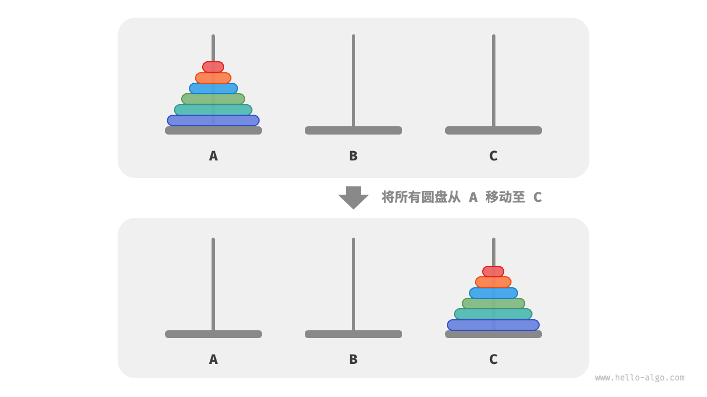
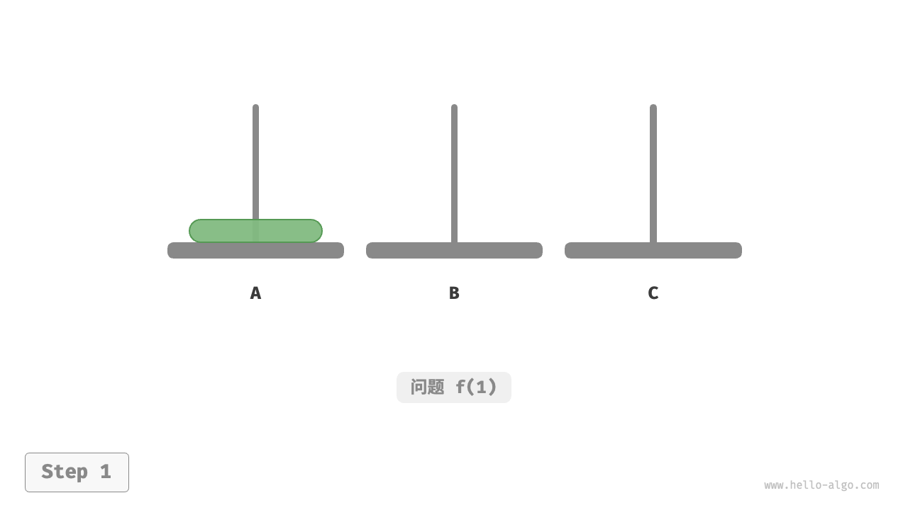
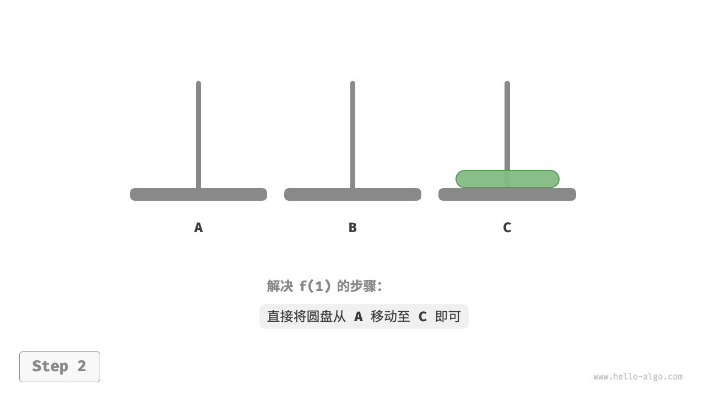
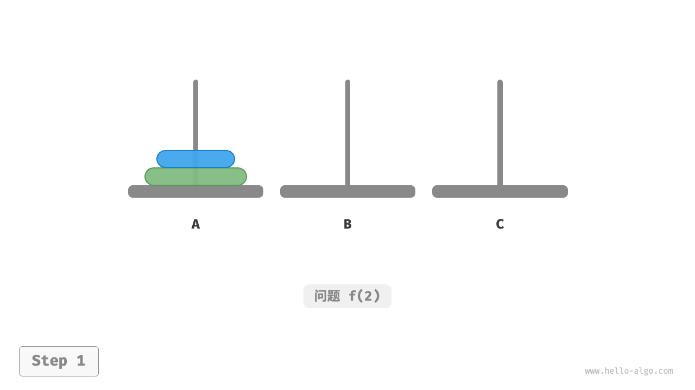
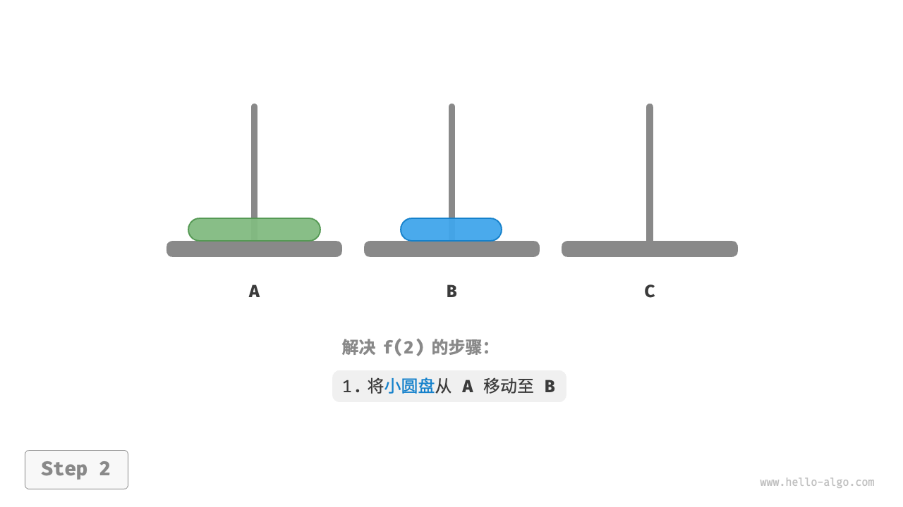
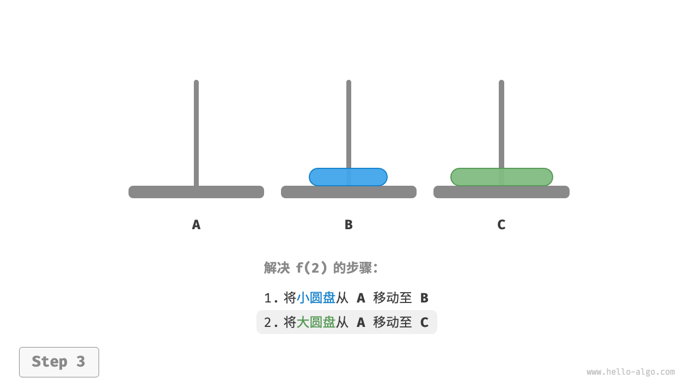
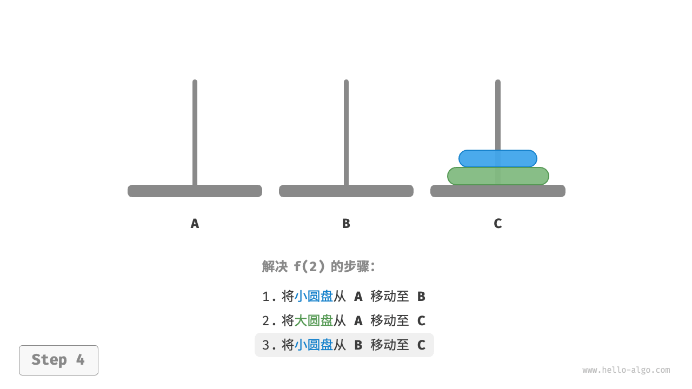
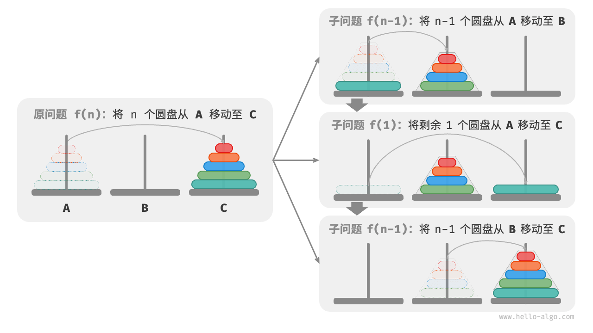
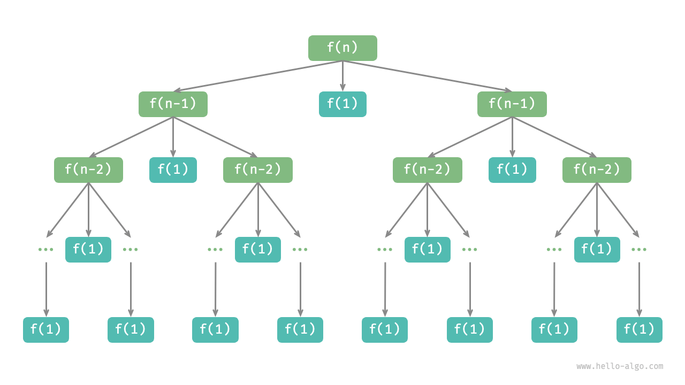

# 汉诺塔问题

在归并排序和构建二叉树中，我们将原问题分解为两个规模为原问题一半的子问题。然而，对于即将介绍的汉诺塔问题，我们采用不同的分解策略。

!!! question

    给定三根柱子，记为 `A` , `B` , `C` 。起始状态下，柱子 `A` 上套着 $n$ 个圆盘，它们从上到下按照从小到大的顺序排列。我们的任务是要把这 $n$ 个圆盘移到柱子 `C` 上，并保持它们的原有顺序不变。在移动圆盘的过程中，需要遵守以下规则：
    
    1. 圆盘只能从一个柱子顶部拿出，从另一个柱子顶部放入；
    2. 每次只能移动一个圆盘；
    3. 小圆盘必须时刻位于大圆盘之上；



在本文中，**我们将规模为 $i$ 的汉诺塔问题记做 $f(i)$** 。例如 $f(3)$ 代表将 $3$ 个圆盘从 `A` 移动至 `C` 的汉诺塔问题。

先考虑最简单的情况：对于问题 $f(1)$ ，即当只有一个圆盘时，则将它直接从 `A` 移动至 `C` 即可。

=== "<1>"
    

=== "<2>"
    

对于问题 $f(2)$ ，即当有两个圆盘时，**由于要时刻满足小圆盘在大圆盘之上，因此需要借助 `B` 来完成移动**，包括三步：

1. 先将上面的小圆盘从 `A` 移至 `B` ；
2. 再将大圆盘从 `A` 移至 `C` ；
3. 最后将小圆盘从 `B` 移至 `C` ；

如下图所示，对于小圆盘的移动，**我们称 `C` 为目标柱、`B` 为缓冲柱**。

=== "<1>"
    

=== "<2>"
    

=== "<3>"
    

=== "<4>"
    

对于问题 $f(3)$ ，即当有三个圆盘时，情况变得稍微复杂了一些。由于已知 $f(1)$ 和 $f(2)$ 的解，我们可以从分治角度思考，**将 `A` 顶部的两个圆盘看做一个整体**，并执行以下步骤：

1. 令 `B` 为目标柱、`C` 为缓冲柱，将两个圆盘从 `A` 移动至 `B` ；
2. 将 `A` 中剩余的一个圆盘从 `A` 移动至 `C` ；
3. 令 `C` 为目标柱、`A` 为缓冲柱，将两个圆盘从 `B` 移动至 `C` ；

这样三个圆盘就被顺利地从 `A` 移动至 `C` 了。

=== "<1>"
    

=== "<2>"
    

=== "<3>"
    

=== "<4>"
    

本质上看，我们将问题 $f(3)$ 划分为两个子问题 $f(2)$ 和子问题 $f(1)$。按顺序解决这三个子问题之后，原问题随之得到解决。**以上分析说明了子问题的独立性，以及解是可以合并的**。

至此，我们可总结出汉诺塔问题的分治策略：**将原问题 $f(n)$ 划分为两个子问题 $f(n-1)$ 和一个子问题 $f(1)$** 。子问题的解决顺序为：

1. 将 $n-1$ 个圆盘借助 `C` 从 `A` 移至 `B` ；
2. 将剩余 $1$ 个圆盘从 `A` 直接移至 `C` ；
3. 将 $n-1$ 个圆盘借助 `A` 从 `B` 移至 `C` ；

并且，对于这两个子问题 $f(n-1)$ ，**可以通过相同的方式进行递归划分**，直至达到最小子问题 $f(1)$ 。而 $f(1)$ 的解是已知的，只需一次移动操作即可。



在代码实现中，我们声明一个递归函数 `dfs(i, src, buf, tar)` ，它的作用是将柱 `src` 顶部的 $i$ 个圆盘借助缓冲柱 `buf` 移动至目标柱 `tar` 。

=== "Java"

    ```java title="hanota.java"
    [class]{hanota}-[func]{move}

    [class]{hanota}-[func]{dfs}

    [class]{hanota}-[func]{hanota}
    ```

=== "C++"

    ```cpp title="hanota.cpp"
    [class]{}-[func]{move}

    [class]{}-[func]{dfs}

    [class]{}-[func]{hanota}
    ```

=== "Python"

    ```python title="hanota.py"
    [class]{}-[func]{move}

    [class]{}-[func]{dfs}

    [class]{}-[func]{hanota}
    ```

=== "Go"

    ```go title="hanota.go"
    [class]{}-[func]{move}

    [class]{}-[func]{dfs}

    [class]{}-[func]{hanota}
    ```

=== "JavaScript"

    ```javascript title="hanota.js"
    [class]{}-[func]{move}

    [class]{}-[func]{dfs}

    [class]{}-[func]{hanota}
    ```

=== "TypeScript"

    ```typescript title="hanota.ts"
    [class]{}-[func]{move}

    [class]{}-[func]{dfs}

    [class]{}-[func]{hanota}
    ```

=== "C"

    ```c title="hanota.c"
    [class]{}-[func]{move}

    [class]{}-[func]{dfs}

    [class]{}-[func]{hanota}
    ```

=== "C#"

    ```csharp title="hanota.cs"
    [class]{hanota}-[func]{move}

    [class]{hanota}-[func]{dfs}

    [class]{hanota}-[func]{hanota}
    ```

=== "Swift"

    ```swift title="hanota.swift"
    [class]{}-[func]{move}

    [class]{}-[func]{dfs}

    [class]{}-[func]{hanota}
    ```

=== "Zig"

    ```zig title="hanota.zig"
    [class]{}-[func]{move}

    [class]{}-[func]{dfs}

    [class]{}-[func]{hanota}
    ```

=== "Dart"

    ```dart title="hanota.dart"
    [class]{}-[func]{move}

    [class]{}-[func]{dfs}

    [class]{}-[func]{hanota}
    ```

如下图所示，汉诺塔问题形成一个高度为 $n$ 的递归树，每个节点代表一个子问题、对应一个开启的 `dfs()` 函数，**因此时间复杂度为 $O(2^n)$ ，空间复杂度为 $O(n)$** 。



有趣的是，汉诺塔问题源自一种古老的传说故事。在古印度的一个寺庙里，僧侣们有三根高大的钻石柱子，以及 $64$ 个大小不一的金圆盘。僧侣们不断地移动原盘，他们相信在最后一个圆盘被正确放置的那一刻，这个世界就会结束。

然而根据以上分析，即使僧侣们每秒钟移动一次，总共需要大约 $2^{64} \approx 1.84×10^{19}$ 秒，合约 $5850$ 亿年，远远超过了现在对宇宙年龄的估计。所以，倘若这个传说是真的，我们应该不需要担心世界末日的到来。
