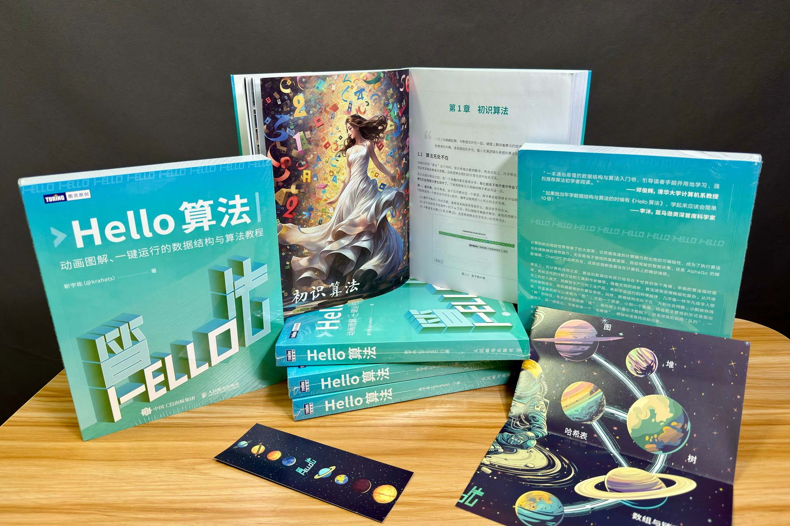
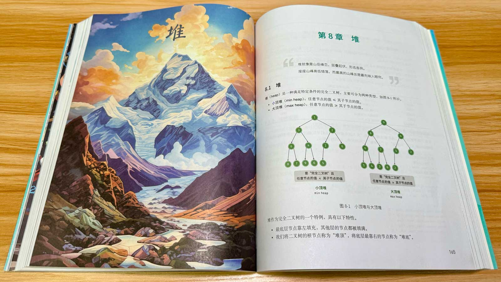
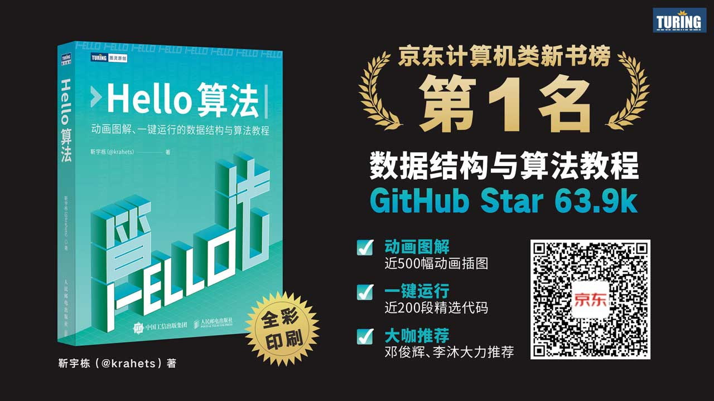

# 纸质书介绍

经过长时间的打磨，《Hello 算法》纸质书终于发布了！此时的心情可以用一句诗来形容：

追风赶月莫停留，平芜尽处是春山。

{ class="animation-figure" }

以下视频展示了纸质书，并且包含我的一些思考：

- 学习数据结构与算法的重要性。
- 为什么在纸质书中选择 Python。
- 对知识分享的理解。

> 新人 UP 主，请多多关照、一键三连～谢谢！

    <iframe src="//player.bilibili.com/player.html?aid=1051597767&bvid=BV1QH4y157uC&cid=1462564112&p=1&autoplay=0" scrolling="no" border="0" frameborder="no" framespacing="0" allowfullscreen="true"> </iframe>

附纸质书快照：

{ class="animation-figure" }

{ class="animation-figure" }

## 优势与不足

总结一下纸质书可能会给大家带来惊喜的地方：

- 采用全彩印刷，能够原汁原味地发挥出本书“动画图解”的优势。
- 考究纸张材质，既保证色彩高度还原，也保留纸质书特有的质感。
- 在不提升定价的前提下，附赠思维导图折页、书签。
- 纸质书、网页版、PDF 版内容同步，随意切换阅读。

!!! tip

    由于纸质书和网页版的同步成本较大，因此可能会有一些细节上的不同，请您见谅！

当然，纸质书也有一些值得大家入手前考虑的地方：

- 使用 Python 语言，可能不匹配你的主语言（也许可以趁此机会练习 Python）。
- 全彩印刷虽然大幅提升了阅读体验，但价格会比黑白印刷高一些。

!!! tip

    “印刷质量”和“价格”就像算法中的“时间效率”和“空间效率”，难以两全。而我认为，“印刷质量”对应的是“时间效率”，更应该被注重。

## 购买链接

如果你对纸质书感兴趣，可以考虑入手一本。我们为大家争取到了新书 5 折优惠，请见[此链接](https://3.cn/-1Wwj1jq)或扫描以下二维码：

{ class="animation-figure" }

## 尾记

起初，我低估了纸质书出版的工作量，以为只要维护好了开源项目，纸质版就可以通过某些自动化手段生成出来。实践证明，纸质书的生产流程与开源项目的更新机制存在很大的不同，两者之间的转化需要做许多额外工作。

一本书的初稿与达到出版标准的定稿之间仍有较长距离，需要出版社（策划、编辑、设计、市场等）与作者的通力合作、长期雕琢。在此，在此感谢图灵策划编辑王军花、以及人民邮电出版社和图灵社区每位参与本书出版流程的工作人员！

希望这本书能够帮助到你！
