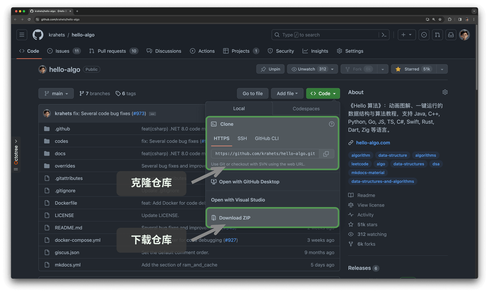

# 如何使用本书

!!! tip

    为了获得最佳的阅读体验，建议您通读本节内容。

## 行文风格约定

- 标题后标注 `*` 的是选读章节，内容相对困难。如果你的时间有限，建议可以先跳过。
- 专有名词和有特指含义的词句会使用 `“双引号”` 标注，以避免歧义。
- 重要专有名词及其英文翻译会用 `「 」` 括号标注，例如 `「数组 array」` 。建议记住它们，以便阅读文献。
- **加粗的文字** 表示重点内容或总结性语句，这类文字值得特别关注。
- 当涉及到编程语言之间不一致的名词时，本书均以 Python 为准，例如使用 $\text{None}$ 来表示“空”。
- 本书部分放弃了编程语言的注释规范，以换取更加紧凑的内容排版。注释主要分为三种类型：标题注释、内容注释、多行注释。

Python

```python
    """标题注释，用于标注函数、类、测试样例等"""
    
    # 内容注释，用于详解代码
    
    """
    多行
    注释
    """
```


Java

```java
    /* 标题注释，用于标注函数、类、测试样例等 */
    
    // 内容注释，用于详解代码
    
    /**
     * 多行
     * 注释
     */
```


## 在动画图解中高效学习

相较于文字，视频和图片具有更高的信息密度和结构化程度，更易于理解。在本书中，**重点和难点知识将主要通过动画和图解形式展示**，而文字则作为动画和图片的解释与补充。

如果你在阅读本书时，发现某段内容提供了下图所示的动画或图解，**请以图为主、以文字为辅**，综合两者来理解内容。


## 在代码实践中加深理解

本书的配套代码被托管在 [GitHub 仓库](https://github.com/krahets/hello-algo)。如下图所示，**源代码附有测试样例，可一键运行**。

如果时间允许，**建议你参照代码自行敲一遍**。如果学习时间有限，请至少通读并运行所有代码。

与阅读代码相比，编写代码的过程往往能带来更多收获。**动手学，才是真的学**。


运行代码的前置工作主要分为三步。

**第一步：安装本地编程环境**。请参照[附录教程](https://www.hello-algo.com/chapter_appendix/installation/)进行安装，如果已安装则可跳过此步骤。

**第二步：克隆或下载代码仓**。如果已经安装 [Git](https://git-scm.com/downloads) ，可以通过以下命令克隆本仓库。

```shell
git clone https://github.com/krahets/hello-algo.git
```

当然，你也可以在下图所示的位置，点击“Download ZIP”直接下载代码压缩包，然后在本地解压即可。



**第三步：运行源代码**。如下图所示，对于顶部标有文件名称的代码块，我们可以在仓库的 `codes` 文件夹内找到对应的源代码文件。源代码文件可一键运行，将帮助你节省不必要的调试时间，让你能够专注于学习内容。


## 在提问讨论中共同成长

在阅读本书时，请不要轻易跳过那些没学明白的知识点。**欢迎在评论区提出你的问题**，我和小伙伴们将竭诚为你解答，一般情况下可在两天内回复。

如下图所示，每篇文章的底部都配有评论区。希望你能多关注评论区的内容。一方面，你可以了解大家遇到的问题，从而查漏补缺，激发更深入的思考。另一方面，期待你能慷慨地回答其他小伙伴的问题，分享您的见解，帮助他人进步。


## 算法学习路线

从总体上看，我们可以将学习数据结构与算法的过程划分为三个阶段。

1. **算法入门**。我们需要熟悉各种数据结构的特点和用法，学习不同算法的原理、流程、用途和效率等方面内容。
2. **刷算法题**。建议从热门题目开刷，如[剑指 Offer](https://leetcode.cn/studyplan/coding-interviews/)和[LeetCode Hot 100](https://leetcode.cn/studyplan/top-100-liked/)，先积累至少 100 道题目，熟悉主流的算法问题。初次刷题时，“知识遗忘”可能是一个挑战，但请放心，这是很正常的。我们可以按照“艾宾浩斯遗忘曲线”来复习题目，通常在进行 3-5 轮的重复后，就能将其牢记在心。
3. **搭建知识体系**。在学习方面，我们可以阅读算法专栏文章、解题框架和算法教材，以不断丰富知识体系。在刷题方面，可以尝试采用进阶刷题策略，如按专题分类、一题多解、一解多题等，相关的刷题心得可以在各个社区找到。

如下图所示，本书内容主要涵盖“第一阶段”，旨在帮助你更高效地展开第二和第三阶段的学习。


-----------------------------------------------------------------

