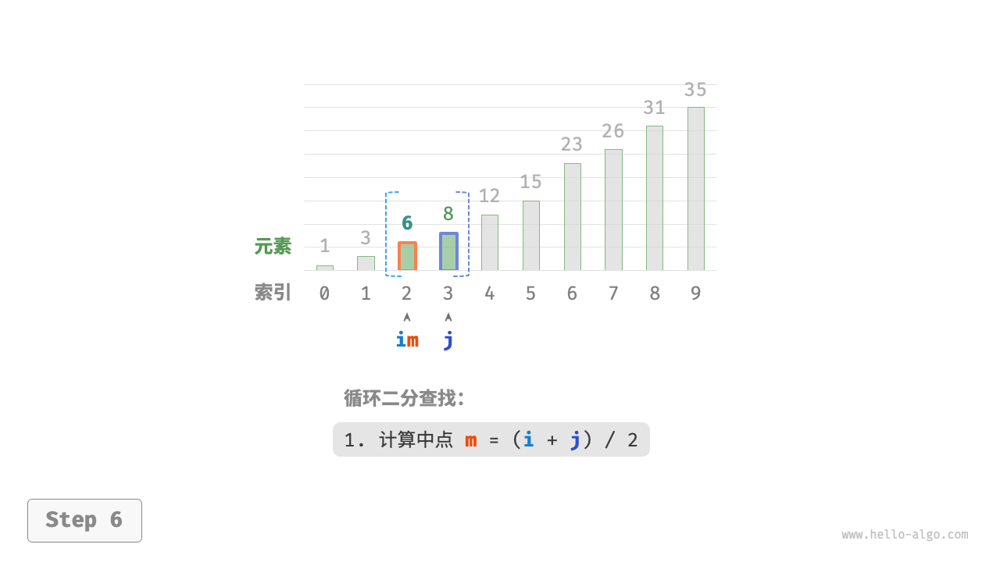
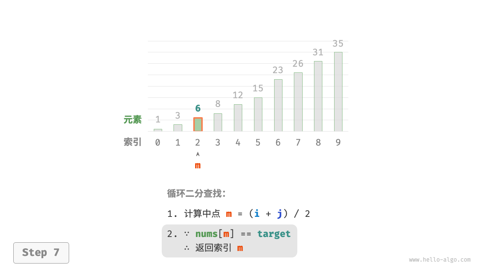

# 10.2. 二分查找

「二分查找 Binary Search」利用数据的有序性，通过每轮缩小一半搜索区间来查找目标元素。

使用二分查找有两个前置条件：

- **要求输入数据是有序的**，这样才能通过判断大小关系来排除一半的搜索区间；
- **二分查找仅适用于数组**，而在链表中使用效率很低，因为其在循环中需要跳跃式（非连续地）访问元素。

## 10.2.1. 算法实现

给定一个长度为 $n$ 的排序数组 `nums` ，元素从小到大排列。数组的索引取值范围为

$$
0, 1, 2, \cdots, n-1
$$

使用「区间」来表示这个取值范围的方法主要有两种：

1. **双闭区间 $[0, n-1]$** ，即两个边界都包含自身；此方法下，区间 $[0, 0]$ 仍包含一个元素；
2. **左闭右开 $[0, n)$** ，即左边界包含自身、右边界不包含自身；此方法下，区间 $[0, 0)$ 为空；

### “双闭区间”实现

首先，我们先采用“双闭区间”的表示，在数组 `nums` 中查找目标元素 `target` 的对应索引。

=== "Step 1"
    

=== "Step 2"
    

=== "Step 3"
    

=== "Step 4"
    

=== "Step 5"
    

=== "Step 6"
    

=== "Step 7"
    

二分查找“双闭区间”表示下的代码如下所示。

=== "Java"

    ```java title="binary_search.java"
    [class]{binary_search}-[func]{binarySearch}
    ```

=== "C++"

    ```cpp title="binary_search.cpp"
    [class]{}-[func]{binarySearch}
    ```

=== "Python"

    ```python title="binary_search.py"
    [class]{}-[func]{binary_search}
    ```

=== "Go"

    ```go title="binary_search.go"
    [class]{}-[func]{binarySearch}
    ```

=== "JavaScript"

    ```javascript title="binary_search.js"
    [class]{}-[func]{binarySearch}
    ```

=== "TypeScript"

    ```typescript title="binary_search.ts"
    [class]{}-[func]{binarySearch}
    ```

=== "C"

    ```c title="binary_search.c"

    ```

=== "C#"

    ```csharp title="binary_search.cs"
    [class]{binary_search}-[func]{binarySearch}
    ```

=== "Swift"

    ```swift title="binary_search.swift"
    [class]{}-[func]{binarySearch}
    ```

=== "Zig"

    ```zig title="binary_search.zig"

    ```

### “左闭右开”实现

当然，我们也可以使用“左闭右开”的表示方法，写出相同功能的二分查找代码。

=== "Java"

    ```java title="binary_search.java"
    [class]{binary_search}-[func]{binarySearch1}
    ```

=== "C++"

    ```cpp title="binary_search.cpp"
    [class]{}-[func]{binarySearch1}
    ```

=== "Python"

    ```python title="binary_search.py"
    [class]{}-[func]{binary_search1}
    ```

=== "Go"

    ```go title="binary_search.go"
    [class]{}-[func]{binarySearch1}
    ```

=== "JavaScript"

    ```javascript title="binary_search.js"
    [class]{}-[func]{binarySearch1}
    ```

=== "TypeScript"

    ```typescript title="binary_search.ts"
    [class]{}-[func]{binarySearch1}
    ```

=== "C"

    ```c title="binary_search.c"

    ```

=== "C#"

    ```csharp title="binary_search.cs"
    [class]{binary_search}-[func]{binarySearch1}
    ```

=== "Swift"

    ```swift title="binary_search.swift"
    [class]{}-[func]{binarySearch1}
    ```

=== "Zig"

    ```zig title="binary_search.zig"

    ```

### 两种表示对比

对比下来，两种表示的代码写法有以下不同点：

<div class="center-table" markdown>

| 表示方法            | 初始化指针          | 缩小区间                  | 循环终止条件 |
| ------------------- | ------------------- | ------------------------- | ------------ |
| 双闭区间 $[0, n-1]$ | $i = 0$ , $j = n-1$ | $i = m + 1$ , $j = m - 1$ | $i > j$      |
| 左闭右开 $[0, n)$   | $i = 0$ , $j = n$   | $i = m + 1$ , $j = m$     | $i = j$      |

</div>

观察发现，在“双闭区间”表示中，由于对左右两边界的定义是相同的，因此缩小区间的 $i$ , $j$ 处理方法也是对称的，这样更不容易出错。综上所述，**建议你采用“双闭区间”的写法。**

### 大数越界处理

当数组长度很大时，加法 $i + j$ 的结果有可能会超出 `int` 类型的取值范围。在此情况下，我们需要换一种计算中点的写法。

=== "Java"

    ```java title=""
    // (i + j) 有可能超出 int 的取值范围
    int m = (i + j) / 2;
    // 更换为此写法则不会越界
    int m = i + (j - i) / 2;
    ```

=== "C++"

    ```cpp title=""
    // (i + j) 有可能超出 int 的取值范围
    int m = (i + j) / 2;
    // 更换为此写法则不会越界
    int m = i + (j - i) / 2;
    ```

=== "Python"

    ```py title=""
    # Python 中的数字理论上可以无限大（取决于内存大小）
    # 因此无需考虑大数越界问题
    ```

=== "Go"

    ```go title=""
    // (i + j) 有可能超出 int 的取值范围
    m := (i + j) / 2
    // 更换为此写法则不会越界
    m := i + (j - i) / 2
    ```

=== "JavaScript"

    ```javascript title=""
    // (i + j) 有可能超出 int 的取值范围
    let m = parseInt((i + j) / 2);
    // 更换为此写法则不会越界
    let m = parseInt(i + (j - i) / 2);
    ```

=== "TypeScript"

    ```typescript title=""
    // (i + j) 有可能超出 Number 的取值范围
    let m = Math.floor((i + j) / 2);
    // 更换为此写法则不会越界
    let m = Math.floor(i + (j - i) / 2);
    ```

=== "C"

    ```c title=""

    ```

=== "C#"

    ```csharp title=""
    // (i + j) 有可能超出 int 的取值范围
    int m = (i + j) / 2;
    // 更换为此写法则不会越界
    int m = i + (j - i) / 2;
    ```

=== "Swift"

    ```swift title=""
    // (i + j) 有可能超出 int 的取值范围
    let m = (i + j) / 2
    // 更换为此写法则不会越界
    let m = i + (j - 1) / 2
    ```

=== "Zig"

    ```zig title=""

    ```

## 10.2.2. 复杂度分析

**时间复杂度 $O(\log n)$** ：其中 $n$ 为数组或链表长度；每轮排除一半的区间，因此循环轮数为 $\log_2 n$ ，使用 $O(\log n)$ 时间。

**空间复杂度 $O(1)$** ：指针 `i` , `j` 使用常数大小空间。

## 10.2.3. 优点与缺点

二分查找效率很高，体现在：

- **二分查找时间复杂度低**。对数阶在数据量很大时具有巨大优势，例如，当数据大小 $n = 2^{20}$ 时，线性查找需要 $2^{20} = 1048576$ 轮循环，而二分查找仅需要 $\log_2 2^{20} = 20$ 轮循环。
- **二分查找不需要额外空间**。相对于借助额外数据结构来实现查找的算法来说，其更加节约空间使用。

但并不意味着所有情况下都应使用二分查找，这是因为：

- **二分查找仅适用于有序数据**。如果输入数据是无序的，为了使用二分查找而专门执行数据排序，那么是得不偿失的，因为排序算法的时间复杂度一般为 $O(n \log n)$ ，比线性查找和二分查找都更差。再例如，对于频繁插入元素的场景，为了保持数组的有序性，需要将元素插入到特定位置，时间复杂度为 $O(n)$ ，也是非常昂贵的。
- **二分查找仅适用于数组**。由于在二分查找中，访问索引是 “非连续” 的，因此链表或者基于链表实现的数据结构都无法使用。
- **在小数据量下，线性查找的性能更好**。在线性查找中，每轮只需要 1 次判断操作；而在二分查找中，需要 1 次加法、1 次除法、1 ~ 3 次判断操作、1 次加法（减法），共 4 ~ 6 个单元操作；因此，在数据量 $n$ 较小时，线性查找反而比二分查找更快。
