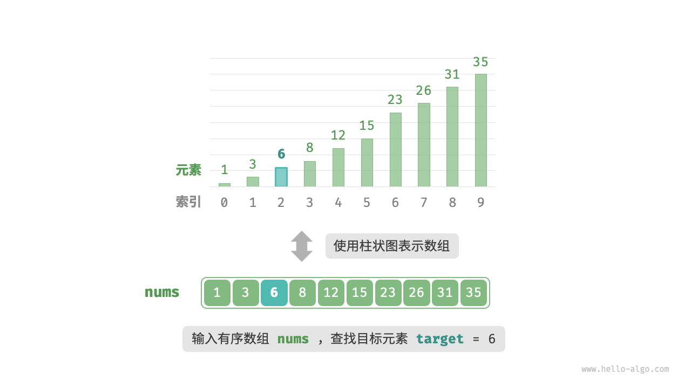
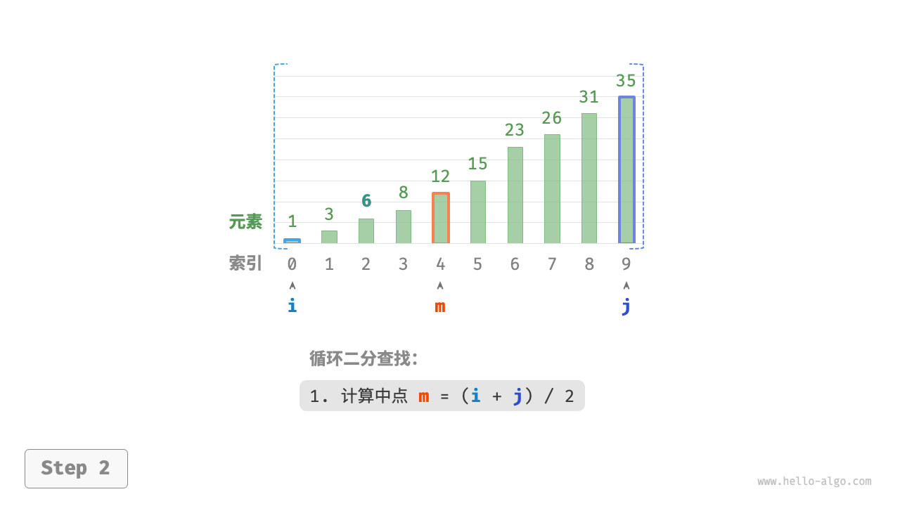

# 二分查找

「二分查找 binary search」是一种基于分治策略的高效搜索算法。它利用数据的有序性，每轮减少一半搜索范围，直至找到目标元素或搜索区间为空为止。

!!! question

    给定一个长度为 $n$ 的数组 `nums` ，元素按从小到大的顺序排列，数组不包含重复元素。请查找并返回元素 `target` 在该数组中的索引。若数组不包含该元素，则返回 $-1$ 。



如下图所示，我们先初始化指针 $i = 0$ 和 $j = n - 1$ ，分别指向数组首元素和尾元素，代表搜索区间 $[0, n - 1]$ 。请注意，中括号表示闭区间，其包含边界值本身。

接下来，循环执行以下两步。

1. 计算中点索引 $m = \lfloor {(i + j) / 2} \rfloor$ ，其中 $\lfloor \: \rfloor$ 表示向下取整操作。
2. 判断 `nums[m]` 和 `target` 的大小关系，分为以下三种情况。
    1. 当 `nums[m] < target` 时，说明 `target` 在区间 $[m + 1, j]$ 中，因此执行 $i = m + 1$ 。
    2. 当 `nums[m] > target` 时，说明 `target` 在区间 $[i, m - 1]$ 中，因此执行 $j = m - 1$ 。
    3. 当 `nums[m] = target` 时，说明找到 `target` ，因此返回索引 $m$ 。

若数组不包含目标元素，搜索区间最终会缩小为空。此时返回 $-1$ 。

=== "<1>"
    

=== "<2>"
    

=== "<3>"
    

=== "<4>"
    

=== "<5>"
    

=== "<6>"
    

=== "<7>"
    

值得注意的是，由于 $i$ 和 $j$ 都是 `int` 类型，**因此 $i + j$ 可能会超出 `int` 类型的取值范围**。为了避免大数越界，我们通常采用公式 $m = \lfloor {i + (j - i) / 2} \rfloor$ 来计算中点。

```src
[file]{binary_search}-[class]{}-[func]{binary_search}
```

**时间复杂度 $O(\log n)$** ：在二分循环中，区间每轮缩小一半，循环次数为 $\log_2 n$ 。

**空间复杂度 $O(1)$** ：指针 $i$ 和 $j$ 使用常数大小空间。

## 区间表示方法

除了上述的双闭区间外，常见的区间表示还有“左闭右开”区间，定义为 $[0, n)$ ，即左边界包含自身，右边界不包含自身。在该表示下，区间 $[i, j]$ 在 $i = j$ 时为空。

我们可以基于该表示实现具有相同功能的二分查找算法。

```src
[file]{binary_search}-[class]{}-[func]{binary_search_lcro}
```

如下图所示，在两种区间表示下，二分查找算法的初始化、循环条件和缩小区间操作皆有所不同。

由于“双闭区间”表示中的左右边界都被定义为闭区间，因此指针 $i$ 和 $j$ 缩小区间操作也是对称的。这样更不容易出错，**因此一般建议采用“双闭区间”的写法**。


## 优点与局限性

二分查找在时间和空间方面都有较好的性能。

- 二分查找的时间效率高。在大数据量下，对数阶的时间复杂度具有显著优势。例如，当数据大小 $n = 2^{20}$ 时，线性查找需要 $2^{20} = 1048576$ 轮循环，而二分查找仅需 $\log_2 2^{20} = 20$ 轮循环。
- 二分查找无须额外空间。相较于需要借助额外空间的搜索算法（例如哈希查找），二分查找更加节省空间。

然而，二分查找并非适用于所有情况，主要有以下原因。

- 二分查找仅适用于有序数据。若输入数据无序，为了使用二分查找而专门进行排序，得不偿失。因为排序算法的时间复杂度通常为 $O(n \log n)$ ，比线性查找和二分查找都更高。对于频繁插入元素的场景，为保持数组有序性，需要将元素插入到特定位置，时间复杂度为 $O(n)$ ，也是非常昂贵的。
- 二分查找仅适用于数组。二分查找需要跳跃式（非连续地）访问元素，而在链表中执行跳跃式访问的效率较低，因此不适合应用在链表或基于链表实现的数据结构。
- 小数据量下，线性查找性能更佳。在线性查找中，每轮只需要 1 次判断操作；而在二分查找中，需要 1 次加法、1 次除法、1 ~ 3 次判断操作、1 次加法（减法），共 4 ~ 6 个单元操作；因此，当数据量 $n$ 较小时，线性查找反而比二分查找更快。


-----------------------------------------------------------------

## BINARY_SEARCH
Python: `binary_search.py`
```python


def binary_search(nums: list[int], target: int) -> int:
    """二分查找（双闭区间）"""
    # 初始化双闭区间 [0, n-1] ，即 i, j 分别指向数组首元素、尾元素
    i, j = 0, len(nums) - 1
    # 循环，当搜索区间为空时跳出（当 i > j 时为空）
    while i <= j:
        # 理论上 Python 的数字可以无限大（取决于内存大小），无须考虑大数越界问题
        m = (i + j) // 2  # 计算中点索引 m
        if nums[m] < target:
            i = m + 1  # 此情况说明 target 在区间 [m+1, j] 中
        elif nums[m] > target:
            j = m - 1  # 此情况说明 target 在区间 [i, m-1] 中
        else:
            return m  # 找到目标元素，返回其索引
    return -1  # 未找到目标元素，返回 -1


def binary_search_lcro(nums: list[int], target: int) -> int:
    """二分查找（左闭右开）"""
    # 初始化左闭右开 [0, n) ，即 i, j 分别指向数组首元素、尾元素+1
    i, j = 0, len(nums)
    # 循环，当搜索区间为空时跳出（当 i = j 时为空）
    while i < j:
        m = (i + j) // 2  # 计算中点索引 m
        if nums[m] < target:
            i = m + 1  # 此情况说明 target 在区间 [m+1, j) 中
        elif nums[m] > target:
            j = m  # 此情况说明 target 在区间 [i, m) 中
        else:
            return m  # 找到目标元素，返回其索引
    return -1  # 未找到目标元素，返回 -1


"""Driver Code"""
if __name__ == "__main__":
    target = 6
    nums = [1, 3, 6, 8, 12, 15, 23, 26, 31, 35]

    # 二分查找（双闭区间）
    index: int = binary_search(nums, target)
    print("目标元素 6 的索引 = ", index)

    # 二分查找（左闭右开）
    index: int = binary_search_lcro(nums, target)
    print("目标元素 6 的索引 = ", index)
```

Java: `binary_search.java`
```java

package chapter_searching;

public class binary_search {
    /* 二分查找（双闭区间） */
    static int binarySearch(int[] nums, int target) {
        // 初始化双闭区间 [0, n-1] ，即 i, j 分别指向数组首元素、尾元素
        int i = 0, j = nums.length - 1;
        // 循环，当搜索区间为空时跳出（当 i > j 时为空）
        while (i <= j) {
            int m = i + (j - i) / 2; // 计算中点索引 m
            if (nums[m] < target) // 此情况说明 target 在区间 [m+1, j] 中
                i = m + 1;
            else if (nums[m] > target) // 此情况说明 target 在区间 [i, m-1] 中
                j = m - 1;
            else // 找到目标元素，返回其索引
                return m;
        }
        // 未找到目标元素，返回 -1
        return -1;
    }

    /* 二分查找（左闭右开） */
    static int binarySearchLCRO(int[] nums, int target) {
        // 初始化左闭右开 [0, n) ，即 i, j 分别指向数组首元素、尾元素+1
        int i = 0, j = nums.length;
        // 循环，当搜索区间为空时跳出（当 i = j 时为空）
        while (i < j) {
            int m = i + (j - i) / 2; // 计算中点索引 m
            if (nums[m] < target) // 此情况说明 target 在区间 [m+1, j) 中
                i = m + 1;
            else if (nums[m] > target) // 此情况说明 target 在区间 [i, m) 中
                j = m;
            else // 找到目标元素，返回其索引
                return m;
        }
        // 未找到目标元素，返回 -1
        return -1;
    }

    public static void main(String[] args) {
        int target = 6;
        int[] nums = { 1, 3, 6, 8, 12, 15, 23, 26, 31, 35 };

        /* 二分查找（双闭区间） */
        int index = binarySearch(nums, target);
        System.out.println("目标元素 6 的索引 = " + index);

        /* 二分查找（左闭右开） */
        index = binarySearchLCRO(nums, target);
        System.out.println("目标元素 6 的索引 = " + index);
    }
}
```


-----------------------------------------------------------------

