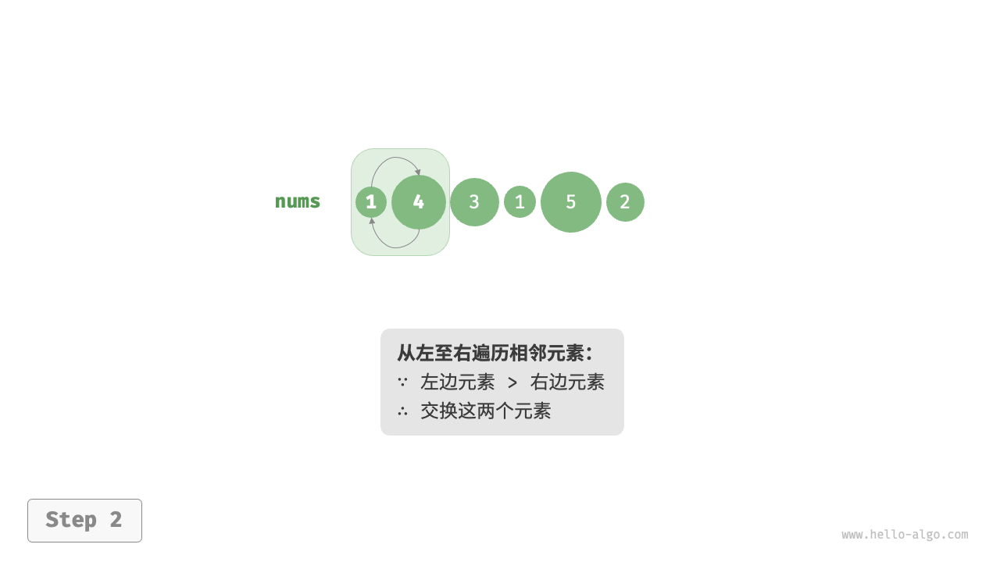
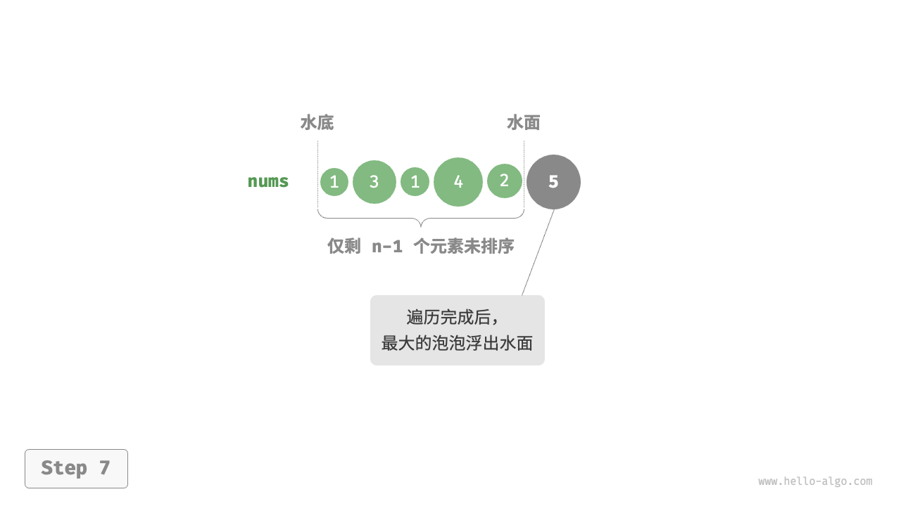

# 11.2. 冒泡排序

「冒泡排序 Bubble Sort」是一种最基础的排序算法，非常适合作为第一个学习的排序算法。顾名思义，「冒泡」是该算法的核心操作。

!!! question "为什么叫“冒泡”"

    在水中，越大的泡泡浮力越大，所以最大的泡泡会最先浮到水面。

「冒泡」操作则是在模拟上述过程，具体做法为：从数组最左端开始向右遍历，依次对比相邻元素大小，若 **左元素 > 右元素** 则将它俩交换，最终可将最大元素移动至数组最右端。

完成此次冒泡操作后，**数组最大元素已在正确位置，接下来只需排序剩余 $n - 1$ 个元素**。

=== "Step 1"
    

=== "Step 2"
    

=== "Step 3"
    

=== "Step 4"
    

=== "Step 5"
    

=== "Step 6"
    

=== "Step 7"
    

<p align="center"> Fig. 冒泡操作 </p>

## 11.2.1. 算法流程

1. 设数组长度为 $n$ ，完成第一轮「冒泡」后，数组最大元素已在正确位置，接下来只需排序剩余 $n - 1$ 个元素。
2. 同理，对剩余 $n - 1$ 个元素执行「冒泡」，可将第二大元素交换至正确位置，因而待排序元素只剩 $n - 2$ 个。
3. 以此类推…… **循环 $n - 1$ 轮「冒泡」，即可完成整个数组的排序**。


<p align="center"> Fig. 冒泡排序流程 </p>

=== "Java"

    ```java title="bubble_sort.java"
    [class]{bubble_sort}-[func]{bubbleSort}
    ```

=== "C++"

    ```cpp title="bubble_sort.cpp"
    [class]{}-[func]{bubbleSort}
    ```

=== "Python"

    ```python title="bubble_sort.py"
    [class]{}-[func]{bubble_sort}
    ```

=== "Go"

    ```go title="bubble_sort.go"
    /* 冒泡排序 */
    func bubbleSort(nums []int) {
        // 外循环：待排序元素数量为 n-1, n-2, ..., 1
        for i := len(nums) - 1; i > 0; i-- {
            // 内循环：冒泡操作
            for j := 0; j < i; j++ {
                if nums[j] > nums[j+1] {
                    // 交换 nums[j] 与 nums[j + 1]
                    nums[j], nums[j+1] = nums[j+1], nums[j]
                }
            }
        }
    }
    ```

=== "JavaScript"

    ```javascript title="bubble_sort.js"
    /* 冒泡排序 */
    function bubbleSort(nums) {
        // 外循环：待排序元素数量为 n-1, n-2, ..., 1
        for (let i = nums.length - 1; i > 0; i--) {
            // 内循环：冒泡操作
            for (let j = 0; j < i; j++) {
                if (nums[j] > nums[j + 1]) {
                    // 交换 nums[j] 与 nums[j + 1]
                    let tmp = nums[j];
                    nums[j] = nums[j + 1];
                    nums[j + 1] = tmp;
                }
            }
        }
    }
    ```

=== "TypeScript"

    ```typescript title="bubble_sort.ts"
    /* 冒泡排序 */
    function bubbleSort(nums: number[]): void {
        // 外循环：待排序元素数量为 n-1, n-2, ..., 1
        for (let i = nums.length - 1; i > 0; i--) {
            // 内循环：冒泡操作
            for (let j = 0; j < i; j++) {
                if (nums[j] > nums[j + 1]) {
                    // 交换 nums[j] 与 nums[j + 1]
                    let tmp = nums[j];
                    nums[j] = nums[j + 1];
                    nums[j + 1] = tmp;
                }
            }
        }
    }
    ```

=== "C"

    ```c title="bubble_sort.c"
    /* 冒泡排序 */
    void bubbleSort(int nums[], int size) {
        // 外循环：待排序元素数量为 n-1, n-2, ..., 1
        for (int i = 0; i < size - 1; i++)
        {
            // 内循环：冒泡操作
            for (int j = 0; j < size - 1 - i; j++)
            {
                if (nums[j] > nums[j + 1])
                {
                    int temp = nums[j];
                    nums[j] = nums[j + 1];
                    nums[j + 1] = temp;
                }
            }
        }
    }
    ```

=== "C#"

    ```csharp title="bubble_sort.cs"
    /* 冒泡排序 */
    void bubbleSort(int[] nums)
    {
        // 外循环：待排序元素数量为 n-1, n-2, ..., 1
        for (int i = nums.Length - 1; i > 0; i--)
        {
            // 内循环：冒泡操作
            for (int j = 0; j < i; j++)
            {
                if (nums[j] > nums[j + 1])
                {
                    // 交换 nums[j] 与 nums[j + 1]
                    int tmp = nums[j];
                    nums[j] = nums[j + 1];
                    nums[j + 1] = tmp;
                }
            }
        }
    }
    ```

=== "Swift"

    ```swift title="bubble_sort.swift"
    /* 冒泡排序 */
    func bubbleSort(nums: inout [Int]) {
        // 外循环：待排序元素数量为 n-1, n-2, ..., 1
        for i in stride(from: nums.count - 1, to: 0, by: -1) {
            // 内循环：冒泡操作
            for j in stride(from: 0, to: i, by: 1) {
                if nums[j] > nums[j + 1] {
                    // 交换 nums[j] 与 nums[j + 1]
                    let tmp = nums[j]
                    nums[j] = nums[j + 1]
                    nums[j + 1] = tmp
                }
            }
        }
    }
    ```

=== "Zig"

    ```zig title="bubble_sort.zig"

    ```

## 11.2.2. 算法特性

**时间复杂度 $O(n^2)$** ：各轮「冒泡」遍历的数组长度为 $n - 1$ , $n - 2$ , $\cdots$ , $2$ , $1$ 次，求和为 $\frac{(n - 1) n}{2}$ ，因此使用 $O(n^2)$ 时间。

**空间复杂度 $O(1)$** ：指针 $i$ , $j$ 使用常数大小的额外空间。

**原地排序**：指针变量仅使用常数大小额外空间。

**稳定排序**：不交换相等元素。

**自适应排序**：引入 `flag` 优化后（见下文），最佳时间复杂度为 $O(N)$ 。

## 11.2.3. 效率优化

我们发现，若在某轮「冒泡」中未执行任何交换操作，则说明数组已经完成排序，可直接返回结果。考虑可以增加一个标志位 `flag` 来监听该情况，若出现则直接返回。

优化后，冒泡排序的最差和平均时间复杂度仍为 $O(n^2)$ ；而在输入数组 **已排序** 时，达到 **最佳时间复杂度** $O(n)$ 。 

=== "Java"

    ```java title="bubble_sort.java"
    [class]{bubble_sort}-[func]{bubbleSortWithFlag}
    ```

=== "C++"

    ```cpp title="bubble_sort.cpp"
    [class]{}-[func]{bubbleSortWithFlag}
    ```

=== "Python"

    ```python title="bubble_sort.py"
    [class]{}-[func]{bubble_sort_with_flag}
    ```

=== "Go"

    ```go title="bubble_sort.go"
    /* 冒泡排序（标志优化）*/
    func bubbleSortWithFlag(nums []int) {
        // 外循环：待排序元素数量为 n-1, n-2, ..., 1
        for i := len(nums) - 1; i > 0; i-- {
            flag := false // 初始化标志位
            // 内循环：冒泡操作
            for j := 0; j < i; j++ {
                if nums[j] > nums[j+1] {
                    // 交换 nums[j] 与 nums[j + 1]
                    nums[j], nums[j+1] = nums[j+1], nums[j]
                    flag = true // 记录交换元素
                }
            }
            if flag == false { // 此轮冒泡未交换任何元素，直接跳出
                break
            }
        }
    }
    ```

=== "JavaScript"

    ```javascript title="bubble_sort.js"
    /* 冒泡排序（标志优化）*/
    function bubbleSortWithFlag(nums) {
        // 外循环：待排序元素数量为 n-1, n-2, ..., 1
        for (let i = nums.length - 1; i > 0; i--) {
            let flag = false; // 初始化标志位
            // 内循环：冒泡操作
            for (let j = 0; j < i; j++) {
                if (nums[j] > nums[j + 1]) {
                    // 交换 nums[j] 与 nums[j + 1]
                    let tmp = nums[j];
                    nums[j] = nums[j + 1];
                    nums[j + 1] = tmp;
                    flag = true;  // 记录交换元素
                }
            }
            if (!flag) break;     // 此轮冒泡未交换任何元素，直接跳出
        }
    }
    ```

=== "TypeScript"

    ```typescript title="bubble_sort.ts"
    /* 冒泡排序（标志优化）*/
    function bubbleSortWithFlag(nums: number[]): void {
        // 外循环：待排序元素数量为 n-1, n-2, ..., 1
        for (let i = nums.length - 1; i > 0; i--) {
            let flag = false; // 初始化标志位
            // 内循环：冒泡操作
            for (let j = 0; j < i; j++) {
                if (nums[j] > nums[j + 1]) {
                    // 交换 nums[j] 与 nums[j + 1]
                    let tmp = nums[j];
                    nums[j] = nums[j + 1];
                    nums[j + 1] = tmp;
                    flag = true;  // 记录交换元素
                }
            }
            if (!flag) break;     // 此轮冒泡未交换任何元素，直接跳出
        }
    }
    ```

=== "C"

    ```c title="bubble_sort.c"
    /* 冒泡排序 */
    void bubbleSortWithFlag(int nums[], int size) {
        // 外循环：待排序元素数量为 n-1, n-2, ..., 1
        for (int i = 0; i < size - 1; i++)
        {
            bool flag = false;
            // 内循环：冒泡操作
            for (int j = 0; j < size - 1 - i; j++)
            {
                if (nums[j] > nums[j + 1])
                {
                    int temp = nums[j];
                    nums[j] = nums[j + 1];
                    nums[j + 1] = temp;
                    flag = true;
                }
            }
            if(!flag) break;
        }
    }
    ```

=== "C#"

    ```csharp title="bubble_sort.cs"
    /* 冒泡排序（标志优化）*/
    void bubbleSortWithFlag(int[] nums)
    {
        // 外循环：待排序元素数量为 n-1, n-2, ..., 1
        for (int i = nums.Length - 1; i > 0; i--)
        {
            bool flag = false; // 初始化标志位
            // 内循环：冒泡操作
            for (int j = 0; j < i; j++)
            {
                if (nums[j] > nums[j + 1])
                {
                    // 交换 nums[j] 与 nums[j + 1]
                    int tmp = nums[j];
                    nums[j] = nums[j + 1];
                    nums[j + 1] = tmp;
                    flag = true;  // 记录交换元素
                }
            }
            if (!flag) break;     // 此轮冒泡未交换任何元素，直接跳出
        }
    }
    ```

=== "Swift"

    ```swift title="bubble_sort.swift"
    /* 冒泡排序（标志优化）*/
    func bubbleSortWithFlag(nums: inout [Int]) {
        // 外循环：待排序元素数量为 n-1, n-2, ..., 1
        for i in stride(from: nums.count - 1, to: 0, by: -1) {
            var flag = false // 初始化标志位
            for j in stride(from: 0, to: i, by: 1) {
                if nums[j] > nums[j + 1] {
                    // 交换 nums[j] 与 nums[j + 1]
                    let tmp = nums[j]
                    nums[j] = nums[j + 1]
                    nums[j + 1] = tmp
                    flag = true // 记录交换元素
                }
            }
            if !flag { // 此轮冒泡未交换任何元素，直接跳出
                break
            }
        }
    }
    ```

=== "Zig"

    ```zig title="bubble_sort.zig"

    ```
