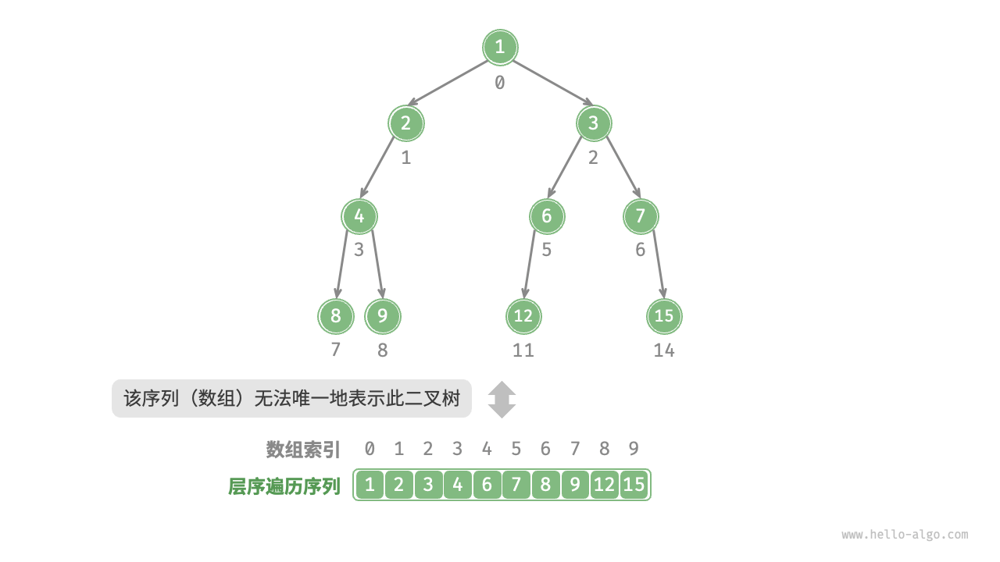

# 二叉树数组表示

在链表表示下，二叉树的存储单元为节点 `TreeNode` ，节点之间通过指针相连接。在上节中，我们学习了在链表表示下的二叉树的各项基本操作。

那么，我们能否用数组来表示二叉树呢？答案是肯定的。

## 表示完美二叉树

先分析一个简单案例。给定一个完美二叉树，我们将所有节点按照层序遍历的顺序存储在一个数组中，则每个节点都对应唯一的数组索引。

根据层序遍历的特性，我们可以推导出父节点索引与子节点索引之间的“映射公式”：**若节点的索引为 $i$ ，则该节点的左子节点索引为 $2i + 1$ ，右子节点索引为 $2i + 2$** 。下图展示了各个节点索引之间的映射关系。


**映射公式的角色相当于链表中的指针**。给定数组中的任意一个节点，我们都可以通过映射公式来访问它的左（右）子节点。

## 表示任意二叉树

完美二叉树是一个特例，在二叉树的中间层通常存在许多 $\text{None}$ 。由于层序遍历序列并不包含这些 $\text{None}$ ，因此我们无法仅凭该序列来推测 $\text{None}$ 的数量和分布位置。**这意味着存在多种二叉树结构都符合该层序遍历序列**。

如下图所示，给定一个非完美二叉树，上述的数组表示方法已经失效。



为了解决此问题，**我们可以考虑在层序遍历序列中显式地写出所有 $\text{None}$** 。如下图所示，这样处理后，层序遍历序列就可以唯一表示二叉树了。

Python

```python
    # 二叉树的数组表示
    # 使用 None 来表示空位
    tree = [1, 2, 3, 4, None, 6, 7, 8, 9, None, None, 12, None, None, 15]
```


Java

```java
    /* 二叉树的数组表示 */
    // 使用 int 的包装类 Integer ，就可以使用 null 来标记空位
    Integer[] tree = { 1, 2, 3, 4, null, 6, 7, 8, 9, null, null, 12, null, null, 15 };
```


值得说明的是，**完全二叉树非常适合使用数组来表示**。回顾完全二叉树的定义，$\text{None}$ 只出现在最底层且靠右的位置，**因此所有 $\text{None}$ 一定出现在层序遍历序列的末尾**。

这意味着使用数组表示完全二叉树时，可以省略存储所有 $\text{None}$ ，非常方便。下图给出了一个例子。


以下代码实现了一个基于数组表示的二叉树，包括以下几种操作。

- 给定某节点，获取它的值、左（右）子节点、父节点。
- 获取前序遍历、中序遍历、后序遍历、层序遍历序列。

```src
[file]{array_binary_tree}-[class]{array_binary_tree}-[func]{}
```

## 优势与局限性

二叉树的数组表示主要有以下优点。

- 数组存储在连续的内存空间中，对缓存友好，访问与遍历速度较快。
- 不需要存储指针，比较节省空间。
- 允许随机访问节点。

然而，数组表示也存在一些局限性。

- 数组存储需要连续内存空间，因此不适合存储数据量过大的树。
- 增删节点需要通过数组插入与删除操作实现，效率较低。
- 当二叉树中存在大量 $\text{None}$ 时，数组中包含的节点数据比重较低，空间利用率较低。


-----------------------------------------------------------------

## ARRAY_BINARY_TREE
Python: `array_binary_tree.py`
```python

import sys
from pathlib import Path

sys.path.append(str(Path(__file__).parent.parent))
from modules import TreeNode, list_to_tree, print_tree


class ArrayBinaryTree:
    """数组表示下的二叉树类"""

    def __init__(self, arr: list[int | None]):
        """构造方法"""
        self._tree = list(arr)

    def size(self):
        """节点数量"""
        return len(self._tree)

    def val(self, i: int) -> int:
        """获取索引为 i 节点的值"""
        # 若索引越界，则返回 None ，代表空位
        if i < 0 or i >= self.size():
            return None
        return self._tree[i]

    def left(self, i: int) -> int | None:
        """获取索引为 i 节点的左子节点的索引"""
        return 2 * i + 1

    def right(self, i: int) -> int | None:
        """获取索引为 i 节点的右子节点的索引"""
        return 2 * i + 2

    def parent(self, i: int) -> int | None:
        """获取索引为 i 节点的父节点的索引"""
        return (i - 1) // 2

    def level_order(self) -> list[int]:
        """层序遍历"""
        self.res = []
        # 直接遍历数组
        for i in range(self.size()):
            if self.val(i) is not None:
                self.res.append(self.val(i))
        return self.res

    def dfs(self, i: int, order: str):
        """深度优先遍历"""
        if self.val(i) is None:
            return
        # 前序遍历
        if order == "pre":
            self.res.append(self.val(i))
        self.dfs(self.left(i), order)
        # 中序遍历
        if order == "in":
            self.res.append(self.val(i))
        self.dfs(self.right(i), order)
        # 后序遍历
        if order == "post":
            self.res.append(self.val(i))

    def pre_order(self) -> list[int]:
        """前序遍历"""
        self.res = []
        self.dfs(0, order="pre")
        return self.res

    def in_order(self) -> list[int]:
        """中序遍历"""
        self.res = []
        self.dfs(0, order="in")
        return self.res

    def post_order(self) -> list[int]:
        """后序遍历"""
        self.res = []
        self.dfs(0, order="post")
        return self.res


"""Driver Code"""
if __name__ == "__main__":
    # 初始化二叉树
    # 这里借助了一个从数组直接生成二叉树的函数
    arr = [1, 2, 3, 4, None, 6, 7, 8, 9, None, None, 12, None, None, 15]
    root = list_to_tree(arr)
    print("\n初始化二叉树\n")
    print(f"二叉树的数组表示：")
    print(arr)
    print(f"二叉树的链表表示：")
    print_tree(root)

    # 数组表示下的二叉树类
    abt = ArrayBinaryTree(arr)

    # 访问节点
    i = 1
    l, r, p = abt.left(i), abt.right(i), abt.parent(i)
    print(f"\n当前节点的索引为 {i} ，值为 {abt.val(i)}")
    print(f"其左子节点的索引为 {l} ，值为 {abt.val(l)}")
    print(f"其右子节点的索引为 {r} ，值为 {abt.val(r)}")
    print(f"其父节点的索引为 {p} ，值为 {abt.val(p)}")

    # 遍历树
    res = abt.level_order()
    print("\n层序遍历为：", res)
    res = abt.pre_order()
    print("前序遍历为：", res)
    res = abt.in_order()
    print("中序遍历为：", res)
    res = abt.post_order()
    print("后序遍历为：", res)
```

Java: `array_binary_tree.java`
```java

package chapter_tree;

import utils.*;
import java.util.*;

/* 数组表示下的二叉树类 */
class ArrayBinaryTree {
    private List<Integer> tree;

    /* 构造方法 */
    public ArrayBinaryTree(List<Integer> arr) {
        tree = new ArrayList<>(arr);
    }

    /* 节点数量 */
    public int size() {
        return tree.size();
    }

    /* 获取索引为 i 节点的值 */
    public Integer val(int i) {
        // 若索引越界，则返回 null ，代表空位
        if (i < 0 || i >= size())
            return null;
        return tree.get(i);
    }

    /* 获取索引为 i 节点的左子节点的索引 */
    public Integer left(int i) {
        return 2 * i + 1;
    }

    /* 获取索引为 i 节点的右子节点的索引 */
    public Integer right(int i) {
        return 2 * i + 2;
    }

    /* 获取索引为 i 节点的父节点的索引 */
    public Integer parent(int i) {
        return (i - 1) / 2;
    }

    /* 层序遍历 */
    public List<Integer> levelOrder() {
        List<Integer> res = new ArrayList<>();
        // 直接遍历数组
        for (int i = 0; i < size(); i++) {
            if (val(i) != null)
                res.add(val(i));
        }
        return res;
    }

    /* 深度优先遍历 */
    private void dfs(Integer i, String order, List<Integer> res) {
        // 若为空位，则返回
        if (val(i) == null)
            return;
        // 前序遍历
        if (order == "pre")
            res.add(val(i));
        dfs(left(i), order, res);
        // 中序遍历
        if (order == "in")
            res.add(val(i));
        dfs(right(i), order, res);
        // 后序遍历
        if (order == "post")
            res.add(val(i));
    }

    /* 前序遍历 */
    public List<Integer> preOrder() {
        List<Integer> res = new ArrayList<>();
        dfs(0, "pre", res);
        return res;
    }

    /* 中序遍历 */
    public List<Integer> inOrder() {
        List<Integer> res = new ArrayList<>();
        dfs(0, "in", res);
        return res;
    }

    /* 后序遍历 */
    public List<Integer> postOrder() {
        List<Integer> res = new ArrayList<>();
        dfs(0, "post", res);
        return res;
    }
}

public class array_binary_tree {
    public static void main(String[] args) {
        // 初始化二叉树
        // 这里借助了一个从数组直接生成二叉树的函数
        List<Integer> arr = Arrays.asList(1, 2, 3, 4, null, 6, 7, 8, 9, null, null, 12, null, null, 15);

        TreeNode root = TreeNode.listToTree(arr);
        System.out.println("\n初始化二叉树\n");
        System.out.println("二叉树的数组表示：");
        System.out.println(arr);
        System.out.println("二叉树的链表表示：");
        PrintUtil.printTree(root);

        // 数组表示下的二叉树类
        ArrayBinaryTree abt = new ArrayBinaryTree(arr);

        // 访问节点
        int i = 1;
        Integer l = abt.left(i);
        Integer r = abt.right(i);
        Integer p = abt.parent(i);
        System.out.println("\n当前节点的索引为 " + i + " ，值为 " + abt.val(i));
        System.out.println("其左子节点的索引为 " + l + " ，值为 " + (l == null ? "null" : abt.val(l)));
        System.out.println("其右子节点的索引为 " + r + " ，值为 " + (r == null ? "null" : abt.val(r)));
        System.out.println("其父节点的索引为 " + p + " ，值为 " + (p == null ? "null" : abt.val(p)));

        // 遍历树
        List<Integer> res = abt.levelOrder();
        System.out.println("\n层序遍历为：" + res);
        res = abt.preOrder();
        System.out.println("前序遍历为：" + res);
        res = abt.inOrder();
        System.out.println("中序遍历为：" + res);
        res = abt.postOrder();
        System.out.println("后序遍历为：" + res);
    }
}
```


-----------------------------------------------------------------

