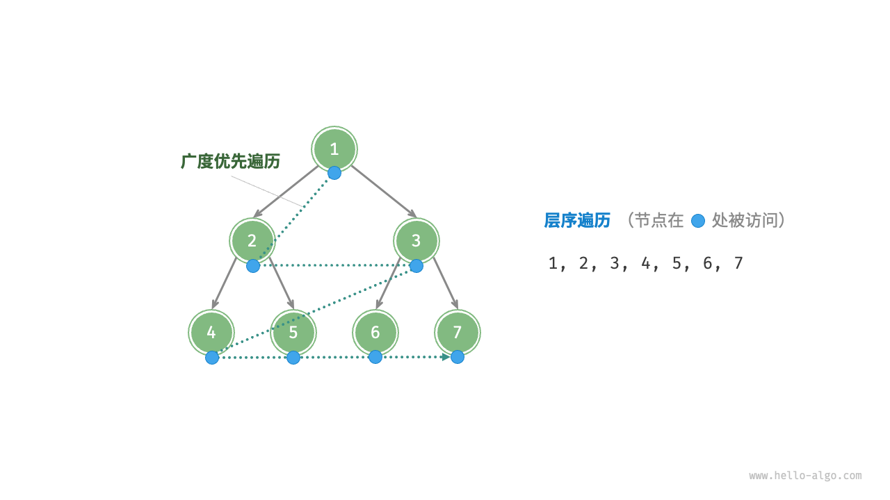

# 二叉树遍历

从物理结构的角度来看，树是一种基于链表的数据结构，因此其遍历方式是通过指针逐个访问节点。然而，树是一种非线性数据结构，这使得遍历树比遍历链表更加复杂，需要借助搜索算法来实现。

二叉树常见的遍历方式包括层序遍历、前序遍历、中序遍历和后序遍历等。

## 层序遍历

「层序遍历 Level-Order Traversal」从顶部到底部逐层遍历二叉树，并在每一层按照从左到右的顺序访问节点。

层序遍历本质上属于「广度优先搜索 Breadth-First Traversal」，它体现了一种“一圈一圈向外扩展”的逐层搜索方式。



### 算法实现

广度优先遍历通常借助「队列」来实现。队列遵循“先进先出”的规则，而广度优先遍历则遵循“逐层推进”的规则，两者背后的思想是一致的。

=== "Java"

    ```java title="binary_tree_bfs.java"
    [class]{binary_tree_bfs}-[func]{levelOrder}
    ```

=== "C++"

    ```cpp title="binary_tree_bfs.cpp"
    [class]{}-[func]{levelOrder}
    ```

=== "Python"

    ```python title="binary_tree_bfs.py"
    [class]{}-[func]{level_order}
    ```

=== "Go"

    ```go title="binary_tree_bfs.go"
    [class]{}-[func]{levelOrder}
    ```

=== "JavaScript"

    ```javascript title="binary_tree_bfs.js"
    [class]{}-[func]{levelOrder}
    ```

=== "TypeScript"

    ```typescript title="binary_tree_bfs.ts"
    [class]{}-[func]{levelOrder}
    ```

=== "C"

    ```c title="binary_tree_bfs.c"
    [class]{}-[func]{levelOrder}
    ```

=== "C#"

    ```csharp title="binary_tree_bfs.cs"
    [class]{binary_tree_bfs}-[func]{levelOrder}
    ```

=== "Swift"

    ```swift title="binary_tree_bfs.swift"
    [class]{}-[func]{levelOrder}
    ```

=== "Zig"

    ```zig title="binary_tree_bfs.zig"
    [class]{}-[func]{levelOrder}
    ```

### 复杂度分析

**时间复杂度**：所有节点被访问一次，使用 $O(n)$ 时间，其中 $n$ 为节点数量。

**空间复杂度**：在最差情况下，即满二叉树时，遍历到最底层之前，队列中最多同时存在 $\frac{n + 1}{2}$ 个节点，占用 $O(n)$ 空间。

## 前序、中序、后序遍历

相应地，前序、中序和后序遍历都属于「深度优先遍历 Depth-First Traversal」，它体现了一种“先走到尽头，再回溯继续”的遍历方式。

如下图所示，左侧是深度优先遍历的示意图，右上方是对应的递归实现代码。深度优先遍历就像是绕着整个二叉树的外围“走”一圈，在这个过程中，在每个节点都会遇到三个位置，分别对应前序遍历、中序遍历和后序遍历。


<div class="center-table" markdown>

| 位置       | 含义                                 | 此处访问节点时对应            |
| ---------- | ------------------------------------ | ----------------------------- |
| 橙色圆圈处 | 刚进入此节点，即将访问该节点的左子树 | 前序遍历 Pre-Order Traversal  |
| 蓝色圆圈处 | 已访问完左子树，即将访问右子树       | 中序遍历 In-Order Traversal   |
| 紫色圆圈处 | 已访问完左子树和右子树，即将返回     | 后序遍历 Post-Order Traversal |

</div>

### 算法实现

=== "Java"

    ```java title="binary_tree_dfs.java"
    [class]{binary_tree_dfs}-[func]{preOrder}

    [class]{binary_tree_dfs}-[func]{inOrder}

    [class]{binary_tree_dfs}-[func]{postOrder}
    ```

=== "C++"

    ```cpp title="binary_tree_dfs.cpp"
    [class]{}-[func]{preOrder}

    [class]{}-[func]{inOrder}

    [class]{}-[func]{postOrder}
    ```

=== "Python"

    ```python title="binary_tree_dfs.py"
    [class]{}-[func]{pre_order}

    [class]{}-[func]{in_order}

    [class]{}-[func]{post_order}
    ```

=== "Go"

    ```go title="binary_tree_dfs.go"
    [class]{}-[func]{preOrder}

    [class]{}-[func]{inOrder}

    [class]{}-[func]{postOrder}
    ```

=== "JavaScript"

    ```javascript title="binary_tree_dfs.js"
    [class]{}-[func]{preOrder}

    [class]{}-[func]{inOrder}

    [class]{}-[func]{postOrder}
    ```

=== "TypeScript"

    ```typescript title="binary_tree_dfs.ts"
    [class]{}-[func]{preOrder}

    [class]{}-[func]{inOrder}

    [class]{}-[func]{postOrder}
    ```

=== "C"

    ```c title="binary_tree_dfs.c"
    [class]{}-[func]{preOrder}

    [class]{}-[func]{inOrder}

    [class]{}-[func]{postOrder}
    ```

=== "C#"

    ```csharp title="binary_tree_dfs.cs"
    [class]{binary_tree_dfs}-[func]{preOrder}

    [class]{binary_tree_dfs}-[func]{inOrder}

    [class]{binary_tree_dfs}-[func]{postOrder}
    ```

=== "Swift"

    ```swift title="binary_tree_dfs.swift"
    [class]{}-[func]{preOrder}

    [class]{}-[func]{inOrder}

    [class]{}-[func]{postOrder}
    ```

=== "Zig"

    ```zig title="binary_tree_dfs.zig"
    [class]{}-[func]{preOrder}

    [class]{}-[func]{inOrder}

    [class]{}-[func]{postOrder}
    ```

!!! note

    使用循环一样可以实现前、中、后序遍历，但代码相对繁琐，有兴趣的同学可以自行实现。

### 复杂度分析

**时间复杂度**：所有节点被访问一次，使用 $O(n)$ 时间，其中 $n$ 为节点数量。

**空间复杂度**：在最差情况下，即树退化为链表时，递归深度达到 $n$ ，系统占用 $O(n)$ 栈帧空间。
