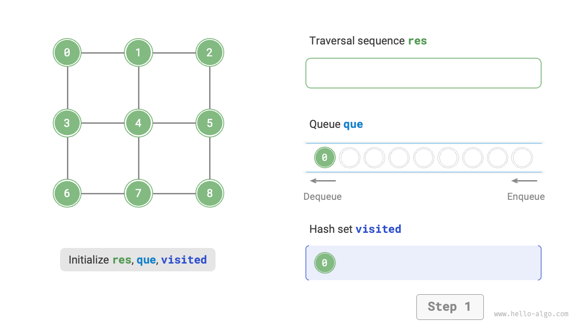
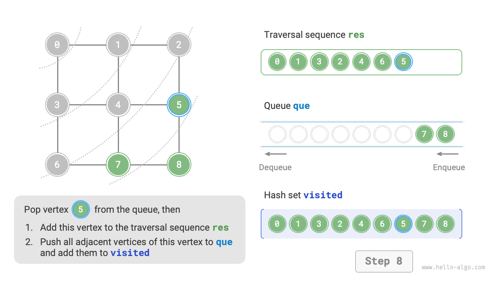
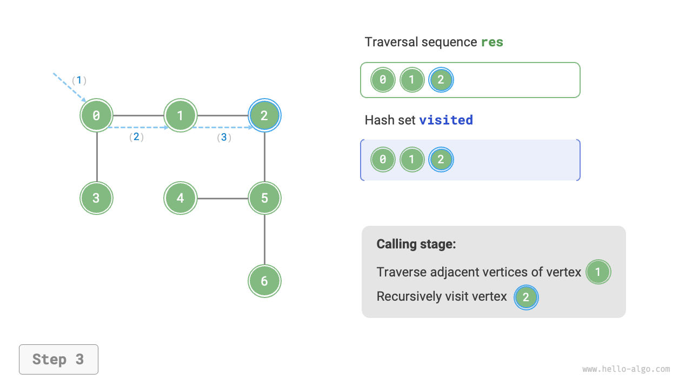
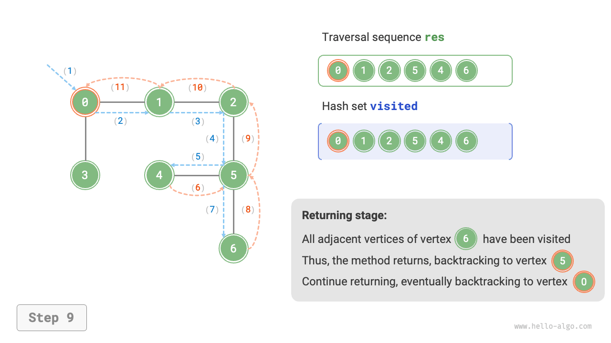

# Graph traversal

Trees represent a "one-to-many" relationship, while graphs have a higher degree of freedom and can represent any "many-to-many" relationship. Therefore, we can consider trees as a special case of graphs. Clearly, **tree traversal operations are also a special case of graph traversal operations**.

Both graphs and trees require the application of search algorithms to implement traversal operations. Graph traversal can be divided into two types: <u>Breadth-First Search (BFS)</u> and <u>Depth-First Search (DFS)</u>.

## Breadth-first search

**Breadth-first search is a near-to-far traversal method, starting from a certain node, always prioritizing the visit to the nearest vertices and expanding outwards layer by layer**. As shown in the figure below, starting from the top left vertex, first traverse all adjacent vertices of that vertex, then traverse all adjacent vertices of the next vertex, and so on, until all vertices have been visited.


### Algorithm implementation

BFS is usually implemented with the help of a queue, as shown in the code below. The queue has a "first in, first out" property, which aligns with the BFS idea of traversing "from near to far".

1. Add the starting vertex `startVet` to the queue and start the loop.
2. In each iteration of the loop, pop the vertex at the front of the queue and record it as visited, then add all adjacent vertices of that vertex to the back of the queue.
3. Repeat step `2.` until all vertices have been visited.

To prevent revisiting vertices, we use a hash table `visited` to record which nodes have been visited.

```src
[file]{graph_bfs}-[class]{}-[func]{graph_bfs}
```

The code is relatively abstract, it is suggested to compare with the figure below to deepen the understanding.

=== "<1>"
    

=== "<2>"
    

=== "<3>"
    

=== "<4>"
    

=== "<5>"
    

=== "<6>"
    

=== "<7>"
    

=== "<8>"
    

=== "<9>"
    

=== "<10>"
    

=== "<11>"
    

!!! question "Is the sequence of breadth-first traversal unique?"

    Not unique. Breadth-first traversal only requires traversing in a "from near to far" order, **and the traversal order of multiple vertices at the same distance can be arbitrarily shuffled**. For example, in the figure above, the visitation order of vertices $1$ and $3$ can be switched, as can the order of vertices $2$, $4$, and $6$.

### Complexity analysis

**Time complexity**: All vertices will be enqueued and dequeued once, using $O(|V|)$ time; in the process of traversing adjacent vertices, since it is an undirected graph, all edges will be visited $2$ times, using $O(2|E|)$ time; overall using $O(|V| + |E|)$ time.

**Space complexity**: The maximum number of vertices in list `res`, hash table `visited`, and queue `que` is $|V|$, using $O(|V|)$ space.

## Depth-first search

**Depth-first search is a traversal method that prioritizes going as far as possible and then backtracks when no further paths are available**. As shown in the figure below, starting from the top left vertex, visit some adjacent vertex of the current vertex until no further path is available, then return and continue until all vertices are traversed.


### Algorithm implementation

This "go as far as possible and then return" algorithm paradigm is usually implemented based on recursion. Similar to breadth-first search, in depth-first search, we also need the help of a hash table `visited` to record the visited vertices to avoid revisiting.

```src
[file]{graph_dfs}-[class]{}-[func]{graph_dfs}
```

The algorithm process of depth-first search is shown in the figure below.

- **Dashed lines represent downward recursion**, indicating that a new recursive method has been initiated to visit a new vertex.
- **Curved dashed lines represent upward backtracking**, indicating that this recursive method has returned to the position where this method was initiated.

To deepen the understanding, it is suggested to combine the figure below with the code to simulate (or draw) the entire DFS process in your mind, including when each recursive method is initiated and when it returns.

=== "<1>"
    

=== "<2>"
    

=== "<3>"
    

=== "<4>"
    

=== "<5>"
    

=== "<6>"
    

=== "<7>"
    

=== "<8>"
    

=== "<9>"
    

=== "<10>"
    

=== "<11>"
    

!!! question "Is the sequence of depth-first traversal unique?"

    Similar to breadth-first traversal, the order of the depth-first traversal sequence is also not unique. Given a certain vertex, exploring in any direction first is possible, that is, the order of adjacent vertices can be arbitrarily shuffled, all being part of depth-first traversal.

    Taking tree traversal as an example, "root $\rightarrow$ left $\rightarrow$ right", "left $\rightarrow$ root $\rightarrow$ right", "left $\rightarrow$ right $\rightarrow$ root" correspond to preorder, inorder, and postorder traversals, respectively. They showcase three types of traversal priorities, yet all three are considered depth-first traversal.

### Complexity analysis

**Time complexity**: All vertices will be visited once, using $O(|V|)$ time; all edges will be visited twice, using $O(2|E|)$ time; overall using $O(|V| + |E|)$ time.

**Space complexity**: The maximum number of vertices in list `res`, hash table `visited` is $|V|$, and the maximum recursion depth is $|V|$, therefore using $O(|V|)$ space.
