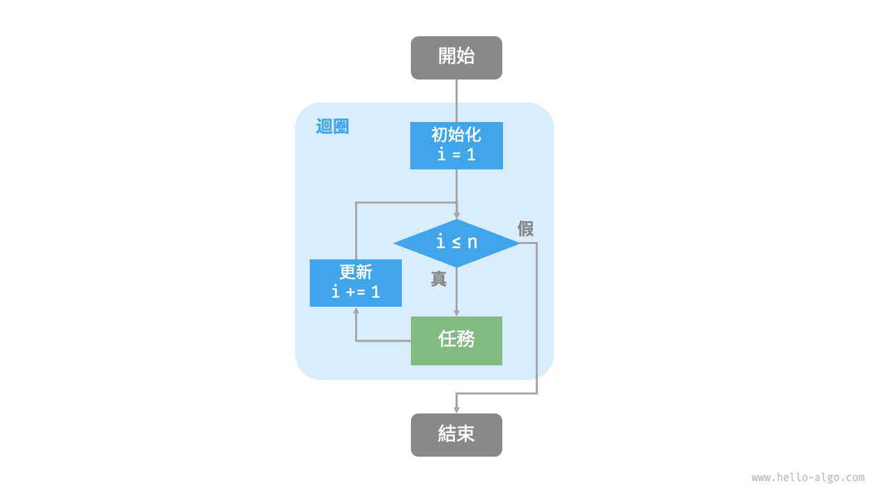
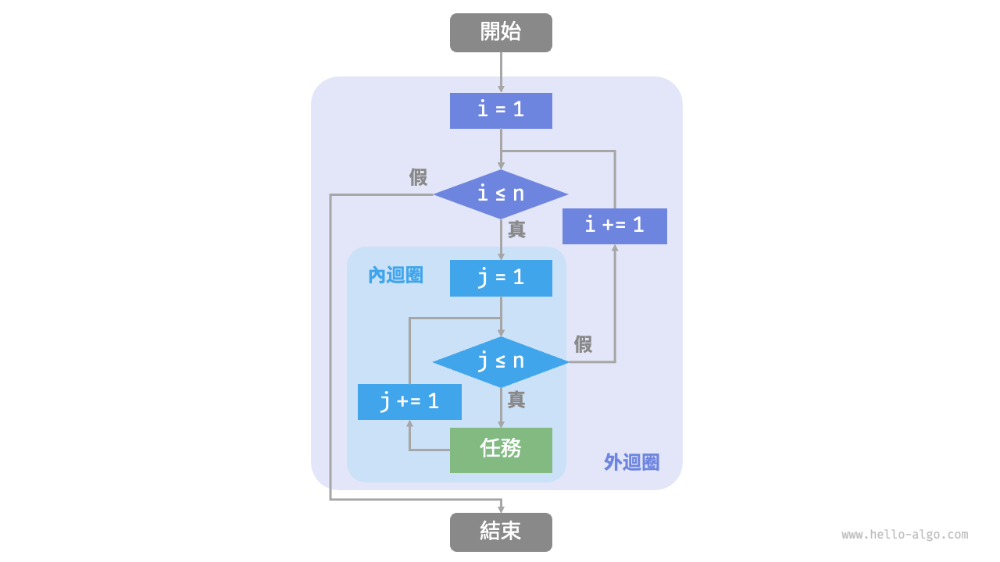
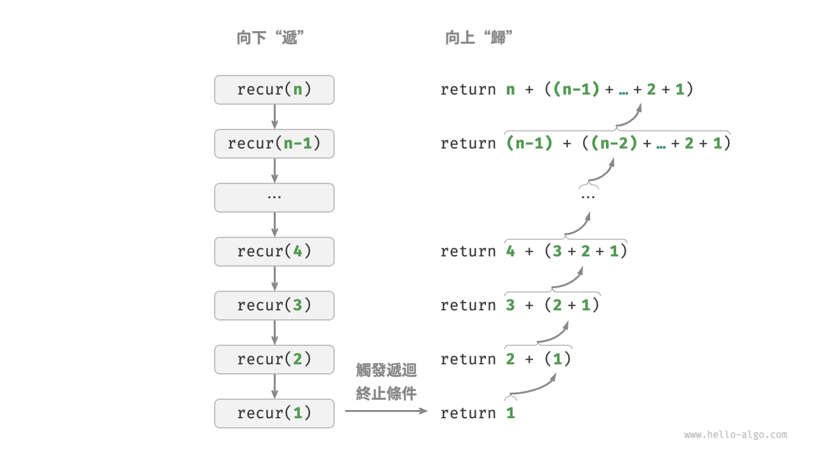
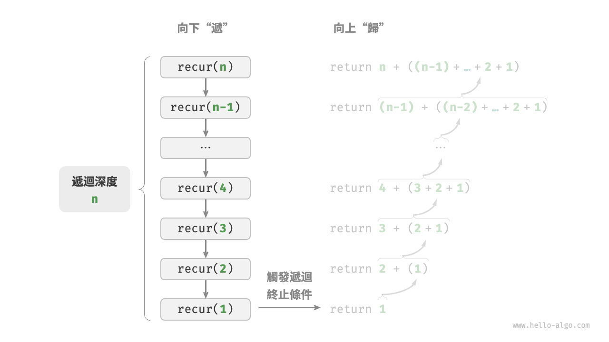
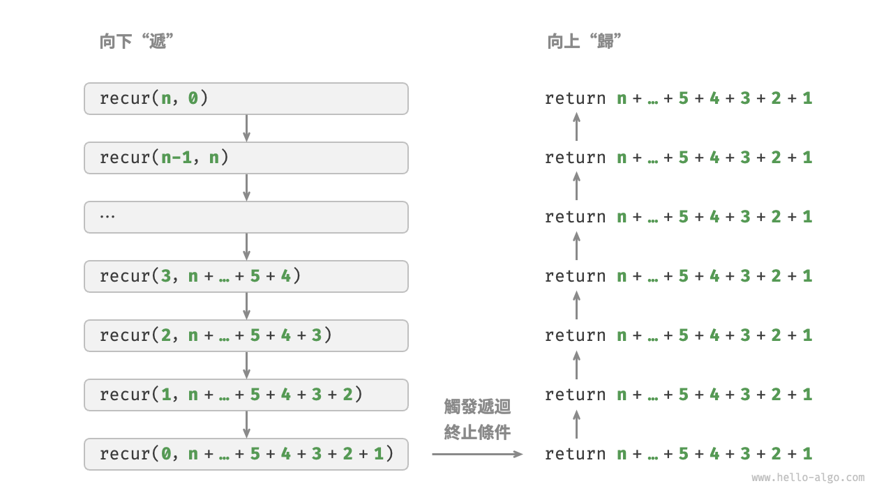
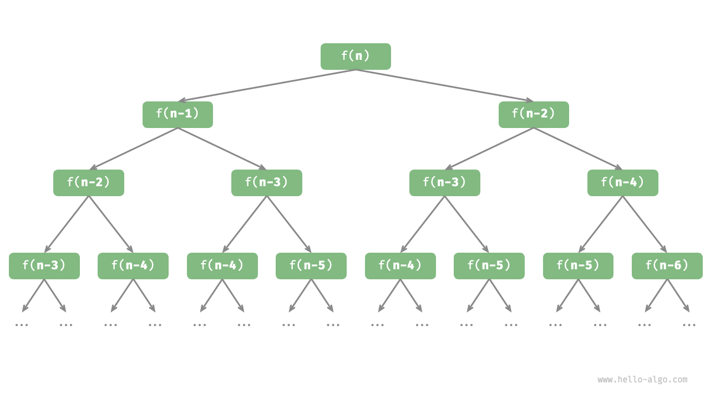

# 迭代與遞迴

在演算法中，重複執行某個任務是很常見的，它與複雜度分析息息相關。因此，在介紹時間複雜度和空間複雜度之前，我們先來了解如何在程式中實現重複執行任務，即兩種基本的程式控制結構：迭代、遞迴。

## 迭代

「迭代 iteration」是一種重複執行某個任務的控制結構。在迭代中，程式會在滿足一定的條件下重複執行某段程式碼，直到這個條件不再滿足。

### for 迴圈

`for` 迴圈是最常見的迭代形式之一，**適合在預先知道迭代次數時使用**。

以下函式基於 `for` 迴圈實現了求和 $1 + 2 + \dots + n$ ，求和結果使用變數 `res` 記錄。需要注意的是，Python 中 `range(a, b)` 對應的區間是“左閉右開”的，對應的走訪範圍為 $a, a + 1, \dots, b-1$ ：

```src
[file]{iteration}-[class]{}-[func]{for_loop}
```

下圖是該求和函式的流程框圖。



此求和函式的運算量與輸入資料大小 $n$ 成正比，或者說成“線性關係”。實際上，**時間複雜度描述的就是這個“線性關係”**。相關內容將會在下一節中詳細介紹。

### while 迴圈

與 `for` 迴圈類似，`while` 迴圈也是一種實現迭代的方法。在 `while` 迴圈中，程式每輪都會先檢查條件，如果條件為真，則繼續執行，否則就結束迴圈。

下面我們用 `while` 迴圈來實現求和 $1 + 2 + \dots + n$ ：

```src
[file]{iteration}-[class]{}-[func]{while_loop}
```

**`while` 迴圈比 `for` 迴圈的自由度更高**。在 `while` 迴圈中，我們可以自由地設計條件變數的初始化和更新步驟。

例如在以下程式碼中，條件變數 $i$ 每輪進行兩次更新，這種情況就不太方便用 `for` 迴圈實現：

```src
[file]{iteration}-[class]{}-[func]{while_loop_ii}
```

總的來說，**`for` 迴圈的程式碼更加緊湊，`while` 迴圈更加靈活**，兩者都可以實現迭代結構。選擇使用哪一個應該根據特定問題的需求來決定。

### 巢狀迴圈

我們可以在一個迴圈結構內巢狀另一個迴圈結構，下面以 `for` 迴圈為例：

```src
[file]{iteration}-[class]{}-[func]{nested_for_loop}
```

下圖是該巢狀迴圈的流程框圖。



在這種情況下，函式的運算量與 $n^2$ 成正比，或者說演算法執行時間和輸入資料大小 $n$ 成“平方關係”。

我們可以繼續新增巢狀迴圈，每一次巢狀都是一次“升維”，將會使時間複雜度提高至“立方關係”“四次方關係”，以此類推。

## 遞迴

 「遞迴 recursion」是一種演算法策略，透過函式呼叫自身來解決問題。它主要包含兩個階段。

1. **遞**：程式不斷深入地呼叫自身，通常傳入更小或更簡化的參數，直到達到“終止條件”。
2. **歸**：觸發“終止條件”後，程式從最深層的遞迴函式開始逐層返回，匯聚每一層的結果。

而從實現的角度看，遞迴程式碼主要包含三個要素。

1. **終止條件**：用於決定什麼時候由“遞”轉“歸”。
2. **遞迴呼叫**：對應“遞”，函式呼叫自身，通常輸入更小或更簡化的參數。
3. **返回結果**：對應“歸”，將當前遞迴層級的結果返回至上一層。

觀察以下程式碼，我們只需呼叫函式 `recur(n)`  ，就可以完成 $1 + 2 + \dots + n$ 的計算：

```src
[file]{recursion}-[class]{}-[func]{recur}
```

下圖展示了該函式的遞迴過程。



雖然從計算角度看，迭代與遞迴可以得到相同的結果，**但它們代表了兩種完全不同的思考和解決問題的正規化**。

- **迭代**：“自下而上”地解決問題。從最基礎的步驟開始，然後不斷重複或累加這些步驟，直到任務完成。
- **遞迴**：“自上而下”地解決問題。將原問題分解為更小的子問題，這些子問題和原問題具有相同的形式。接下來將子問題繼續分解為更小的子問題，直到基本情況時停止（基本情況的解是已知的）。

以上述求和函式為例，設問題 $f(n) = 1 + 2 + \dots + n$ 。

- **迭代**：在迴圈中模擬求和過程，從 $1$ 走訪到 $n$ ，每輪執行求和操作，即可求得 $f(n)$ 。
- **遞迴**：將問題分解為子問題 $f(n) = n + f(n-1)$ ，不斷（遞迴地）分解下去，直至基本情況 $f(1) = 1$ 時終止。

### 呼叫堆疊

遞迴函式每次呼叫自身時，系統都會為新開啟的函式分配記憶體，以儲存區域性變數、呼叫位址和其他資訊等。這將導致兩方面的結果。

- 函式的上下文資料都儲存在稱為“堆疊幀空間”的記憶體區域中，直至函式返回後才會被釋放。因此，**遞迴通常比迭代更加耗費記憶體空間**。
- 遞迴呼叫函式會產生額外的開銷。**因此遞迴通常比迴圈的時間效率更低**。

如下圖所示，在觸發終止條件前，同時存在 $n$ 個未返回的遞迴函式，**遞迴深度為 $n$** 。



在實際中，程式語言允許的遞迴深度通常是有限的，過深的遞迴可能導致堆疊溢位錯誤。

### 尾遞迴

有趣的是，**如果函式在返回前的最後一步才進行遞迴呼叫**，則該函式可以被編譯器或直譯器最佳化，使其在空間效率上與迭代相當。這種情況被稱為「尾遞迴 tail recursion」。

- **普通遞迴**：當函式返回到上一層級的函式後，需要繼續執行程式碼，因此系統需要儲存上一層呼叫的上下文。
- **尾遞迴**：遞迴呼叫是函式返回前的最後一個操作，這意味著函式返回到上一層級後，無須繼續執行其他操作，因此系統無須儲存上一層函式的上下文。

以計算 $1 + 2 + \dots + n$ 為例，我們可以將結果變數 `res` 設為函式參數，從而實現尾遞迴：

```src
[file]{recursion}-[class]{}-[func]{tail_recur}
```

尾遞迴的執行過程如下圖所示。對比普通遞迴和尾遞迴，兩者的求和操作的執行點是不同的。

- **普通遞迴**：求和操作是在“歸”的過程中執行的，每層返回後都要再執行一次求和操作。
- **尾遞迴**：求和操作是在“遞”的過程中執行的，“歸”的過程只需層層返回。



!!! tip

    請注意，許多編譯器或直譯器並不支援尾遞迴最佳化。例如，Python 預設不支援尾遞迴最佳化，因此即使函式是尾遞迴形式，仍然可能會遇到堆疊溢位問題。

### 遞迴樹

當處理與“分治”相關的演算法問題時，遞迴往往比迭代的思路更加直觀、程式碼更加易讀。以“費波那契數列”為例。

!!! question

    給定一個費波那契數列 $0, 1, 1, 2, 3, 5, 8, 13, \dots$ ，求該數列的第 $n$ 個數字。

設費波那契數列的第 $n$ 個數字為 $f(n)$ ，易得兩個結論。

- 數列的前兩個數字為 $f(1) = 0$ 和 $f(2) = 1$ 。
- 數列中的每個數字是前兩個數字的和，即 $f(n) = f(n - 1) + f(n - 2)$ 。

按照遞推關係進行遞迴呼叫，將前兩個數字作為終止條件，便可寫出遞迴程式碼。呼叫 `fib(n)` 即可得到費波那契數列的第 $n$ 個數字：

```src
[file]{recursion}-[class]{}-[func]{fib}
```

觀察以上程式碼，我們在函式內遞迴呼叫了兩個函式，**這意味著從一個呼叫產生了兩個呼叫分支**。如下圖所示，這樣不斷遞迴呼叫下去，最終將產生一棵層數為 $n$ 的「遞迴樹 recursion tree」。



從本質上看，遞迴體現了“將問題分解為更小子問題”的思維正規化，這種分治策略至關重要。

- 從演算法角度看，搜尋、排序、回溯、分治、動態規劃等許多重要演算法策略直接或間接地應用了這種思維方式。
- 從資料結構角度看，遞迴天然適合處理鏈結串列、樹和圖的相關問題，因為它們非常適合用分治思想進行分析。

## 兩者對比

總結以上內容，如下表所示，迭代和遞迴在實現、效能和適用性上有所不同。

<p align="center"> 表 <id> &nbsp; 迭代與遞迴特點對比 </p>

|          | 迭代                                   | 遞迴                                                         |
| -------- | -------------------------------------- | ------------------------------------------------------------ |
| 實現方式 | 迴圈結構                               | 函式呼叫自身                                                 |
| 時間效率 | 效率通常較高，無函式呼叫開銷           | 每次函式呼叫都會產生開銷                                     |
| 記憶體使用 | 通常使用固定大小的記憶體空間             | 累積函式呼叫可能使用大量的堆疊幀空間                           |
| 適用問題 | 適用於簡單迴圈任務，程式碼直觀、可讀性好 | 適用於子問題分解，如樹、圖、分治、回溯等，程式碼結構簡潔、清晰 |

!!! tip

    如果感覺以下內容理解困難，可以在讀完“堆疊”章節後再來複習。

那麼，迭代和遞迴具有什麼內在關聯呢？以上述遞迴函式為例，求和操作在遞迴的“歸”階段進行。這意味著最初被呼叫的函式實際上是最後完成其求和操作的，**這種工作機制與堆疊的“先入後出”原則異曲同工**。

事實上，“呼叫堆疊”和“堆疊幀空間”這類遞迴術語已經暗示了遞迴與堆疊之間的密切關係。

1. **遞**：當函式被呼叫時，系統會在“呼叫堆疊”上為該函式分配新的堆疊幀，用於儲存函式的區域性變數、參數、返回位址等資料。
2. **歸**：當函式完成執行並返回時，對應的堆疊幀會被從“呼叫堆疊”上移除，恢復之前函式的執行環境。

因此，**我們可以使用一個顯式的堆疊來模擬呼叫堆疊的行為**，從而將遞迴轉化為迭代形式：

```src
[file]{recursion}-[class]{}-[func]{for_loop_recur}
```

觀察以上程式碼，當遞迴轉化為迭代後，程式碼變得更加複雜了。儘管迭代和遞迴在很多情況下可以互相轉化，但不一定值得這樣做，有以下兩點原因。

- 轉化後的程式碼可能更加難以理解，可讀性更差。
- 對於某些複雜問題，模擬系統呼叫堆疊的行為可能非常困難。

總之，**選擇迭代還是遞迴取決於特定問題的性質**。在程式設計實踐中，權衡兩者的優劣並根據情境選擇合適的方法至關重要。
