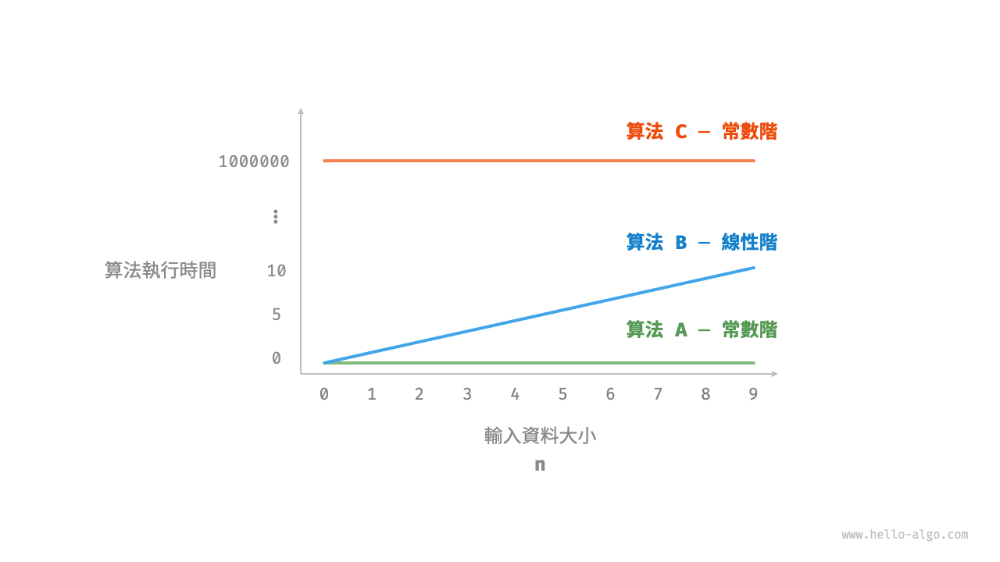
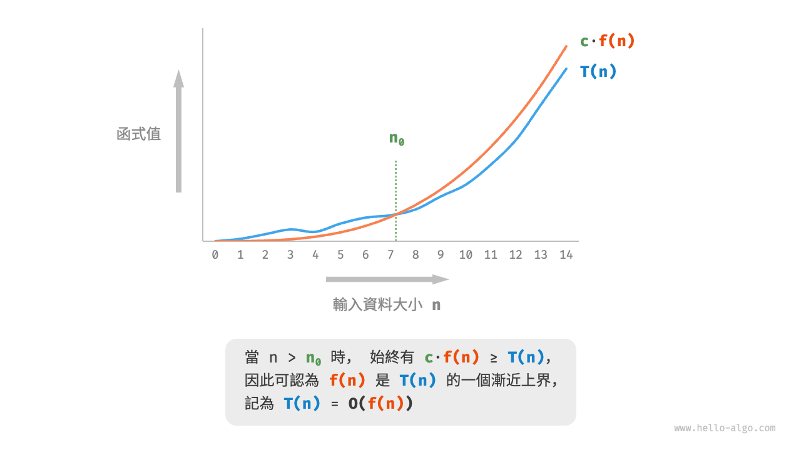
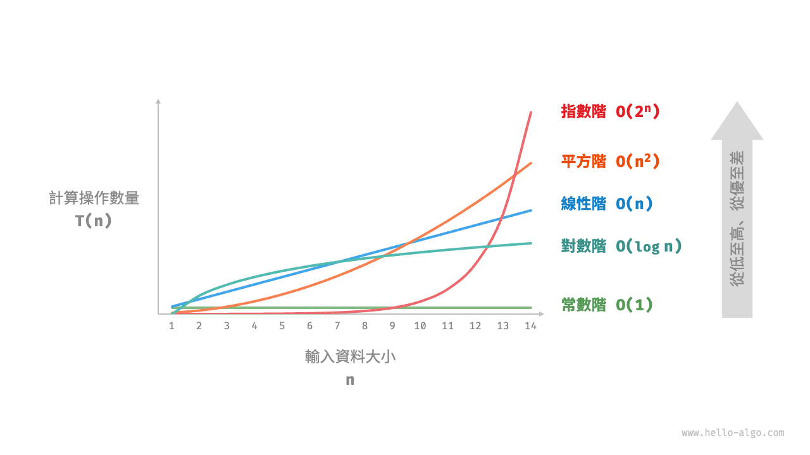
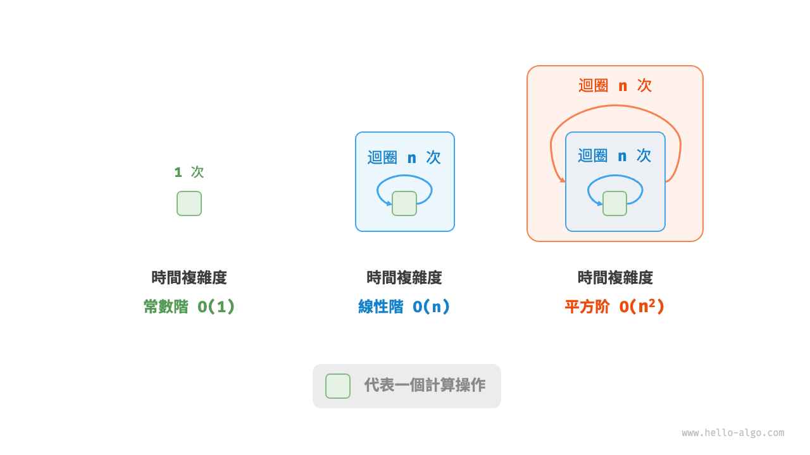
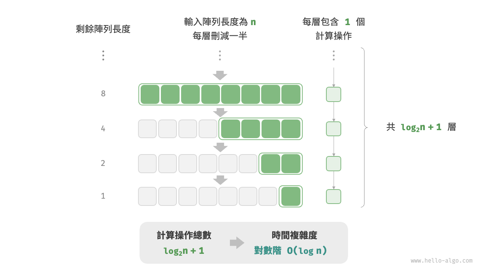
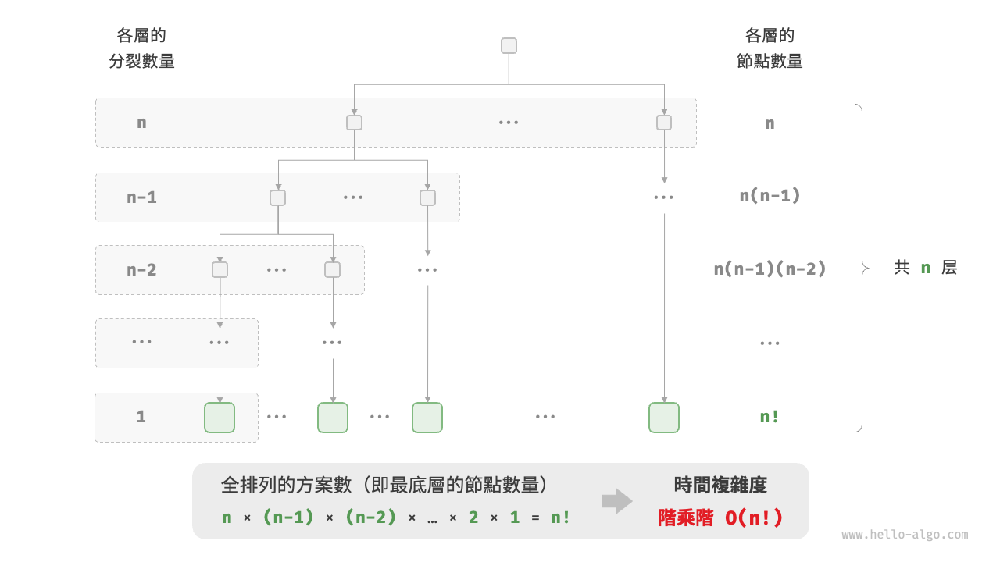

# 時間複雜度

執行時間可以直觀且準確地反映演算法的效率。如果我們想準確預估一段程式碼的執行時間，應該如何操作呢？

1. **確定執行平臺**，包括硬體配置、程式語言、系統環境等，這些因素都會影響程式碼的執行效率。
2. **評估各種計算操作所需的執行時間**，例如加法操作 `+` 需要 1 ns ，乘法操作 `*` 需要 10 ns ，列印操作 `print()` 需要 5 ns 等。
3. **統計程式碼中所有的計算操作**，並將所有操作的執行時間求和，從而得到執行時間。

例如在以下程式碼中，輸入資料大小為 $n$ ：

=== "Python"

    ```python title=""
    # 在某執行平臺下
    def algorithm(n: int):
        a = 2      # 1 ns
        a = a + 1  # 1 ns
        a = a * 2  # 10 ns
        # 迴圈 n 次
        for _ in range(n):  # 1 ns
            print(0)        # 5 ns
    ```

=== "C++"

    ```cpp title=""
    // 在某執行平臺下
    void algorithm(int n) {
        int a = 2;  // 1 ns
        a = a + 1;  // 1 ns
        a = a * 2;  // 10 ns
        // 迴圈 n 次
        for (int i = 0; i < n; i++) {  // 1 ns ，每輪都要執行 i++
            cout << 0 << endl;         // 5 ns
        }
    }
    ```

=== "Java"

    ```java title=""
    // 在某執行平臺下
    void algorithm(int n) {
        int a = 2;  // 1 ns
        a = a + 1;  // 1 ns
        a = a * 2;  // 10 ns
        // 迴圈 n 次
        for (int i = 0; i < n; i++) {  // 1 ns ，每輪都要執行 i++
            System.out.println(0);     // 5 ns
        }
    }
    ```

=== "C#"

    ```csharp title=""
    // 在某執行平臺下
    void Algorithm(int n) {
        int a = 2;  // 1 ns
        a = a + 1;  // 1 ns
        a = a * 2;  // 10 ns
        // 迴圈 n 次
        for (int i = 0; i < n; i++) {  // 1 ns ，每輪都要執行 i++
            Console.WriteLine(0);      // 5 ns
        }
    }
    ```

=== "Go"

    ```go title=""
    // 在某執行平臺下
    func algorithm(n int) {
        a := 2     // 1 ns
        a = a + 1  // 1 ns
        a = a * 2  // 10 ns
        // 迴圈 n 次
        for i := 0; i < n; i++ {  // 1 ns
            fmt.Println(a)        // 5 ns
        }
    }
    ```

=== "Swift"

    ```swift title=""
    // 在某執行平臺下
    func algorithm(n: Int) {
        var a = 2 // 1 ns
        a = a + 1 // 1 ns
        a = a * 2 // 10 ns
        // 迴圈 n 次
        for _ in 0 ..< n { // 1 ns
            print(0) // 5 ns
        }
    }
    ```

=== "JS"

    ```javascript title=""
    // 在某執行平臺下
    function algorithm(n) {
        var a = 2; // 1 ns
        a = a + 1; // 1 ns
        a = a * 2; // 10 ns
        // 迴圈 n 次
        for(let i = 0; i < n; i++) { // 1 ns ，每輪都要執行 i++
            console.log(0); // 5 ns
        }
    }
    ```

=== "TS"

    ```typescript title=""
    // 在某執行平臺下
    function algorithm(n: number): void {
        var a: number = 2; // 1 ns
        a = a + 1; // 1 ns
        a = a * 2; // 10 ns
        // 迴圈 n 次
        for(let i = 0; i < n; i++) { // 1 ns ，每輪都要執行 i++
            console.log(0); // 5 ns
        }
    }
    ```

=== "Dart"

    ```dart title=""
    // 在某執行平臺下
    void algorithm(int n) {
      int a = 2; // 1 ns
      a = a + 1; // 1 ns
      a = a * 2; // 10 ns
      // 迴圈 n 次
      for (int i = 0; i < n; i++) { // 1 ns ，每輪都要執行 i++
        print(0); // 5 ns
      }
    }
    ```

=== "Rust"

    ```rust title=""
    // 在某執行平臺下
    fn algorithm(n: i32) {
        let mut a = 2;      // 1 ns
        a = a + 1;          // 1 ns
        a = a * 2;          // 10 ns
        // 迴圈 n 次
        for _ in 0..n {     // 1 ns ，每輪都要執行 i++
            println!("{}", 0);  // 5 ns
        }
    }
    ```

=== "C"

    ```c title=""
    // 在某執行平臺下
    void algorithm(int n) {
        int a = 2;  // 1 ns
        a = a + 1;  // 1 ns
        a = a * 2;  // 10 ns
        // 迴圈 n 次
        for (int i = 0; i < n; i++) {   // 1 ns ，每輪都要執行 i++
            printf("%d", 0);            // 5 ns
        }
    }
    ```

=== "Zig"

    ```zig title=""
    // 在某執行平臺下
    fn algorithm(n: usize) void {
        var a: i32 = 2; // 1 ns
        a += 1; // 1 ns
        a *= 2; // 10 ns
        // 迴圈 n 次
        for (0..n) |_| { // 1 ns
            std.debug.print("{}\n", .{0}); // 5 ns
        }
    }
    ```

根據以上方法，可以得到演算法的執行時間為 $(6n + 12)$ ns ：

$$
1 + 1 + 10 + (1 + 5) \times n = 6n + 12
$$

但實際上，**統計算法的執行時間既不合理也不現實**。首先，我們不希望將預估時間和執行平臺繫結，因為演算法需要在各種不同的平臺上執行。其次，我們很難獲知每種操作的執行時間，這給預估過程帶來了極大的難度。

## 統計時間增長趨勢

時間複雜度分析統計的不是演算法執行時間，**而是演算法執行時間隨著資料量變大時的增長趨勢**。

“時間增長趨勢”這個概念比較抽象，我們透過一個例子來加以理解。假設輸入資料大小為 $n$ ，給定三個演算法 `A`、`B` 和 `C` ：

=== "Python"

    ```python title=""
    # 演算法 A 的時間複雜度：常數階
    def algorithm_A(n: int):
        print(0)
    # 演算法 B 的時間複雜度：線性階
    def algorithm_B(n: int):
        for _ in range(n):
            print(0)
    # 演算法 C 的時間複雜度：常數階
    def algorithm_C(n: int):
        for _ in range(1000000):
            print(0)
    ```

=== "C++"

    ```cpp title=""
    // 演算法 A 的時間複雜度：常數階
    void algorithm_A(int n) {
        cout << 0 << endl;
    }
    // 演算法 B 的時間複雜度：線性階
    void algorithm_B(int n) {
        for (int i = 0; i < n; i++) {
            cout << 0 << endl;
        }
    }
    // 演算法 C 的時間複雜度：常數階
    void algorithm_C(int n) {
        for (int i = 0; i < 1000000; i++) {
            cout << 0 << endl;
        }
    }
    ```

=== "Java"

    ```java title=""
    // 演算法 A 的時間複雜度：常數階
    void algorithm_A(int n) {
        System.out.println(0);
    }
    // 演算法 B 的時間複雜度：線性階
    void algorithm_B(int n) {
        for (int i = 0; i < n; i++) {
            System.out.println(0);
        }
    }
    // 演算法 C 的時間複雜度：常數階
    void algorithm_C(int n) {
        for (int i = 0; i < 1000000; i++) {
            System.out.println(0);
        }
    }
    ```

=== "C#"

    ```csharp title=""
    // 演算法 A 的時間複雜度：常數階
    void AlgorithmA(int n) {
        Console.WriteLine(0);
    }
    // 演算法 B 的時間複雜度：線性階
    void AlgorithmB(int n) {
        for (int i = 0; i < n; i++) {
            Console.WriteLine(0);
        }
    }
    // 演算法 C 的時間複雜度：常數階
    void AlgorithmC(int n) {
        for (int i = 0; i < 1000000; i++) {
            Console.WriteLine(0);
        }
    }
    ```

=== "Go"

    ```go title=""
    // 演算法 A 的時間複雜度：常數階
    func algorithm_A(n int) {
        fmt.Println(0)
    }
    // 演算法 B 的時間複雜度：線性階
    func algorithm_B(n int) {
        for i := 0; i < n; i++ {
            fmt.Println(0)
        }
    }
    // 演算法 C 的時間複雜度：常數階
    func algorithm_C(n int) {
        for i := 0; i < 1000000; i++ {
            fmt.Println(0)
        }
    }
    ```

=== "Swift"

    ```swift title=""
    // 演算法 A 的時間複雜度：常數階
    func algorithmA(n: Int) {
        print(0)
    }

    // 演算法 B 的時間複雜度：線性階
    func algorithmB(n: Int) {
        for _ in 0 ..< n {
            print(0)
        }
    }

    // 演算法 C 的時間複雜度：常數階
    func algorithmC(n: Int) {
        for _ in 0 ..< 1_000_000 {
            print(0)
        }
    }
    ```

=== "JS"

    ```javascript title=""
    // 演算法 A 的時間複雜度：常數階
    function algorithm_A(n) {
        console.log(0);
    }
    // 演算法 B 的時間複雜度：線性階
    function algorithm_B(n) {
        for (let i = 0; i < n; i++) {
            console.log(0);
        }
    }
    // 演算法 C 的時間複雜度：常數階
    function algorithm_C(n) {
        for (let i = 0; i < 1000000; i++) {
            console.log(0);
        }
    }

    ```

=== "TS"

    ```typescript title=""
    // 演算法 A 的時間複雜度：常數階
    function algorithm_A(n: number): void {
        console.log(0);
    }
    // 演算法 B 的時間複雜度：線性階
    function algorithm_B(n: number): void {
        for (let i = 0; i < n; i++) {
            console.log(0);
        }
    }
    // 演算法 C 的時間複雜度：常數階
    function algorithm_C(n: number): void {
        for (let i = 0; i < 1000000; i++) {
            console.log(0);
        }
    }
    ```

=== "Dart"

    ```dart title=""
    // 演算法 A 的時間複雜度：常數階
    void algorithmA(int n) {
      print(0);
    }
    // 演算法 B 的時間複雜度：線性階
    void algorithmB(int n) {
      for (int i = 0; i < n; i++) {
        print(0);
      }
    }
    // 演算法 C 的時間複雜度：常數階
    void algorithmC(int n) {
      for (int i = 0; i < 1000000; i++) {
        print(0);
      }
    }
    ```

=== "Rust"

    ```rust title=""
    // 演算法 A 的時間複雜度：常數階
    fn algorithm_A(n: i32) {
        println!("{}", 0);
    }
    // 演算法 B 的時間複雜度：線性階
    fn algorithm_B(n: i32) {
        for _ in 0..n {
            println!("{}", 0);
        }
    }
    // 演算法 C 的時間複雜度：常數階
    fn algorithm_C(n: i32) {
        for _ in 0..1000000 {
            println!("{}", 0);
        }
    }
    ```

=== "C"

    ```c title=""
    // 演算法 A 的時間複雜度：常數階
    void algorithm_A(int n) {
        printf("%d", 0);
    }
    // 演算法 B 的時間複雜度：線性階
    void algorithm_B(int n) {
        for (int i = 0; i < n; i++) {
            printf("%d", 0);
        }
    }
    // 演算法 C 的時間複雜度：常數階
    void algorithm_C(int n) {
        for (int i = 0; i < 1000000; i++) {
            printf("%d", 0);
        }
    }
    ```

=== "Zig"

    ```zig title=""
    // 演算法 A 的時間複雜度：常數階
    fn algorithm_A(n: usize) void {
        _ = n;
        std.debug.print("{}\n", .{0});
    }
    // 演算法 B 的時間複雜度：線性階
    fn algorithm_B(n: i32) void {
        for (0..n) |_| {
            std.debug.print("{}\n", .{0});
        }
    }
    // 演算法 C 的時間複雜度：常數階
    fn algorithm_C(n: i32) void {
        _ = n;
        for (0..1000000) |_| { 
            std.debug.print("{}\n", .{0});
        }
    }
    ```

下圖展示了以上三個演算法函式的時間複雜度。

- 演算法 `A` 只有 $1$ 個列印操作，演算法執行時間不隨著 $n$ 增大而增長。我們稱此演算法的時間複雜度為“常數階”。
- 演算法 `B` 中的列印操作需要迴圈 $n$ 次，演算法執行時間隨著 $n$ 增大呈線性增長。此演算法的時間複雜度被稱為“線性階”。
- 演算法 `C` 中的列印操作需要迴圈 $1000000$ 次，雖然執行時間很長，但它與輸入資料大小 $n$ 無關。因此 `C` 的時間複雜度和 `A` 相同，仍為“常數階”。



相較於直接統計算法的執行時間，時間複雜度分析有哪些特點呢？

- **時間複雜度能夠有效評估演算法效率**。例如，演算法 `B` 的執行時間呈線性增長，在 $n > 1$ 時比演算法 `A` 更慢，在 $n > 1000000$ 時比演算法 `C` 更慢。事實上，只要輸入資料大小 $n$ 足夠大，複雜度為“常數階”的演算法一定優於“線性階”的演算法，這正是時間增長趨勢的含義。
- **時間複雜度的推算方法更簡便**。顯然，執行平臺和計算操作型別都與演算法執行時間的增長趨勢無關。因此在時間複雜度分析中，我們可以簡單地將所有計算操作的執行時間視為相同的“單位時間”，從而將“計算操作執行時間統計”簡化為“計算運算量統計”，這樣一來估算難度就大大降低了。
- **時間複雜度也存在一定的侷限性**。例如，儘管演算法 `A` 和 `C` 的時間複雜度相同，但實際執行時間差別很大。同樣，儘管演算法 `B` 的時間複雜度比 `C` 高，但在輸入資料大小 $n$ 較小時，演算法 `B` 明顯優於演算法 `C` 。在這些情況下，我們很難僅憑時間複雜度判斷演算法效率的高低。當然，儘管存在上述問題，複雜度分析仍然是評判演算法效率最有效且常用的方法。

## 函式漸近上界

給定一個輸入大小為 $n$ 的函式：

=== "Python"

    ```python title=""
    def algorithm(n: int):
        a = 1      # +1
        a = a + 1  # +1
        a = a * 2  # +1
        # 迴圈 n 次
        for i in range(n):  # +1
            print(0)        # +1
    ```

=== "C++"

    ```cpp title=""
    void algorithm(int n) {
        int a = 1;  // +1
        a = a + 1;  // +1
        a = a * 2;  // +1
        // 迴圈 n 次
        for (int i = 0; i < n; i++) { // +1（每輪都執行 i ++）
            cout << 0 << endl;    // +1
        }
    }
    ```

=== "Java"

    ```java title=""
    void algorithm(int n) {
        int a = 1;  // +1
        a = a + 1;  // +1
        a = a * 2;  // +1
        // 迴圈 n 次
        for (int i = 0; i < n; i++) { // +1（每輪都執行 i ++）
            System.out.println(0);    // +1
        }
    }
    ```

=== "C#"

    ```csharp title=""
    void Algorithm(int n) {
        int a = 1;  // +1
        a = a + 1;  // +1
        a = a * 2;  // +1
        // 迴圈 n 次
        for (int i = 0; i < n; i++) {   // +1（每輪都執行 i ++）
            Console.WriteLine(0);   // +1
        }
    }
    ```

=== "Go"

    ```go title=""
    func algorithm(n int) {
        a := 1      // +1
        a = a + 1   // +1
        a = a * 2   // +1
        // 迴圈 n 次
        for i := 0; i < n; i++ {   // +1
            fmt.Println(a)         // +1
        }
    }
    ```

=== "Swift"

    ```swift title=""
    func algorithm(n: Int) {
        var a = 1 // +1
        a = a + 1 // +1
        a = a * 2 // +1
        // 迴圈 n 次
        for _ in 0 ..< n { // +1
            print(0) // +1
        }
    }
    ```

=== "JS"

    ```javascript title=""
    function algorithm(n) {
        var a = 1; // +1
        a += 1; // +1
        a *= 2; // +1
        // 迴圈 n 次
        for(let i = 0; i < n; i++){ // +1（每輪都執行 i ++）
            console.log(0); // +1
        }
    }
    ```

=== "TS"

    ```typescript title=""
    function algorithm(n: number): void{
        var a: number = 1; // +1
        a += 1; // +1
        a *= 2; // +1
        // 迴圈 n 次
        for(let i = 0; i < n; i++){ // +1（每輪都執行 i ++）
            console.log(0); // +1
        }
    }
    ```

=== "Dart"

    ```dart title=""
    void algorithm(int n) {
      int a = 1; // +1
      a = a + 1; // +1
      a = a * 2; // +1
      // 迴圈 n 次
      for (int i = 0; i < n; i++) { // +1（每輪都執行 i ++）
        print(0); // +1
      }
    }
    ```

=== "Rust"

    ```rust title=""
    fn algorithm(n: i32) {
        let mut a = 1;   // +1
        a = a + 1;      // +1
        a = a * 2;      // +1

        // 迴圈 n 次
        for _ in 0..n { // +1（每輪都執行 i ++）
            println!("{}", 0); // +1
        }
    }
    ```

=== "C"

    ```c title=""
    void algorithm(int n) {
        int a = 1;  // +1
        a = a + 1;  // +1
        a = a * 2;  // +1
        // 迴圈 n 次
        for (int i = 0; i < n; i++) {   // +1（每輪都執行 i ++）
            printf("%d", 0);            // +1
        }
    }  
    ```

=== "Zig"

    ```zig title=""
    fn algorithm(n: usize) void {
        var a: i32 = 1; // +1
        a += 1; // +1
        a *= 2; // +1
        // 迴圈 n 次
        for (0..n) |_| { // +1（每輪都執行 i ++）
            std.debug.print("{}\n", .{0}); // +1
        }
    }
    ```

設演算法的運算量是一個關於輸入資料大小 $n$ 的函式，記為 $T(n)$ ，則以上函式的運算量為：

$$
T(n) = 3 + 2n
$$

$T(n)$ 是一次函式，說明其執行時間的增長趨勢是線性的，因此它的時間複雜度是線性階。

我們將線性階的時間複雜度記為 $O(n)$ ，這個數學符號稱為「大 $O$ 記號 big-$O$ notation」，表示函式 $T(n)$ 的「漸近上界 asymptotic upper bound」。

時間複雜度分析本質上是計算“運算量 $T(n)$”的漸近上界，它具有明確的數學定義。

!!! abstract "函式漸近上界"

    若存在正實數 $c$ 和實數 $n_0$ ，使得對於所有的 $n > n_0$ ，均有 $T(n) \leq c \cdot f(n)$ ，則可認為 $f(n)$ 給出了 $T(n)$ 的一個漸近上界，記為 $T(n) = O(f(n))$ 。

如下圖所示，計算漸近上界就是尋找一個函式 $f(n)$ ，使得當 $n$ 趨向於無窮大時，$T(n)$ 和 $f(n)$ 處於相同的增長級別，僅相差一個常數項 $c$ 的倍數。



## 推算方法

漸近上界的數學味兒有點重，如果你感覺沒有完全理解，也無須擔心。我們可以先掌握推算方法，在不斷的實踐中，就可以逐漸領悟其數學意義。

根據定義，確定 $f(n)$ 之後，我們便可得到時間複雜度 $O(f(n))$ 。那麼如何確定漸近上界 $f(n)$ 呢？總體分為兩步：首先統計運算量，然後判斷漸近上界。

### 第一步：統計運算量

針對程式碼，逐行從上到下計算即可。然而，由於上述 $c \cdot f(n)$ 中的常數項 $c$ 可以取任意大小，**因此運算量 $T(n)$ 中的各種係數、常數項都可以忽略**。根據此原則，可以總結出以下計數簡化技巧。

1. **忽略 $T(n)$ 中的常數項**。因為它們都與 $n$ 無關，所以對時間複雜度不產生影響。
2. **省略所有係數**。例如，迴圈 $2n$ 次、$5n + 1$ 次等，都可以簡化記為 $n$ 次，因為 $n$ 前面的係數對時間複雜度沒有影響。
3. **迴圈巢狀時使用乘法**。總運算量等於外層迴圈和內層迴圈運算量之積，每一層迴圈依然可以分別套用第 `1.` 點和第 `2.` 點的技巧。

給定一個函式，我們可以用上述技巧來統計運算量：

=== "Python"

    ```python title=""
    def algorithm(n: int):
        a = 1      # +0（技巧 1）
        a = a + n  # +0（技巧 1）
        # +n（技巧 2）
        for i in range(5 * n + 1):
            print(0)
        # +n*n（技巧 3）
        for i in range(2 * n):
            for j in range(n + 1):
                print(0)
    ```

=== "C++"

    ```cpp title=""
    void algorithm(int n) {
        int a = 1;  // +0（技巧 1）
        a = a + n;  // +0（技巧 1）
        // +n（技巧 2）
        for (int i = 0; i < 5 * n + 1; i++) {
            cout << 0 << endl;
        }
        // +n*n（技巧 3）
        for (int i = 0; i < 2 * n; i++) {
            for (int j = 0; j < n + 1; j++) {
                cout << 0 << endl;
            }
        }
    }
    ```

=== "Java"

    ```java title=""
    void algorithm(int n) {
        int a = 1;  // +0（技巧 1）
        a = a + n;  // +0（技巧 1）
        // +n（技巧 2）
        for (int i = 0; i < 5 * n + 1; i++) {
            System.out.println(0);
        }
        // +n*n（技巧 3）
        for (int i = 0; i < 2 * n; i++) {
            for (int j = 0; j < n + 1; j++) {
                System.out.println(0);
            }
        }
    }
    ```

=== "C#"

    ```csharp title=""
    void Algorithm(int n) {
        int a = 1;  // +0（技巧 1）
        a = a + n;  // +0（技巧 1）
        // +n（技巧 2）
        for (int i = 0; i < 5 * n + 1; i++) {
            Console.WriteLine(0);
        }
        // +n*n（技巧 3）
        for (int i = 0; i < 2 * n; i++) {
            for (int j = 0; j < n + 1; j++) {
                Console.WriteLine(0);
            }
        }
    }
    ```

=== "Go"

    ```go title=""
    func algorithm(n int) {
        a := 1     // +0（技巧 1）
        a = a + n  // +0（技巧 1）
        // +n（技巧 2）
        for i := 0; i < 5 * n + 1; i++ {
            fmt.Println(0)
        }
        // +n*n（技巧 3）
        for i := 0; i < 2 * n; i++ {
            for j := 0; j < n + 1; j++ {
                fmt.Println(0)
            }
        }
    }
    ```

=== "Swift"

    ```swift title=""
    func algorithm(n: Int) {
        var a = 1 // +0（技巧 1）
        a = a + n // +0（技巧 1）
        // +n（技巧 2）
        for _ in 0 ..< (5 * n + 1) {
            print(0)
        }
        // +n*n（技巧 3）
        for _ in 0 ..< (2 * n) {
            for _ in 0 ..< (n + 1) {
                print(0)
            }
        }
    }
    ```

=== "JS"

    ```javascript title=""
    function algorithm(n) {
        let a = 1;  // +0（技巧 1）
        a = a + n;  // +0（技巧 1）
        // +n（技巧 2）
        for (let i = 0; i < 5 * n + 1; i++) {
            console.log(0);
        }
        // +n*n（技巧 3）
        for (let i = 0; i < 2 * n; i++) {
            for (let j = 0; j < n + 1; j++) {
                console.log(0);
            }
        }
    }
    ```

=== "TS"

    ```typescript title=""
    function algorithm(n: number): void {
        let a = 1;  // +0（技巧 1）
        a = a + n;  // +0（技巧 1）
        // +n（技巧 2）
        for (let i = 0; i < 5 * n + 1; i++) {
            console.log(0);
        }
        // +n*n（技巧 3）
        for (let i = 0; i < 2 * n; i++) {
            for (let j = 0; j < n + 1; j++) {
                console.log(0);
            }
        }
    }
    ```

=== "Dart"

    ```dart title=""
    void algorithm(int n) {
      int a = 1; // +0（技巧 1）
      a = a + n; // +0（技巧 1）
      // +n（技巧 2）
      for (int i = 0; i < 5 * n + 1; i++) {
        print(0);
      }
      // +n*n（技巧 3）
      for (int i = 0; i < 2 * n; i++) {
        for (int j = 0; j < n + 1; j++) {
          print(0);
        }
      }
    }
    ```

=== "Rust"

    ```rust title=""
    fn algorithm(n: i32) {
        let mut a = 1;     // +0（技巧 1）
        a = a + n;        // +0（技巧 1）

        // +n（技巧 2）
        for i in 0..(5 * n + 1) {
            println!("{}", 0);
        }

        // +n*n（技巧 3）
        for i in 0..(2 * n) {
            for j in 0..(n + 1) {
                println!("{}", 0);
            }
        }
    }
    ```

=== "C"

    ```c title=""
    void algorithm(int n) {
        int a = 1;  // +0（技巧 1）
        a = a + n;  // +0（技巧 1）
        // +n（技巧 2）
        for (int i = 0; i < 5 * n + 1; i++) {
            printf("%d", 0);
        }
        // +n*n（技巧 3）
        for (int i = 0; i < 2 * n; i++) {
            for (int j = 0; j < n + 1; j++) {
                printf("%d", 0);
            }
        }
    }
    ```

=== "Zig"

    ```zig title=""
    fn algorithm(n: usize) void {
        var a: i32 = 1;     // +0（技巧 1）
        a = a + @as(i32, @intCast(n));        // +0（技巧 1）

        // +n（技巧 2）
        for(0..(5 * n + 1)) |_| {
            std.debug.print("{}\n", .{0}); 
        }

        // +n*n（技巧 3）
        for(0..(2 * n)) |_| {
            for(0..(n + 1)) |_| {
                std.debug.print("{}\n", .{0}); 
            }
        }
    }
    ```

以下公式展示了使用上述技巧前後的統計結果，兩者推算出的時間複雜度都為 $O(n^2)$ 。

$$
\begin{aligned}
T(n) & = 2n(n + 1) + (5n + 1) + 2 & \text{完整統計 (-.-|||)} \newline
& = 2n^2 + 7n + 3 \newline
T(n) & = n^2 + n & \text{偷懶統計 (o.O)}
\end{aligned}
$$

### 第二步：判斷漸近上界

**時間複雜度由 $T(n)$ 中最高階的項來決定**。這是因為在 $n$ 趨於無窮大時，最高階的項將發揮主導作用，其他項的影響都可以忽略。

下表展示了一些例子，其中一些誇張的值是為了強調“係數無法撼動階數”這一結論。當 $n$ 趨於無窮大時，這些常數變得無足輕重。

<p align="center"> 表 <id> &nbsp; 不同運算量對應的時間複雜度 </p>

| 運算量 $T(n)$        | 時間複雜度 $O(f(n))$ |
| ---------------------- | -------------------- |
| $100000$               | $O(1)$               |
| $3n + 2$               | $O(n)$               |
| $2n^2 + 3n + 2$        | $O(n^2)$             |
| $n^3 + 10000n^2$       | $O(n^3)$             |
| $2^n + 10000n^{10000}$ | $O(2^n)$             |

## 常見型別

設輸入資料大小為 $n$ ，常見的時間複雜度型別如下圖所示（按照從低到高的順序排列）。

$$
\begin{aligned}
O(1) < O(\log n) < O(n) < O(n \log n) < O(n^2) < O(2^n) < O(n!) \newline
\text{常數階} < \text{對數階} < \text{線性階} < \text{線性對數階} < \text{平方階} < \text{指數階} < \text{階乘階}
\end{aligned}
$$



### 常數階 $O(1)$

常數階的運算量與輸入資料大小 $n$ 無關，即不隨著 $n$ 的變化而變化。

在以下函式中，儘管運算量 `size` 可能很大，但由於其與輸入資料大小 $n$ 無關，因此時間複雜度仍為 $O(1)$ ：

```src
[file]{time_complexity}-[class]{}-[func]{constant}
```

### 線性階 $O(n)$

線性階的運算量相對於輸入資料大小 $n$ 以線性級別增長。線性階通常出現在單層迴圈中：

```src
[file]{time_complexity}-[class]{}-[func]{linear}
```

走訪陣列和走訪鏈結串列等操作的時間複雜度均為 $O(n)$ ，其中 $n$ 為陣列或鏈結串列的長度：

```src
[file]{time_complexity}-[class]{}-[func]{array_traversal}
```

值得注意的是，**輸入資料大小 $n$ 需根據輸入資料的型別來具體確定**。比如在第一個示例中，變數 $n$ 為輸入資料大小；在第二個示例中，陣列長度 $n$ 為資料大小。

### 平方階 $O(n^2)$

平方階的運算量相對於輸入資料大小 $n$ 以平方級別增長。平方階通常出現在巢狀迴圈中，外層迴圈和內層迴圈的時間複雜度都為 $O(n)$ ，因此總體的時間複雜度為 $O(n^2)$ ：

```src
[file]{time_complexity}-[class]{}-[func]{quadratic}
```

下圖對比了常數階、線性階和平方階三種時間複雜度。



以泡沫排序為例，外層迴圈執行 $n - 1$ 次，內層迴圈執行 $n-1$、$n-2$、$\dots$、$2$、$1$ 次，平均為 $n / 2$ 次，因此時間複雜度為 $O((n - 1) n / 2) = O(n^2)$ ：

```src
[file]{time_complexity}-[class]{}-[func]{bubble_sort}
```

### 指數階 $O(2^n)$

生物學的“細胞分裂”是指數階增長的典型例子：初始狀態為 $1$ 個細胞，分裂一輪後變為 $2$ 個，分裂兩輪後變為 $4$ 個，以此類推，分裂 $n$ 輪後有 $2^n$ 個細胞。

下圖和以下程式碼模擬了細胞分裂的過程，時間複雜度為 $O(2^n)$ ：

```src
[file]{time_complexity}-[class]{}-[func]{exponential}
```


在實際演算法中，指數階常出現於遞迴函式中。例如在以下程式碼中，其遞迴地一分為二，經過 $n$ 次分裂後停止：

```src
[file]{time_complexity}-[class]{}-[func]{exp_recur}
```

指數階增長非常迅速，在窮舉法（暴力搜尋、回溯等）中比較常見。對於資料規模較大的問題，指數階是不可接受的，通常需要使用動態規劃或貪婪演算法等來解決。

### 對數階 $O(\log n)$

與指數階相反，對數階反映了“每輪縮減到一半”的情況。設輸入資料大小為 $n$ ，由於每輪縮減到一半，因此迴圈次數是 $\log_2 n$ ，即 $2^n$ 的反函式。

下圖和以下程式碼模擬了“每輪縮減到一半”的過程，時間複雜度為 $O(\log_2 n)$ ，簡記為 $O(\log n)$ ：

```src
[file]{time_complexity}-[class]{}-[func]{logarithmic}
```



與指數階類似，對數階也常出現於遞迴函式中。以下程式碼形成了一棵高度為 $\log_2 n$ 的遞迴樹：

```src
[file]{time_complexity}-[class]{}-[func]{log_recur}
```

對數階常出現於基於分治策略的演算法中，體現了“一分為多”和“化繁為簡”的演算法思想。它增長緩慢，是僅次於常數階的理想的時間複雜度。

!!! tip "$O(\log n)$ 的底數是多少？"

    準確來說，“一分為 $m$”對應的時間複雜度是 $O(\log_m n)$ 。而透過對數換底公式，我們可以得到具有不同底數、相等的時間複雜度：

    $$
    O(\log_m n) = O(\log_k n / \log_k m) = O(\log_k n)
    $$

    也就是說，底數 $m$ 可以在不影響複雜度的前提下轉換。因此我們通常會省略底數 $m$ ，將對數階直接記為 $O(\log n)$ 。

### 線性對數階 $O(n \log n)$

線性對數階常出現於巢狀迴圈中，兩層迴圈的時間複雜度分別為 $O(\log n)$ 和 $O(n)$ 。相關程式碼如下：

```src
[file]{time_complexity}-[class]{}-[func]{linear_log_recur}
```

下圖展示了線性對數階的生成方式。二元樹的每一層的操作總數都為 $n$ ，樹共有 $\log_2 n + 1$ 層，因此時間複雜度為 $O(n \log n)$ 。


主流排序演算法的時間複雜度通常為 $O(n \log n)$ ，例如快速排序、歸併排序、堆積排序等。

### 階乘階 $O(n!)$

階乘階對應數學上的“全排列”問題。給定 $n$ 個互不重複的元素，求其所有可能的排列方案，方案數量為：

$$
n! = n \times (n - 1) \times (n - 2) \times \dots \times 2 \times 1
$$

階乘通常使用遞迴實現。如下圖和以下程式碼所示，第一層分裂出 $n$ 個，第二層分裂出 $n - 1$ 個，以此類推，直至第 $n$ 層時停止分裂：

```src
[file]{time_complexity}-[class]{}-[func]{factorial_recur}
```



請注意，因為當 $n \geq 4$ 時恆有 $n! > 2^n$ ，所以階乘階比指數階增長得更快，在 $n$ 較大時也是不可接受的。

## 最差、最佳、平均時間複雜度

**演算法的時間效率往往不是固定的，而是與輸入資料的分佈有關**。假設輸入一個長度為 $n$ 的陣列 `nums` ，其中 `nums` 由從 $1$ 至 $n$ 的數字組成，每個數字只出現一次；但元素順序是隨機打亂的，任務目標是返回元素 $1$ 的索引。我們可以得出以下結論。

- 當 `nums = [?, ?, ..., 1]` ，即當末尾元素是 $1$ 時，需要完整走訪陣列，**達到最差時間複雜度 $O(n)$** 。
- 當 `nums = [1, ?, ?, ...]` ，即當首個元素為 $1$ 時，無論陣列多長都不需要繼續走訪，**達到最佳時間複雜度 $\Omega(1)$** 。

“最差時間複雜度”對應函式漸近上界，使用大 $O$ 記號表示。相應地，“最佳時間複雜度”對應函式漸近下界，用 $\Omega$ 記號表示：

```src
[file]{worst_best_time_complexity}-[class]{}-[func]{find_one}
```

值得說明的是，我們在實際中很少使用最佳時間複雜度，因為通常只有在很小機率下才能達到，可能會帶來一定的誤導性。**而最差時間複雜度更為實用，因為它給出了一個效率安全值**，讓我們可以放心地使用演算法。

從上述示例可以看出，最差時間複雜度和最佳時間複雜度只出現於“特殊的資料分佈”，這些情況的出現機率可能很小，並不能真實地反映演算法執行效率。相比之下，**平均時間複雜度可以體現演算法在隨機輸入資料下的執行效率**，用 $\Theta$ 記號來表示。

對於部分演算法，我們可以簡單地推算出隨機資料分佈下的平均情況。比如上述示例，由於輸入陣列是被打亂的，因此元素 $1$ 出現在任意索引的機率都是相等的，那麼演算法的平均迴圈次數就是陣列長度的一半 $n / 2$ ，平均時間複雜度為 $\Theta(n / 2) = \Theta(n)$ 。

但對於較為複雜的演算法，計算平均時間複雜度往往比較困難，因為很難分析出在資料分佈下的整體數學期望。在這種情況下，我們通常使用最差時間複雜度作為演算法效率的評判標準。

!!! question "為什麼很少看到 $\Theta$ 符號？"

    可能由於 $O$ 符號過於朗朗上口，因此我們常常使用它來表示平均時間複雜度。但從嚴格意義上講，這種做法並不規範。在本書和其他資料中，若遇到類似“平均時間複雜度 $O(n)$”的表述，請將其直接理解為 $\Theta(n)$ 。
