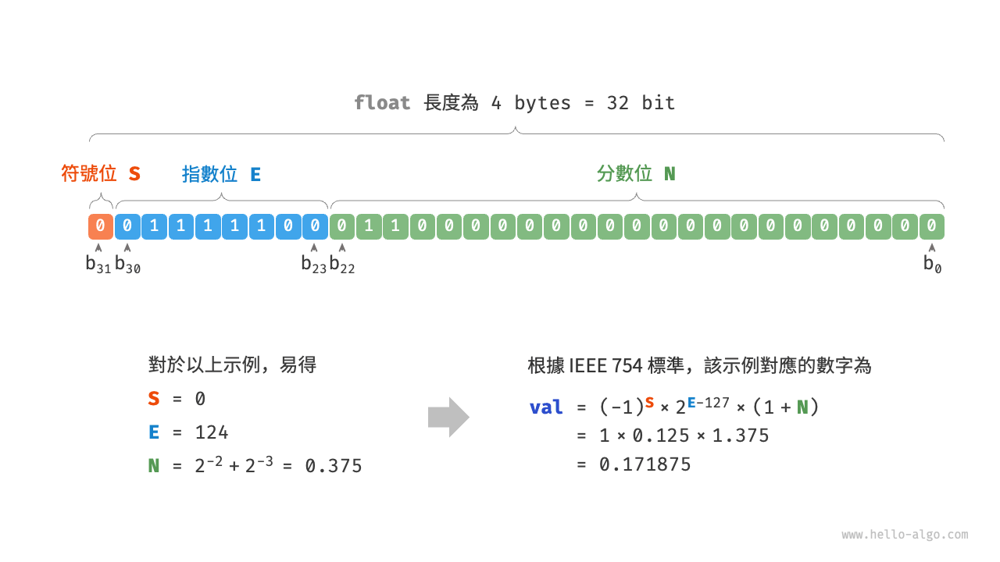

# 數字編碼 *

!!! note

    在本書中，標題帶有 * 符號的是選讀章節。如果你時間有限或感到理解困難，可以先跳過，等學完必讀章節後再單獨攻克。

## 原碼、反碼和補碼

在上一節的表格中我們發現，所有整數型別能夠表示的負數都比正數多一個，例如 `byte` 的取值範圍是 $[-128, 127]$ 。這個現象比較反直覺，它的內在原因涉及原碼、反碼、補碼的相關知識。

首先需要指出，**數字是以“補碼”的形式儲存在計算機中的**。在分析這樣做的原因之前，首先給出三者的定義。

- **原碼**：我們將數字的二進位制表示的最高位視為符號位，其中 $0$ 表示正數，$1$ 表示負數，其餘位表示數字的值。
- **反碼**：正數的反碼與其原碼相同，負數的反碼是對其原碼除符號位外的所有位取反。
- **補碼**：正數的補碼與其原碼相同，負數的補碼是在其反碼的基礎上加 $1$ 。

下圖展示了原碼、反碼和補碼之間的轉換方法。

「原碼 sign-magnitude」雖然最直觀，但存在一些侷限性。一方面，**負數的原碼不能直接用於運算**。例如在原碼下計算 $1 + (-2)$ ，得到的結果是 $-3$ ，這顯然是不對的。

$$
\begin{aligned}
& 1 + (-2) \newline
& \rightarrow 0000 \; 0001 + 1000 \; 0010 \newline
& = 1000 \; 0011 \newline
& \rightarrow -3
\end{aligned}
$$

為了解決此問題，計算機引入了「反碼 1's complement」。如果我們先將原碼轉換為反碼，並在反碼下計算 $1 + (-2)$ ，最後將結果從反碼轉換回原碼，則可得到正確結果 $-1$ 。

$$
\begin{aligned}
& 1 + (-2) \newline
& \rightarrow 0000 \; 0001 \; \text{(原碼)} + 1000 \; 0010 \; \text{(原碼)} \newline
& = 0000 \; 0001 \; \text{(反碼)} + 1111  \; 1101 \; \text{(反碼)} \newline
& = 1111 \; 1110 \; \text{(反碼)} \newline
& = 1000 \; 0001 \; \text{(原碼)} \newline
& \rightarrow -1
\end{aligned}
$$

另一方面，**數字零的原碼有 $+0$ 和 $-0$ 兩種表示方式**。這意味著數字零對應兩個不同的二進位制編碼，這可能會帶來歧義。比如在條件判斷中，如果沒有區分正零和負零，則可能會導致判斷結果出錯。而如果我們想處理正零和負零歧義，則需要引入額外的判斷操作，這可能會降低計算機的運算效率。

$$
\begin{aligned}
+0 & \rightarrow 0000 \; 0000 \newline
-0 & \rightarrow 1000 \; 0000
\end{aligned}
$$

與原碼一樣，反碼也存在正負零歧義問題，因此計算機進一步引入了「補碼 2's complement」。我們先來觀察一下負零的原碼、反碼、補碼的轉換過程：

$$
\begin{aligned}
-0 \rightarrow \; & 1000 \; 0000 \; \text{(原碼)} \newline
= \; & 1111 \; 1111 \; \text{(反碼)} \newline
= 1 \; & 0000 \; 0000 \; \text{(補碼)} \newline
\end{aligned}
$$

在負零的反碼基礎上加 $1$ 會產生進位，但 `byte` 型別的長度只有 8 位，因此溢位到第 9 位的 $1$ 會被捨棄。也就是說，**負零的補碼為 $0000 \; 0000$ ，與正零的補碼相同**。這意味著在補碼錶示中只存在一個零，正負零歧義從而得到解決。

還剩最後一個疑惑：`byte` 型別的取值範圍是 $[-128, 127]$ ，多出來的一個負數 $-128$ 是如何得到的呢？我們注意到，區間 $[-127, +127]$ 內的所有整數都有對應的原碼、反碼和補碼，並且原碼和補碼之間可以互相轉換。

然而，**補碼 $1000 \; 0000$ 是一個例外，它並沒有對應的原碼**。根據轉換方法，我們得到該補碼的原碼為 $0000 \; 0000$ 。這顯然是矛盾的，因為該原碼錶示數字 $0$ ，它的補碼應該是自身。計算機規定這個特殊的補碼 $1000 \; 0000$ 代表 $-128$ 。實際上，$(-1) + (-127)$ 在補碼下的計算結果就是 $-128$ 。

$$
\begin{aligned}
& (-127) + (-1) \newline
& \rightarrow 1111 \; 1111 \; \text{(原碼)} + 1000 \; 0001 \; \text{(原碼)} \newline
& = 1000 \; 0000 \; \text{(反碼)} + 1111  \; 1110 \; \text{(反碼)} \newline
& = 1000 \; 0001 \; \text{(補碼)} + 1111  \; 1111 \; \text{(補碼)} \newline
& = 1000 \; 0000 \; \text{(補碼)} \newline
& \rightarrow -128
\end{aligned}
$$

你可能已經發現了，上述所有計算都是加法運算。這暗示著一個重要事實：**計算機內部的硬體電路主要是基於加法運算設計的**。這是因為加法運算相對於其他運算（比如乘法、除法和減法）來說，硬體實現起來更簡單，更容易進行並行化處理，運算速度更快。

請注意，這並不意味著計算機只能做加法。**透過將加法與一些基本邏輯運算結合，計算機能夠實現各種其他的數學運算**。例如，計算減法 $a - b$ 可以轉換為計算加法 $a + (-b)$ ；計算乘法和除法可以轉換為計算多次加法或減法。

現在我們可以總結出計算機使用補碼的原因：基於補碼錶示，計算機可以用同樣的電路和操作來處理正數和負數的加法，不需要設計特殊的硬體電路來處理減法，並且無須特別處理正負零的歧義問題。這大大簡化了硬體設計，提高了運算效率。

補碼的設計非常精妙，因篇幅關係我們就先介紹到這裡，建議有興趣的讀者進一步深入瞭解。

## 浮點數編碼

細心的你可能會發現：`int` 和 `float` 長度相同，都是 4 位元組 ，但為什麼 `float` 的取值範圍遠大於 `int` ？這非常反直覺，因為按理說 `float` 需要表示小數，取值範圍應該變小才對。

實際上，**這是因為浮點數 `float` 採用了不同的表示方式**。記一個 32 位元長度的二進位制數為：

$$
b_{31} b_{30} b_{29} \ldots b_2 b_1 b_0
$$

根據 IEEE 754 標準，32-bit 長度的 `float` 由以下三個部分構成。

- 符號位 $\mathrm{S}$ ：佔 1 位 ，對應 $b_{31}$ 。
- 指數位 $\mathrm{E}$ ：佔 8 位 ，對應 $b_{30} b_{29} \ldots b_{23}$ 。
- 分數位 $\mathrm{N}$ ：佔 23 位 ，對應 $b_{22} b_{21} \ldots b_0$ 。

二進位制數 `float` 對應值的計算方法為：

$$
\text {val} = (-1)^{b_{31}} \times 2^{\left(b_{30} b_{29} \ldots b_{23}\right)_2-127} \times\left(1 . b_{22} b_{21} \ldots b_0\right)_2
$$

轉化到十進位制下的計算公式為：

$$
\text {val}=(-1)^{\mathrm{S}} \times 2^{\mathrm{E} -127} \times (1 + \mathrm{N})
$$

其中各項的取值範圍為：

$$
\begin{aligned}
\mathrm{S} \in & \{ 0, 1\}, \quad \mathrm{E} \in \{ 1, 2, \dots, 254 \} \newline
(1 + \mathrm{N}) = & (1 + \sum_{i=1}^{23} b_{23-i} 2^{-i}) \subset [1, 2 - 2^{-23}]
\end{aligned}
$$

觀察上圖，給定一個示例資料 $\mathrm{S} = 0$ ， $\mathrm{E} = 124$ ，$\mathrm{N} = 2^{-2} + 2^{-3} = 0.375$ ，則有：

$$
\text { val } = (-1)^0 \times 2^{124 - 127} \times (1 + 0.375) = 0.171875
$$

現在我們可以回答最初的問題：**`float` 的表示方式包含指數位，導致其取值範圍遠大於 `int`** 。根據以上計算，`float` 可表示的最大正數為 $2^{254 - 127} \times (2 - 2^{-23}) \approx 3.4 \times 10^{38}$ ，切換符號位便可得到最小負數。

**儘管浮點數 `float` 擴展了取值範圍，但其副作用是犧牲了精度**。整數型別 `int` 將全部 32 位元用於表示數字，數字是均勻分佈的；而由於指數位的存在，浮點數 `float` 的數值越大，相鄰兩個數字之間的差值就會趨向越大。

如下表所示，指數位 $E = 0$ 和 $E = 255$ 具有特殊含義，**用於表示零、無窮大、$\mathrm{NaN}$ 等**。

 表 <id> &nbsp; 指數位含義 

| 指數位 E           | 分數位 $\mathrm{N} = 0$ | 分數位 $\mathrm{N} \ne 0$ | 計算公式                                                               |
| ------------------ | ----------------------- | ------------------------- | ---------------------------------------------------------------------- |
| $0$                | $\pm 0$                 | 次正規數                  | $(-1)^{\mathrm{S}} \times 2^{-126} \times (0.\mathrm{N})$              |
| $1, 2, \dots, 254$ | 正規數                  | 正規數                    | $(-1)^{\mathrm{S}} \times 2^{(\mathrm{E} -127)} \times (1.\mathrm{N})$ |
| $255$              | $\pm \infty$            | $\mathrm{NaN}$            |                                                                        |

值得說明的是，次正規數顯著提升了浮點數的精度。最小正正規數為 $2^{-126}$ ，最小正次正規數為 $2^{-126} \times 2^{-23}$ 。

雙精度 `double` 也採用類似於 `float` 的表示方法，在此不做贅述。
