# 編輯距離問題

編輯距離，也稱 Levenshtein 距離，指兩個字串之間互相轉換的最少修改次數，通常用於在資訊檢索和自然語言處理中度量兩個序列的相似度。

!!! question

    輸入兩個字串 $s$ 和 $t$ ，返回將 $s$ 轉換為 $t$ 所需的最少編輯步數。
    
    你可以在一個字串中進行三種編輯操作：插入一個字元、刪除一個字元、將字元替換為任意一個字元。

如下圖所示，將 `kitten` 轉換為 `sitting` 需要編輯 3 步，包括 2 次替換操作與 1 次新增操作；將 `hello` 轉換為 `algo` 需要 3 步，包括 2 次替換操作和 1 次刪除操作。

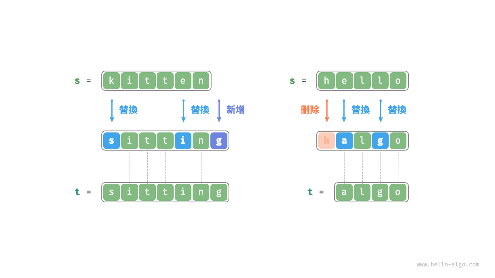

**編輯距離問題可以很自然地用決策樹模型來解釋**。字串對應樹節點，一輪決策（一次編輯操作）對應樹的一條邊。

如下圖所示，在不限制操作的情況下，每個節點都可以派生出許多條邊，每條邊對應一種操作，這意味著從 `hello` 轉換到 `algo` 有許多種可能的路徑。

從決策樹的角度看，本題的目標是求解節點 `hello` 和節點 `algo` 之間的最短路徑。


### 動態規劃思路

**第一步：思考每輪的決策，定義狀態，從而得到 $dp$ 表**

每一輪的決策是對字串 $s$ 進行一次編輯操作。

我們希望在編輯操作的過程中，問題的規模逐漸縮小，這樣才能構建子問題。設字串 $s$ 和 $t$ 的長度分別為 $n$ 和 $m$ ，我們先考慮兩字串尾部的字元 $s[n-1]$ 和 $t[m-1]$ 。

- 若 $s[n-1]$ 和 $t[m-1]$ 相同，我們可以跳過它們，直接考慮 $s[n-2]$ 和 $t[m-2]$ 。
- 若 $s[n-1]$ 和 $t[m-1]$ 不同，我們需要對 $s$ 進行一次編輯（插入、刪除、替換），使得兩字串尾部的字元相同，從而可以跳過它們，考慮規模更小的問題。

也就是說，我們在字串 $s$ 中進行的每一輪決策（編輯操作），都會使得 $s$ 和 $t$ 中剩餘的待匹配字元發生變化。因此，狀態為當前在 $s$ 和 $t$ 中考慮的第 $i$ 和第 $j$ 個字元，記為 $[i, j]$ 。

狀態 $[i, j]$ 對應的子問題：**將 $s$ 的前 $i$ 個字元更改為 $t$ 的前 $j$ 個字元所需的最少編輯步數**。

至此，得到一個尺寸為 $(i+1) \times (j+1)$ 的二維 $dp$ 表。

**第二步：找出最優子結構，進而推匯出狀態轉移方程**

考慮子問題 $dp[i, j]$ ，其對應的兩個字串的尾部字元為 $s[i-1]$ 和 $t[j-1]$ ，可根據不同編輯操作分為下圖所示的三種情況。

1. 在 $s[i-1]$ 之後新增 $t[j-1]$ ，則剩餘子問題 $dp[i, j-1]$ 。
2. 刪除 $s[i-1]$ ，則剩餘子問題 $dp[i-1, j]$ 。
3. 將 $s[i-1]$ 替換為 $t[j-1]$ ，則剩餘子問題 $dp[i-1, j-1]$ 。

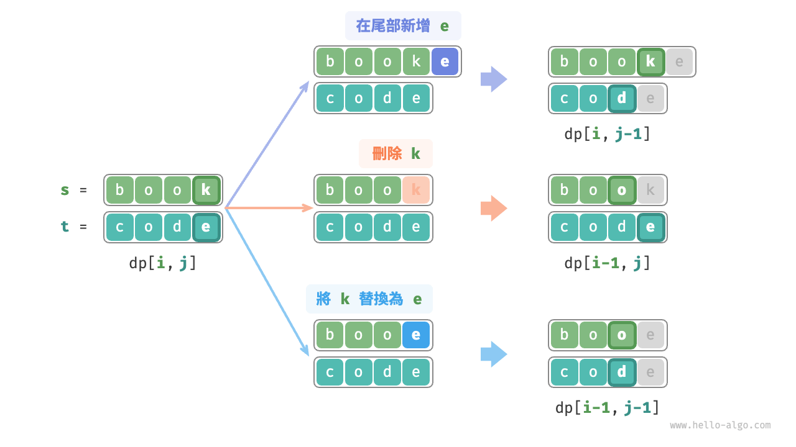

根據以上分析，可得最優子結構：$dp[i, j]$ 的最少編輯步數等於 $dp[i, j-1]$、$dp[i-1, j]$、$dp[i-1, j-1]$ 三者中的最少編輯步數，再加上本次的編輯步數 $1$ 。對應的狀態轉移方程為：

$$
dp[i, j] = \min(dp[i, j-1], dp[i-1, j], dp[i-1, j-1]) + 1
$$

請注意，**當 $s[i-1]$ 和 $t[j-1]$ 相同時，無須編輯當前字元**，這種情況下的狀態轉移方程為：

$$
dp[i, j] = dp[i-1, j-1]
$$

**第三步：確定邊界條件和狀態轉移順序**

當兩字串都為空時，編輯步數為 $0$ ，即 $dp[0, 0] = 0$ 。當 $s$ 為空但 $t$ 不為空時，最少編輯步數等於 $t$ 的長度，即首行 $dp[0, j] = j$ 。當 $s$ 不為空但 $t$ 為空時，最少編輯步數等於 $s$ 的長度，即首列 $dp[i, 0] = i$ 。

觀察狀態轉移方程，解 $dp[i, j]$ 依賴左方、上方、左上方的解，因此透過兩層迴圈正序走訪整個 $dp$ 表即可。

### 程式碼實現

```src
[file]{edit_distance}-[class]{}-[func]{edit_distance_dp}
```

如下圖所示，編輯距離問題的狀態轉移過程與背包問題非常類似，都可以看作填寫一個二維網格的過程。

=== "<1>"
    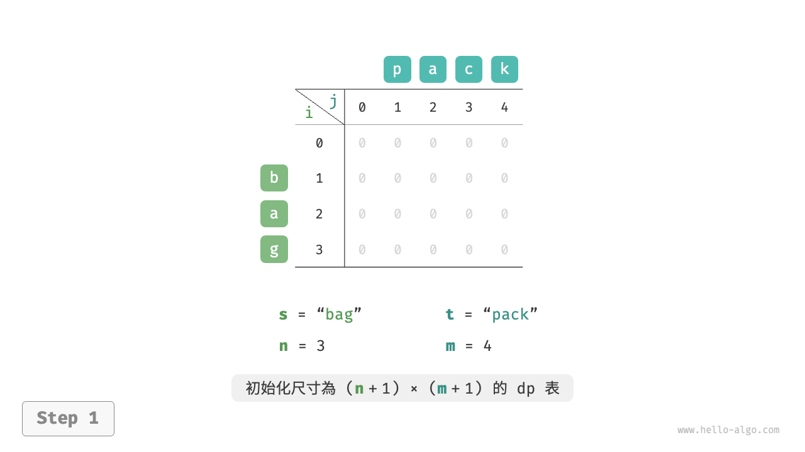

=== "<2>"
    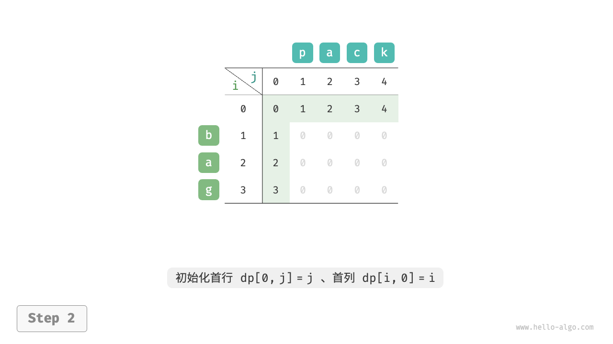

=== "<3>"
    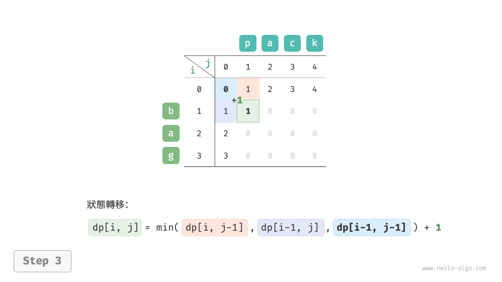

=== "<4>"
    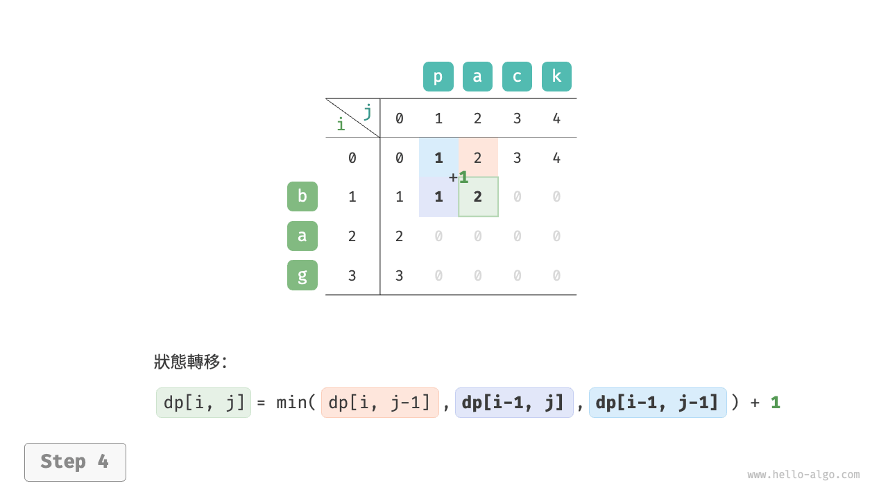

=== "<5>"
    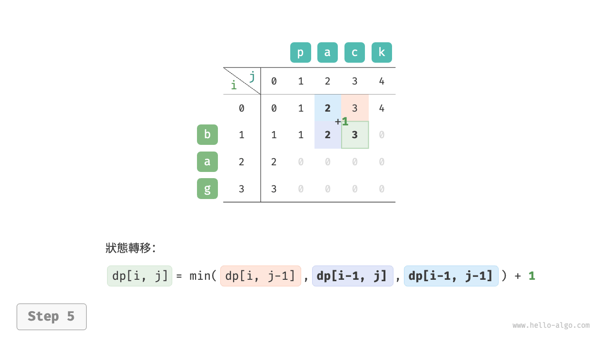

=== "<6>"
    

=== "<7>"
    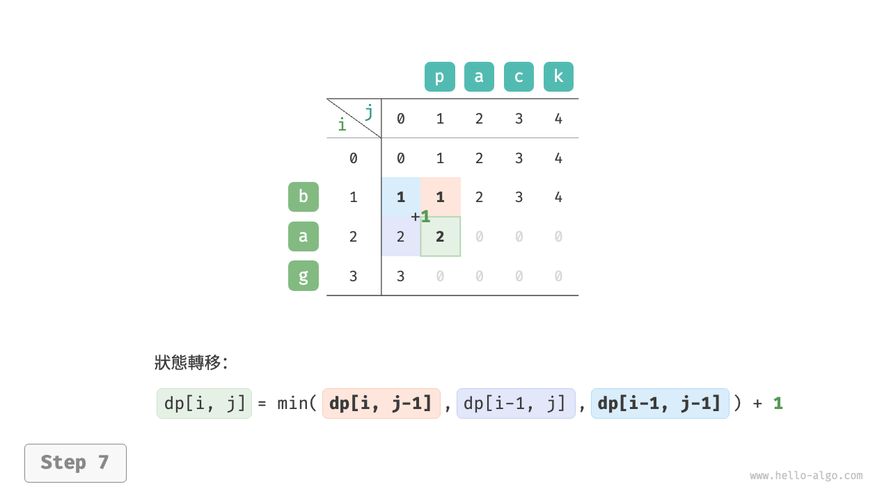

=== "<8>"
    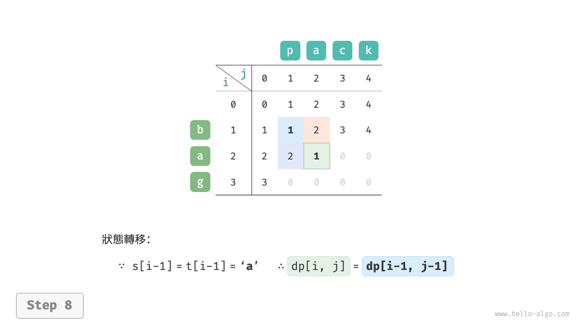

=== "<9>"
    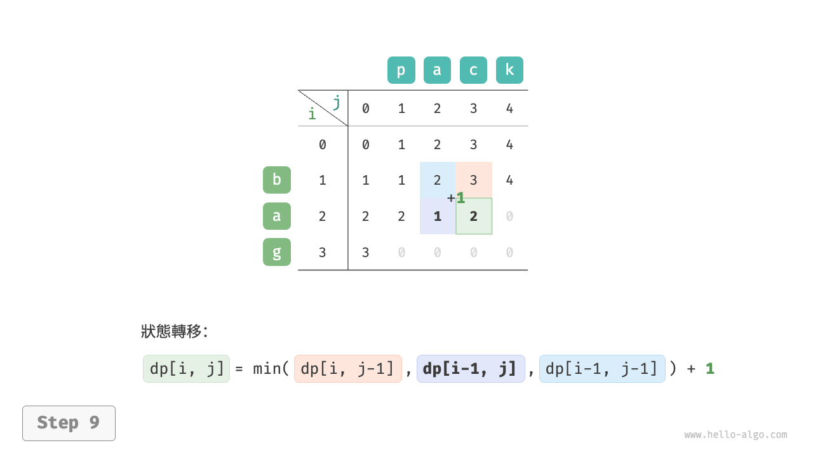

=== "<10>"
    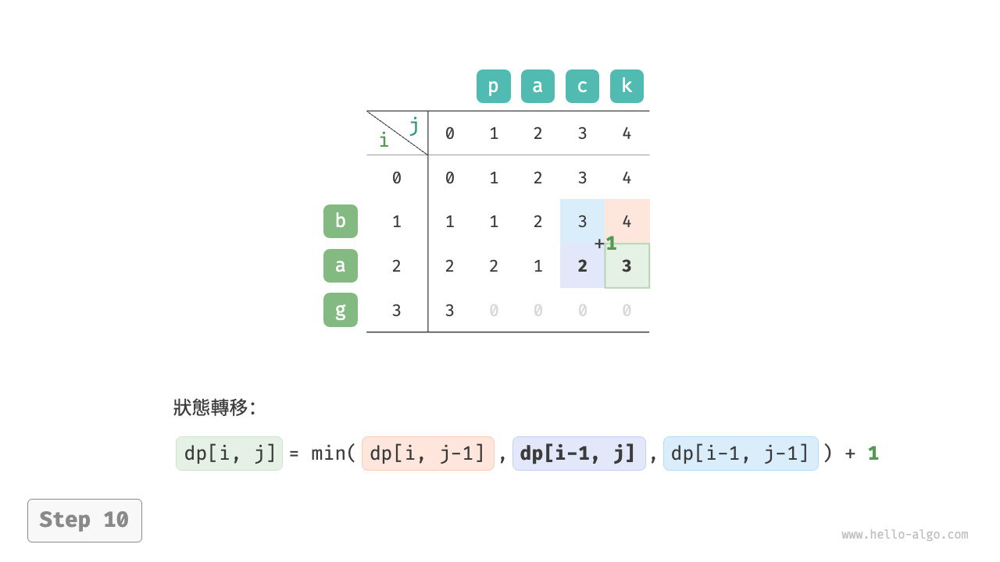

=== "<11>"
    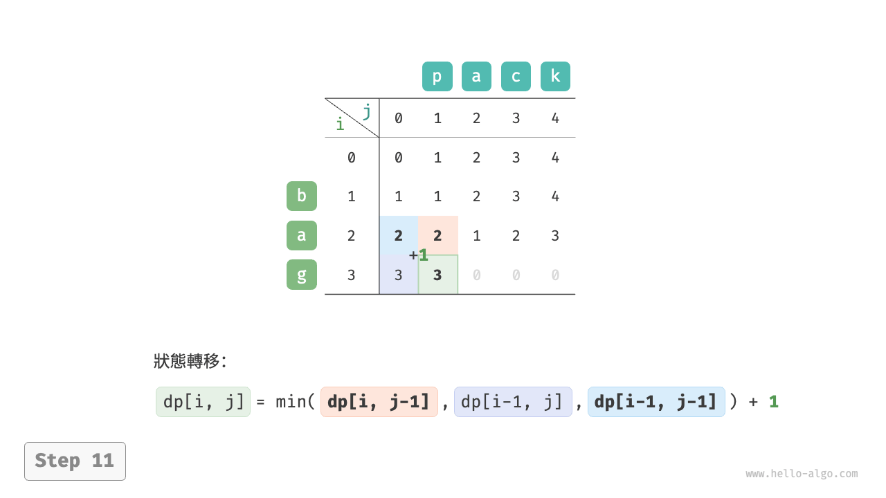

=== "<12>"
    

=== "<13>"
    

=== "<14>"
    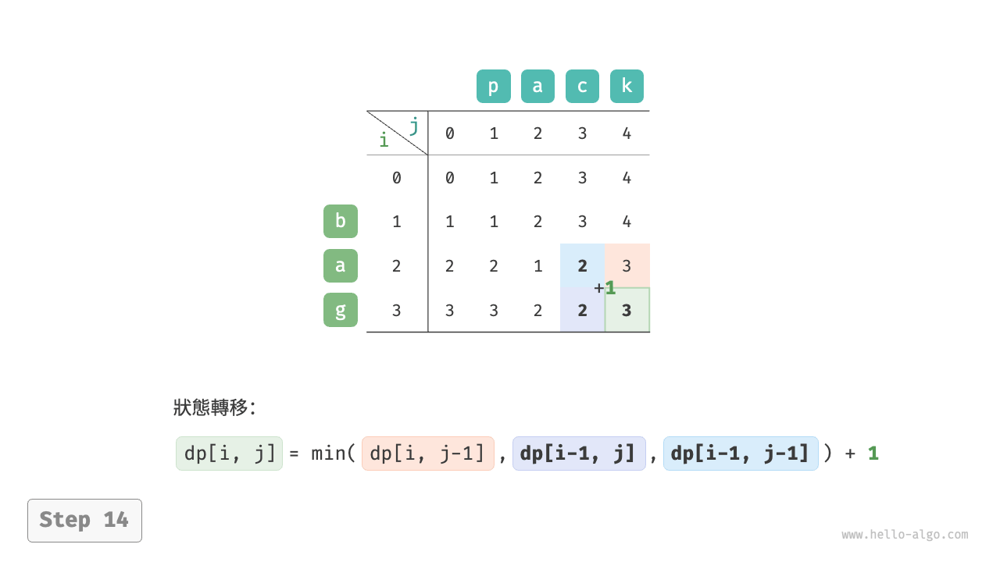

=== "<15>"
    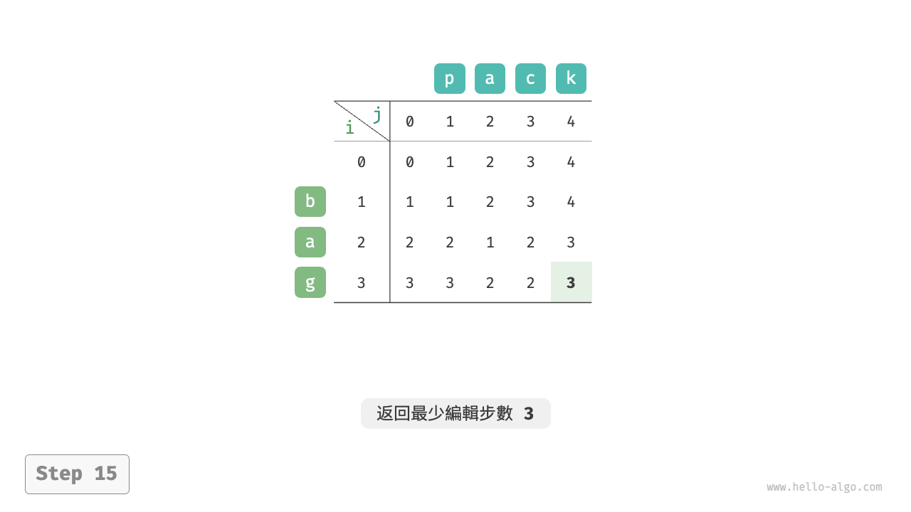

### 空間最佳化

由於 $dp[i,j]$ 是由上方 $dp[i-1, j]$、左方 $dp[i, j-1]$、左上方 $dp[i-1, j-1]$ 轉移而來的，而正序走訪會丟失左上方 $dp[i-1, j-1]$ ，倒序走訪無法提前構建 $dp[i, j-1]$ ，因此兩種走訪順序都不可取。

為此，我們可以使用一個變數 `leftup` 來暫存左上方的解 $dp[i-1, j-1]$ ，從而只需考慮左方和上方的解。此時的情況與完全背包問題相同，可使用正序走訪。程式碼如下所示：

```src
[file]{edit_distance}-[class]{}-[func]{edit_distance_dp_comp}
```
