# 完全背包問題

在本節中，我們先求解另一個常見的背包問題：完全背包，再瞭解它的一種特例：零錢兌換。

## 完全背包問題

!!! question

    給定 $n$ 個物品，第 $i$ 個物品的重量為 $wgt[i-1]$、價值為 $val[i-1]$ ，和一個容量為 $cap$ 的背包。**每個物品可以重複選取**，問在限定背包容量下能放入物品的最大價值。示例如下圖所示。


### 動態規劃思路

完全背包問題和 0-1 背包問題非常相似，**區別僅在於不限制物品的選擇次數**。

- 在 0-1 背包問題中，每種物品只有一個，因此將物品 $i$ 放入背包後，只能從前 $i-1$ 個物品中選擇。
- 在完全背包問題中，每種物品的數量是無限的，因此將物品 $i$ 放入背包後，**仍可以從前 $i$ 個物品中選擇**。

在完全背包問題的規定下，狀態 $[i, c]$ 的變化分為兩種情況。

- **不放入物品 $i$** ：與 0-1 背包問題相同，轉移至 $[i-1, c]$ 。
- **放入物品 $i$** ：與 0-1 背包問題不同，轉移至 $[i, c-wgt[i-1]]$ 。

從而狀態轉移方程變為：

$$
dp[i, c] = \max(dp[i-1, c], dp[i, c - wgt[i-1]] + val[i-1])
$$

### 程式碼實現

對比兩道題目的程式碼，狀態轉移中有一處從 $i-1$ 變為 $i$ ，其餘完全一致：

```src
[file]{unbounded_knapsack}-[class]{}-[func]{unbounded_knapsack_dp}
```

### 空間最佳化

由於當前狀態是從左邊和上邊的狀態轉移而來的，**因此空間最佳化後應該對 $dp$ 表中的每一行進行正序走訪**。

這個走訪順序與 0-1 背包正好相反。請藉助下圖來理解兩者的區別。

=== "<1>"
    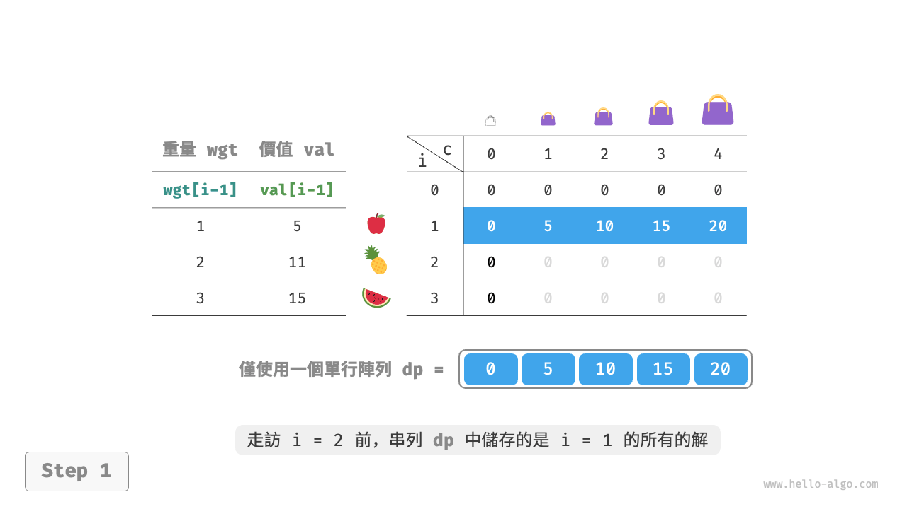

=== "<2>"
    

=== "<3>"
    

=== "<4>"
    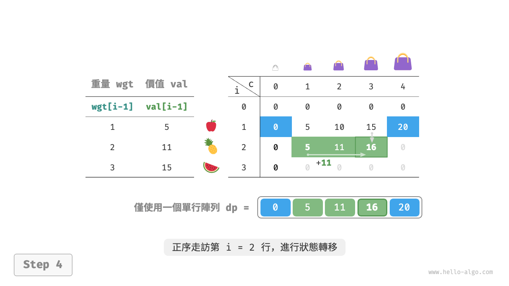

=== "<5>"
    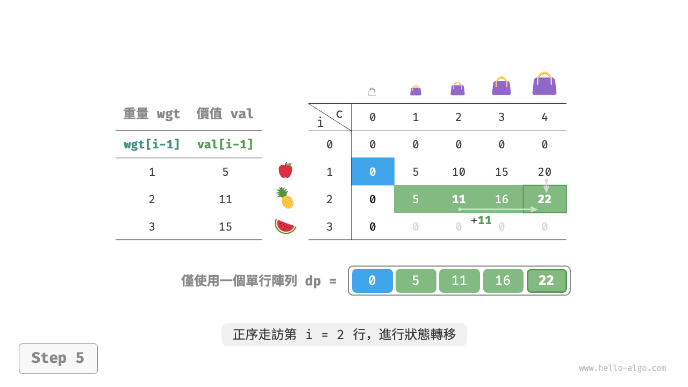

=== "<6>"
    

程式碼實現比較簡單，僅需將陣列 `dp` 的第一維刪除：

```src
[file]{unbounded_knapsack}-[class]{}-[func]{unbounded_knapsack_dp_comp}
```

## 零錢兌換問題

背包問題是一大類動態規劃問題的代表，其擁有很多變種，例如零錢兌換問題。

!!! question

    給定 $n$ 種硬幣，第 $i$ 種硬幣的面值為 $coins[i - 1]$ ，目標金額為 $amt$ ，**每種硬幣可以重複選取**，問能夠湊出目標金額的最少硬幣數量。如果無法湊出目標金額，則返回 $-1$ 。示例如下圖所示。

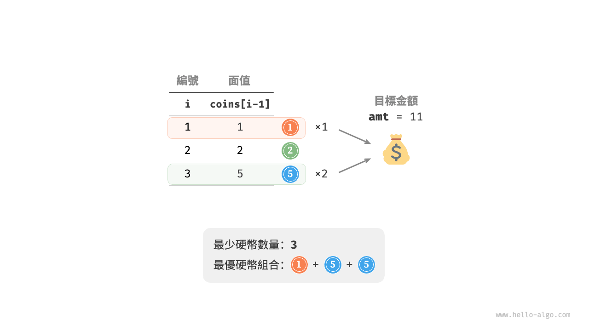

### 動態規劃思路

**零錢兌換可以看作完全背包問題的一種特殊情況**，兩者具有以下關聯與不同點。

- 兩道題可以相互轉換，“物品”對應“硬幣”、“物品重量”對應“硬幣面值”、“背包容量”對應“目標金額”。
- 最佳化目標相反，完全背包問題是要最大化物品價值，零錢兌換問題是要最小化硬幣數量。
- 完全背包問題是求“不超過”背包容量下的解，零錢兌換是求“恰好”湊到目標金額的解。

**第一步：思考每輪的決策，定義狀態，從而得到 $dp$ 表**

狀態 $[i, a]$ 對應的子問題為：**前 $i$ 種硬幣能夠湊出金額 $a$ 的最少硬幣數量**，記為 $dp[i, a]$ 。

二維 $dp$ 表的尺寸為 $(n+1) \times (amt+1)$ 。

**第二步：找出最優子結構，進而推匯出狀態轉移方程**

本題與完全背包問題的狀態轉移方程存在以下兩點差異。

- 本題要求最小值，因此需將運算子 $\max()$ 更改為 $\min()$ 。
- 最佳化主體是硬幣數量而非商品價值，因此在選中硬幣時執行 $+1$ 即可。

$$
dp[i, a] = \min(dp[i-1, a], dp[i, a - coins[i-1]] + 1)
$$

**第三步：確定邊界條件和狀態轉移順序**

當目標金額為 $0$ 時，湊出它的最少硬幣數量為 $0$ ，即首列所有 $dp[i, 0]$ 都等於 $0$ 。

當無硬幣時，**無法湊出任意 $> 0$ 的目標金額**，即是無效解。為使狀態轉移方程中的 $\min()$ 函式能夠識別並過濾無效解，我們考慮使用 $+ \infty$ 來表示它們，即令首行所有 $dp[0, a]$ 都等於 $+ \infty$ 。

### 程式碼實現

大多數程式語言並未提供 $+ \infty$ 變數，只能使用整型 `int` 的最大值來代替。而這又會導致大數越界：狀態轉移方程中的 $+ 1$ 操作可能發生溢位。

為此，我們採用數字 $amt + 1$ 來表示無效解，因為湊出 $amt$ 的硬幣數量最多為 $amt$ 。最後返回前，判斷 $dp[n, amt]$ 是否等於 $amt + 1$ ，若是則返回 $-1$ ，代表無法湊出目標金額。程式碼如下所示：

```src
[file]{coin_change}-[class]{}-[func]{coin_change_dp}
```

下圖展示了零錢兌換的動態規劃過程，和完全背包問題非常相似。

=== "<1>"
    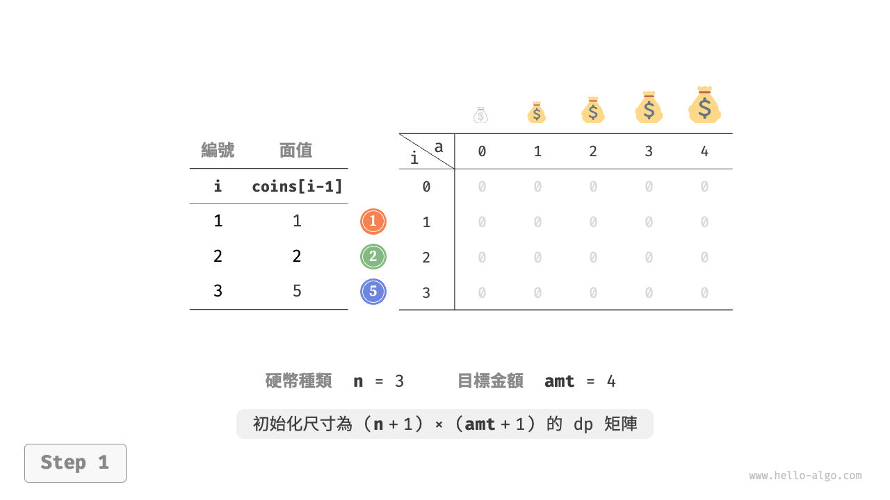

=== "<2>"
    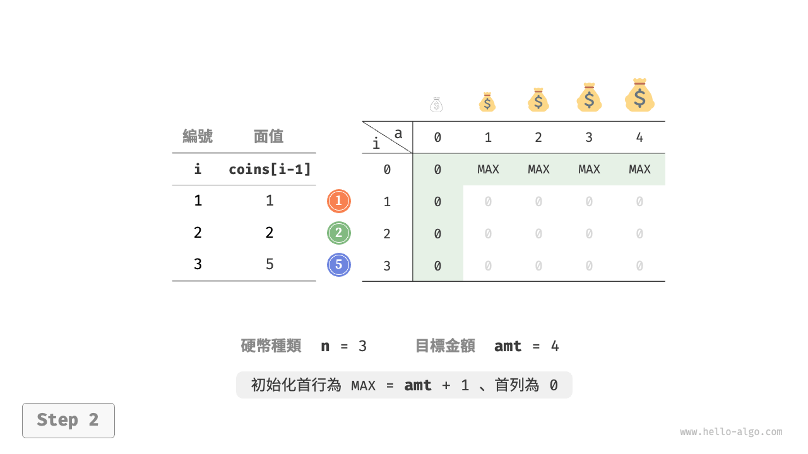

=== "<3>"
    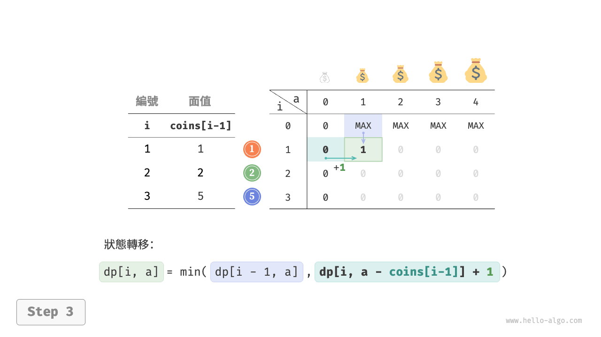

=== "<4>"
    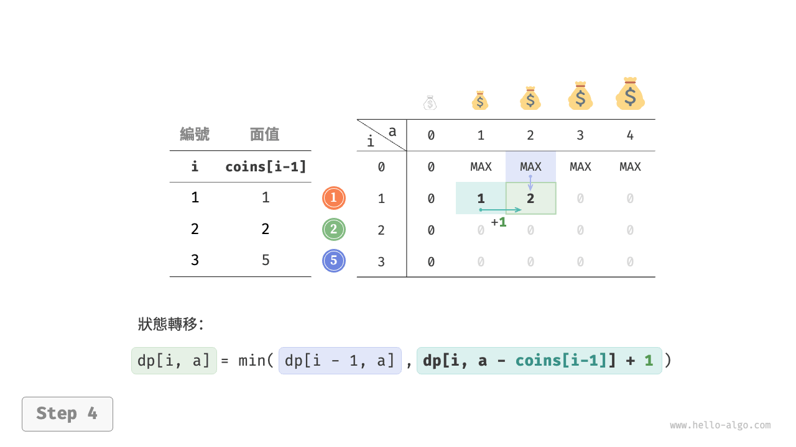

=== "<5>"
    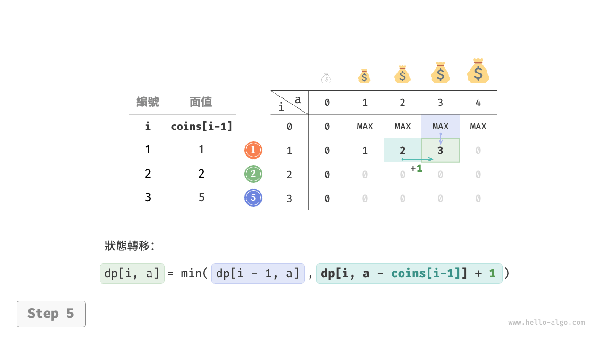

=== "<6>"
    

=== "<7>"
    

=== "<8>"
    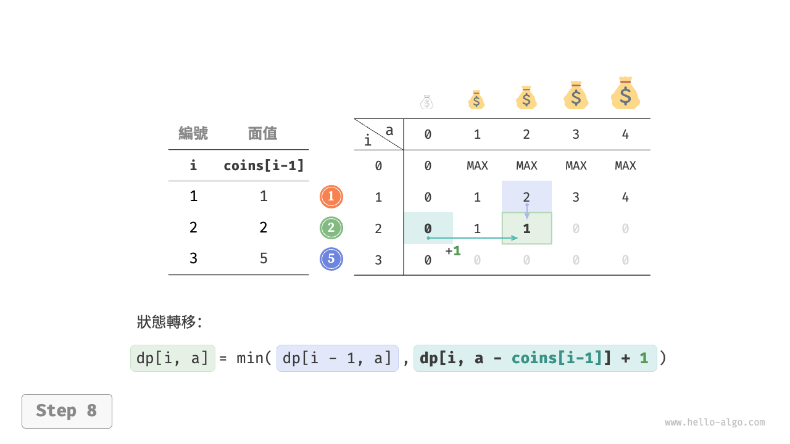

=== "<9>"
    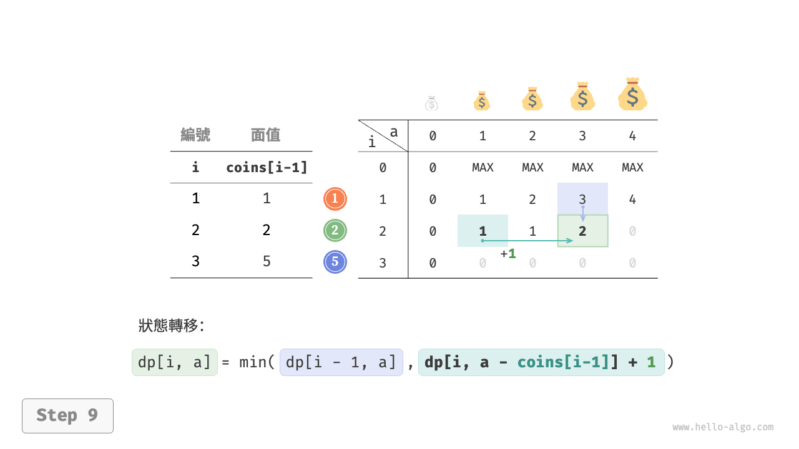

=== "<10>"
    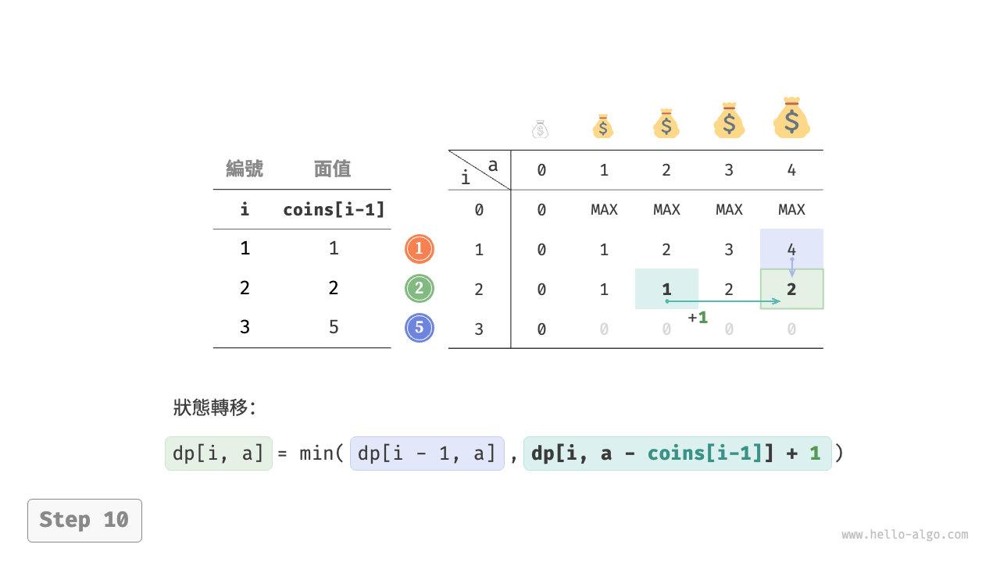

=== "<11>"
    

=== "<12>"
    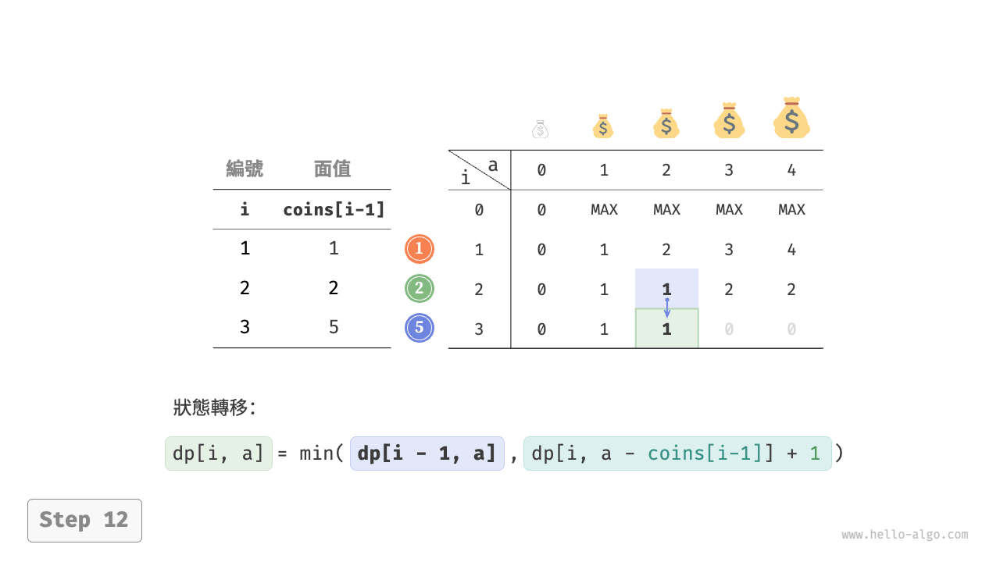

=== "<13>"
    

=== "<14>"
    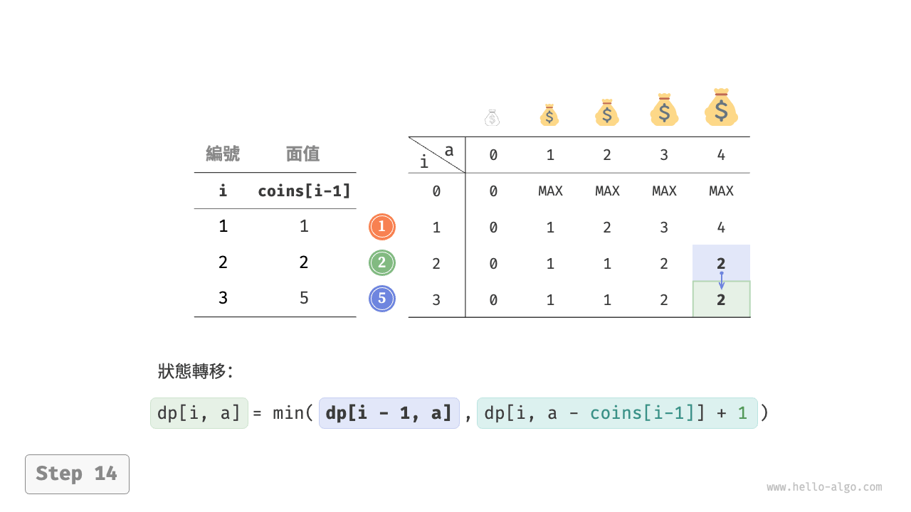

=== "<15>"
    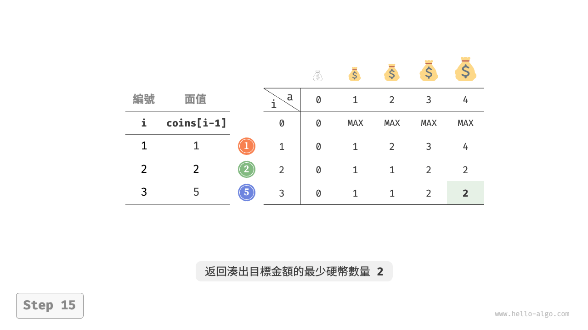

### 空間最佳化

零錢兌換的空間最佳化的處理方式和完全背包問題一致：

```src
[file]{coin_change}-[class]{}-[func]{coin_change_dp_comp}
```

## 零錢兌換問題 II

!!! question

    給定 $n$ 種硬幣，第 $i$ 種硬幣的面值為 $coins[i - 1]$ ，目標金額為 $amt$ ，每種硬幣可以重複選取，**問湊出目標金額的硬幣組合數量**。示例如下圖所示。

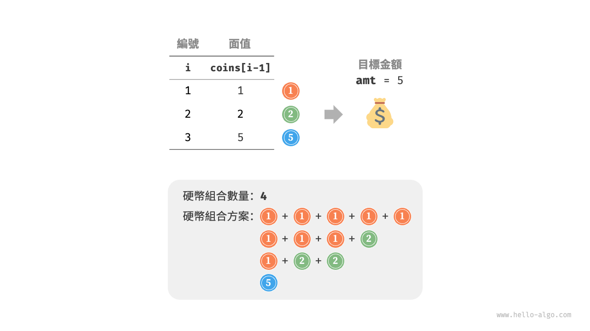

### 動態規劃思路

相比於上一題，本題目標是求組合數量，因此子問題變為：**前 $i$ 種硬幣能夠湊出金額 $a$ 的組合數量**。而 $dp$ 表仍然是尺寸為 $(n+1) \times (amt + 1)$ 的二維矩陣。

當前狀態的組合數量等於不選當前硬幣與選當前硬幣這兩種決策的組合數量之和。狀態轉移方程為：

$$
dp[i, a] = dp[i-1, a] + dp[i, a - coins[i-1]]
$$

當目標金額為 $0$ 時，無須選擇任何硬幣即可湊出目標金額，因此應將首列所有 $dp[i, 0]$ 都初始化為 $1$ 。當無硬幣時，無法湊出任何 $>0$ 的目標金額，因此首行所有 $dp[0, a]$ 都等於 $0$ 。

### 程式碼實現

```src
[file]{coin_change_ii}-[class]{}-[func]{coin_change_ii_dp}
```

### 空間最佳化

空間最佳化處理方式相同，刪除硬幣維度即可：

```src
[file]{coin_change_ii}-[class]{}-[func]{coin_change_ii_dp_comp}
```
