# 圖的走訪

樹代表的是“一對多”的關係，而圖則具有更高的自由度，可以表示任意的“多對多”關係。因此，我們可以把樹看作圖的一種特例。顯然，**樹的走訪操作也是圖的走訪操作的一種特例**。

圖和樹都需要應用搜索演算法來實現走訪操作。圖的走訪方式也可分為兩種：「廣度優先走訪」和「深度優先走訪」。

## 廣度優先走訪

**廣度優先走訪是一種由近及遠的走訪方式，從某個節點出發，始終優先訪問距離最近的頂點，並一層層向外擴張**。如下圖所示，從左上角頂點出發，首先走訪該頂點的所有鄰接頂點，然後走訪下一個頂點的所有鄰接頂點，以此類推，直至所有頂點訪問完畢。

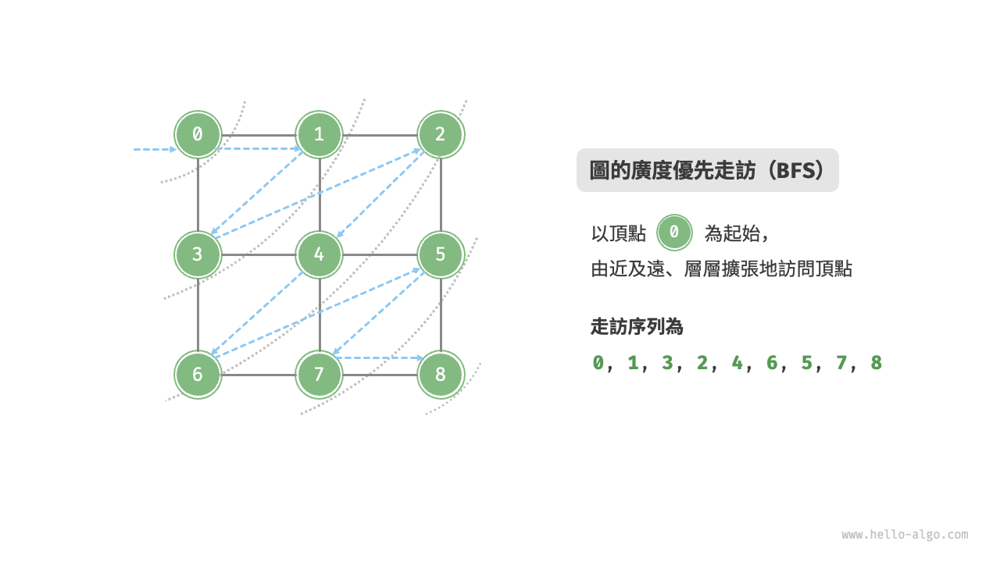

### 演算法實現

BFS 通常藉助佇列來實現，程式碼如下所示。佇列具有“先入先出”的性質，這與 BFS 的“由近及遠”的思想異曲同工。

1. 將走訪起始頂點 `startVet` 加入列列，並開啟迴圈。
2. 在迴圈的每輪迭代中，彈出佇列首頂點並記錄訪問，然後將該頂點的所有鄰接頂點加入到佇列尾部。
3. 迴圈步驟 `2.` ，直到所有頂點被訪問完畢後結束。

為了防止重複走訪頂點，我們需要藉助一個雜湊表 `visited` 來記錄哪些節點已被訪問。

```src
[file]{graph_bfs}-[class]{}-[func]{graph_bfs}
```

程式碼相對抽象，建議對照下圖來加深理解。

=== "<1>"
    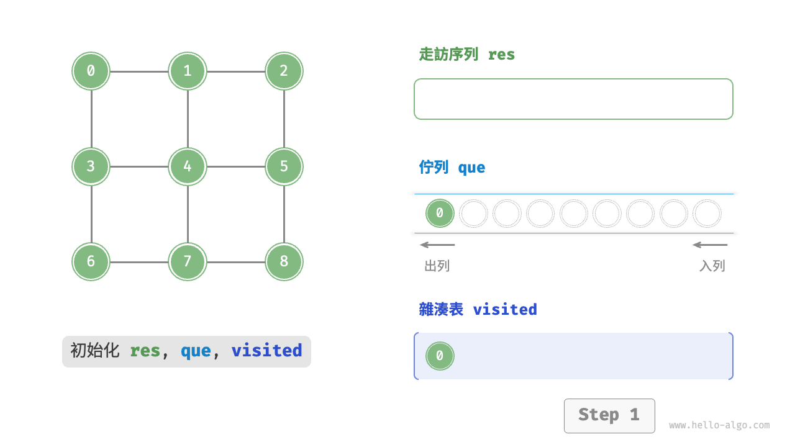

=== "<2>"
    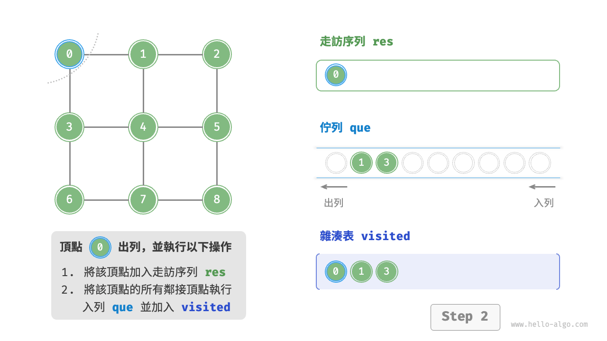

=== "<3>"
    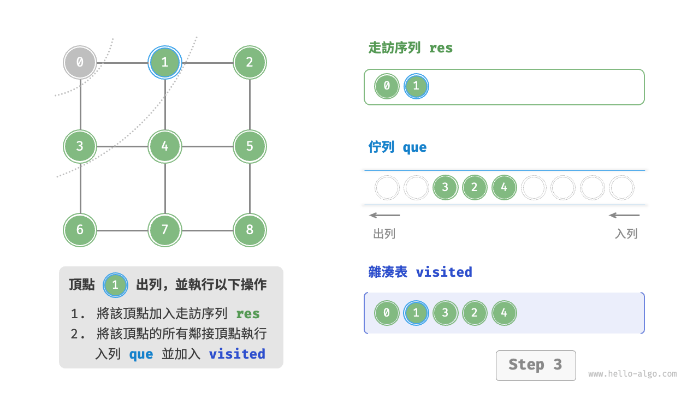

=== "<4>"
    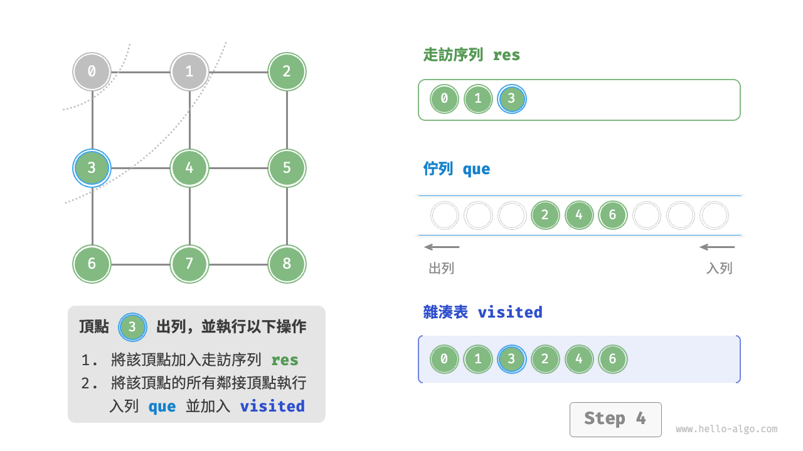

=== "<5>"
    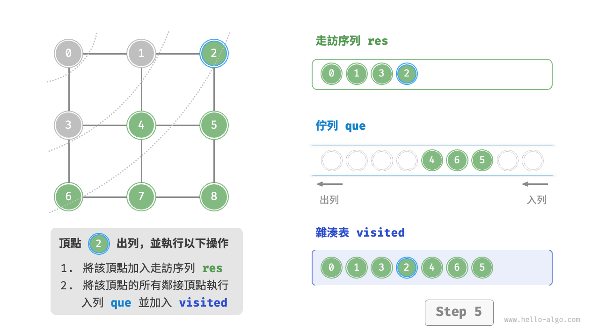

=== "<6>"
    

=== "<7>"
    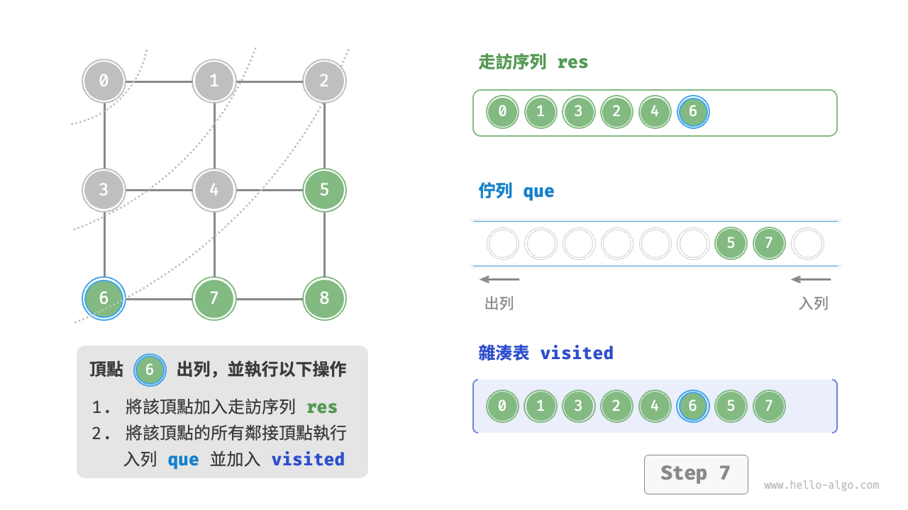

=== "<8>"
    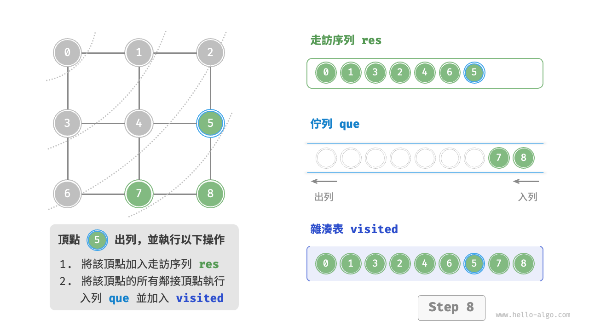

=== "<9>"
    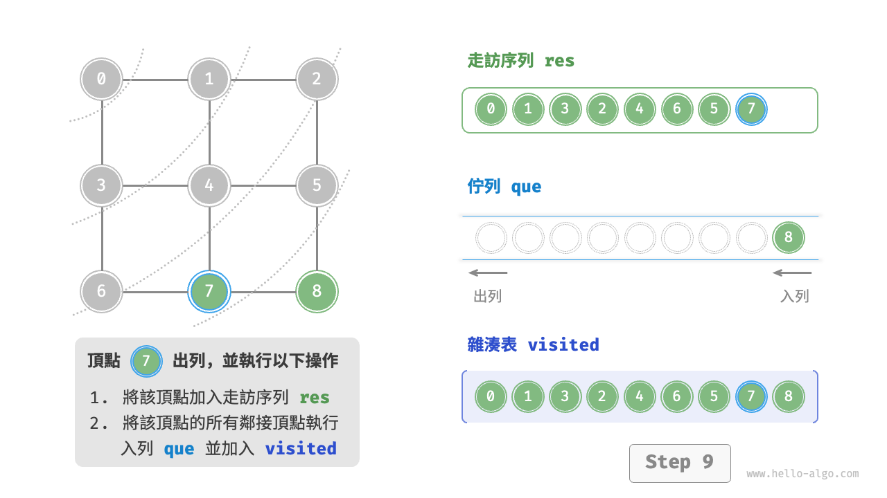

=== "<10>"
    

=== "<11>"
    

!!! question "廣度優先走訪的序列是否唯一？"

    不唯一。廣度優先走訪只要求按“由近及遠”的順序走訪，**而多個相同距離的頂點的走訪順序允許被任意打亂**。以上圖為例，頂點 $1$、$3$ 的訪問順序可以交換，頂點 $2$、$4$、$6$ 的訪問順序也可以任意交換。

### 複雜度分析

**時間複雜度**：所有頂點都會入列並出隊一次，使用 $O(|V|)$ 時間；在走訪鄰接頂點的過程中，由於是無向圖，因此所有邊都會被訪問 $2$ 次，使用 $O(2|E|)$ 時間；總體使用 $O(|V| + |E|)$ 時間。

**空間複雜度**：串列 `res` ，雜湊表 `visited` ，佇列 `que` 中的頂點數量最多為 $|V|$ ，使用 $O(|V|)$ 空間。

## 深度優先走訪

**深度優先走訪是一種優先走到底、無路可走再回頭的走訪方式**。如下圖所示，從左上角頂點出發，訪問當前頂點的某個鄰接頂點，直到走到盡頭時返回，再繼續走到盡頭並返回，以此類推，直至所有頂點走訪完成。

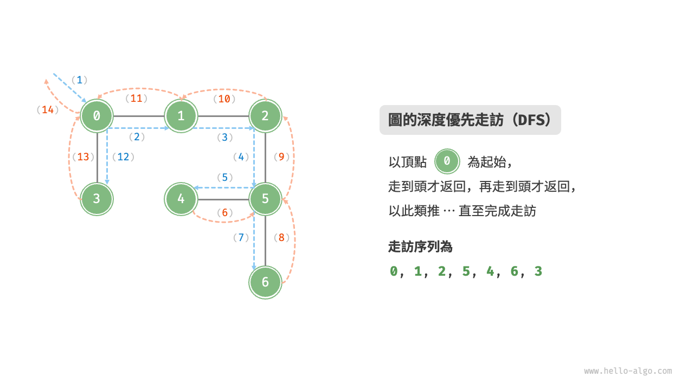

### 演算法實現

這種“走到盡頭再返回”的演算法範式通常基於遞迴來實現。與廣度優先走訪類似，在深度優先走訪中，我們也需要藉助一個雜湊表 `visited` 來記錄已被訪問的頂點，以避免重複訪問頂點。

```src
[file]{graph_dfs}-[class]{}-[func]{graph_dfs}
```

深度優先走訪的演算法流程如下圖所示。

- **直虛線代表向下遞推**，表示開啟了一個新的遞迴方法來訪問新頂點。
- **曲虛線代表向上回溯**，表示此遞迴方法已經返回，回溯到了開啟此方法的位置。

為了加深理解，建議將下圖與程式碼結合起來，在腦中模擬（或者用筆畫下來）整個 DFS 過程，包括每個遞迴方法何時開啟、何時返回。

=== "<1>"
    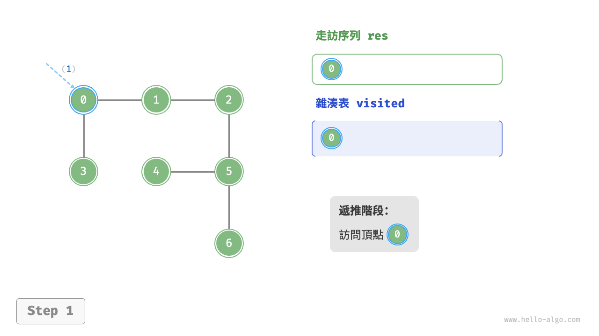

=== "<2>"
    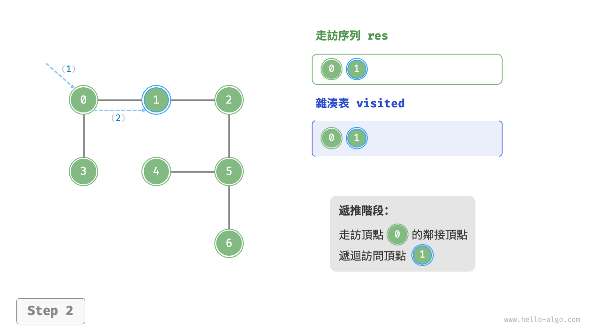

=== "<3>"
    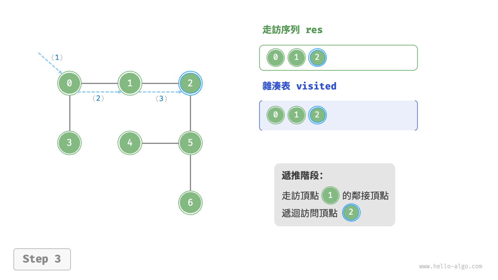

=== "<4>"
    

=== "<5>"
    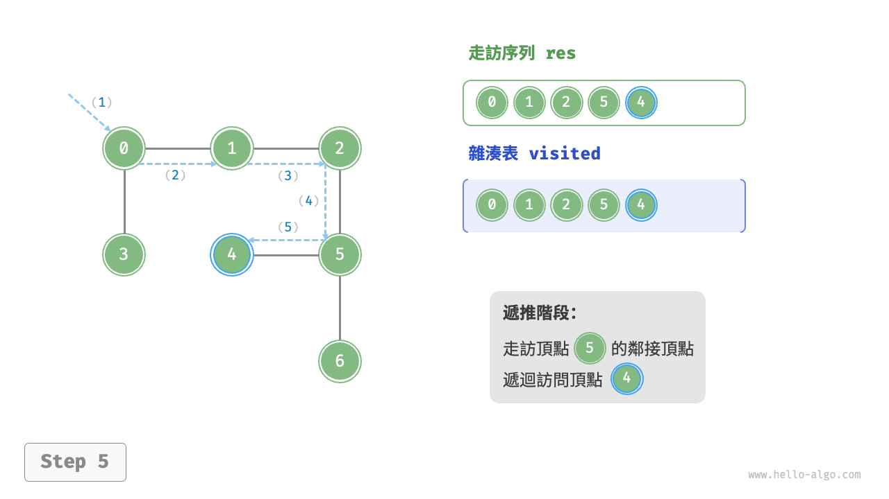

=== "<6>"
    

=== "<7>"
    

=== "<8>"
    

=== "<9>"
    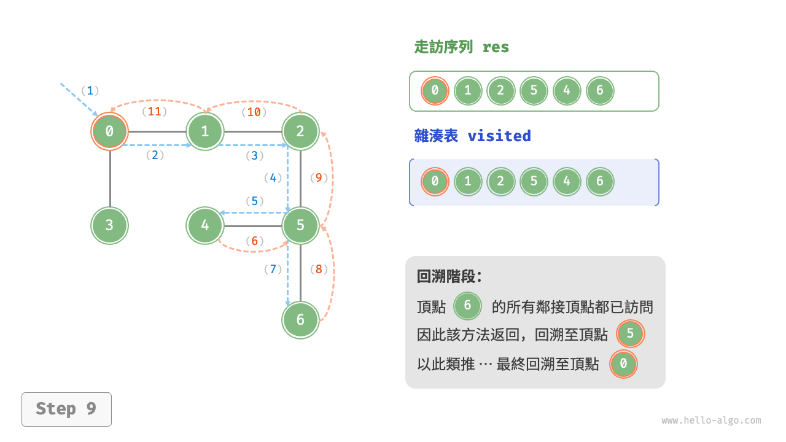

=== "<10>"
    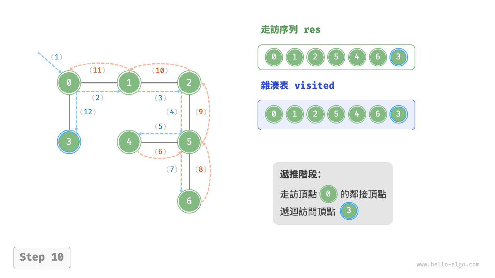

=== "<11>"
    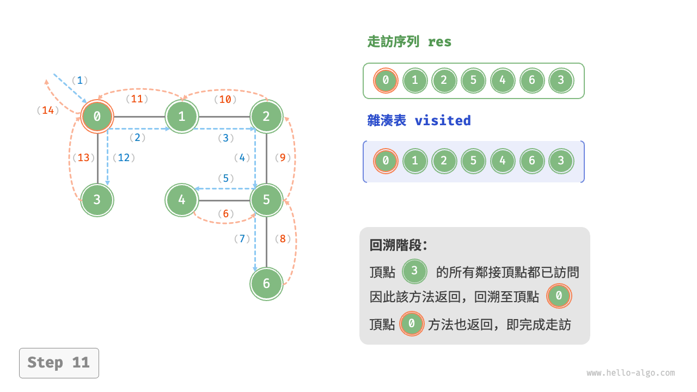

!!! question "深度優先走訪的序列是否唯一？"

    與廣度優先走訪類似，深度優先走訪序列的順序也不是唯一的。給定某頂點，先往哪個方向探索都可以，即鄰接頂點的順序可以任意打亂，都是深度優先走訪。
    
    以樹的走訪為例，“根 $\rightarrow$ 左 $\rightarrow$ 右”“左 $\rightarrow$ 根 $\rightarrow$ 右”“左 $\rightarrow$ 右 $\rightarrow$ 根”分別對應前序、中序、後序走訪，它們展示了三種走訪優先順序，然而這三者都屬於深度優先走訪。

### 複雜度分析

**時間複雜度**：所有頂點都會被訪問 $1$ 次，使用 $O(|V|)$ 時間；所有邊都會被訪問 $2$ 次，使用 $O(2|E|)$ 時間；總體使用 $O(|V| + |E|)$ 時間。

**空間複雜度**：串列 `res` ，雜湊表 `visited` 頂點數量最多為 $|V|$ ，遞迴深度最大為 $|V|$ ，因此使用 $O(|V|)$ 空間。
