# 堆積

「堆積 heap」是一種滿足特定條件的完全二元樹，主要可分為兩種型別，如下圖所示。

- 「小頂堆積 min heap」：任意節點的值 $\leq$ 其子節點的值。
- 「大頂堆積 max heap」：任意節點的值 $\geq$ 其子節點的值。

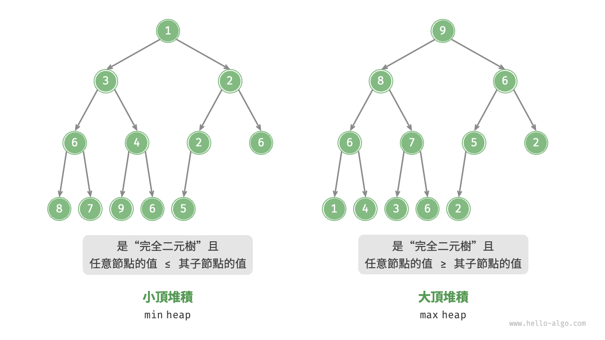

堆積作為完全二元樹的一個特例，具有以下特性。

- 最底層節點靠左填充，其他層的節點都被填滿。
- 我們將二元樹的根節點稱為“堆積頂”，將底層最靠右的節點稱為“堆積底”。
- 對於大頂堆積（小頂堆積），堆積頂元素（根節點）的值是最大（最小）的。

## 堆積的常用操作

需要指出的是，許多程式語言提供的是「優先佇列 priority queue」，這是一種抽象的資料結構，定義為具有優先順序排序的佇列。

實際上，**堆積通常用於實現優先佇列，大頂堆積相當於元素按從大到小的順序出列的優先佇列**。從使用角度來看，我們可以將“優先佇列”和“堆積”看作等價的資料結構。因此，本書對兩者不做特別區分，統一稱作“堆積”。

堆積的常用操作見下表，方法名需要根據程式語言來確定。

<p align="center"> 表 <id> &nbsp; 堆積的操作效率 </p>

| 方法名      | 描述                                             | 時間複雜度  |
| ----------- | ------------------------------------------------ | ----------- |
| `push()`    | 元素入堆積                                         | $O(\log n)$ |
| `pop()`     | 堆積頂元素出堆積                                     | $O(\log n)$ |
| `peek()`    | 訪問堆積頂元素（對於大 / 小頂堆積分別為最大 / 小值） | $O(1)$      |
| `size()`    | 獲取堆積的元素數量                                 | $O(1)$      |
| `isEmpty()` | 判斷堆積是否為空                                   | $O(1)$      |

在實際應用中，我們可以直接使用程式語言提供的堆積類（或優先佇列類）。

類似於排序演算法中的“從小到大排列”和“從大到小排列”，我們可以透過設定一個 `flag` 或修改 `Comparator` 實現“小頂堆積”與“大頂堆積”之間的轉換。程式碼如下所示：

=== "Python"

    ```python title="heap.py"
    # 初始化小頂堆積
    min_heap, flag = [], 1
    # 初始化大頂堆積
    max_heap, flag = [], -1

    # Python 的 heapq 模組預設實現小頂堆積
    # 考慮將“元素取負”後再入堆積，這樣就可以將大小關係顛倒，從而實現大頂堆積
    # 在本示例中，flag = 1 時對應小頂堆積，flag = -1 時對應大頂堆積

    # 元素入堆積
    heapq.heappush(max_heap, flag * 1)
    heapq.heappush(max_heap, flag * 3)
    heapq.heappush(max_heap, flag * 2)
    heapq.heappush(max_heap, flag * 5)
    heapq.heappush(max_heap, flag * 4)

    # 獲取堆積頂元素
    peek: int = flag * max_heap[0] # 5

    # 堆積頂元素出堆積
    # 出堆積元素會形成一個從大到小的序列
    val = flag * heapq.heappop(max_heap) # 5
    val = flag * heapq.heappop(max_heap) # 4
    val = flag * heapq.heappop(max_heap) # 3
    val = flag * heapq.heappop(max_heap) # 2
    val = flag * heapq.heappop(max_heap) # 1

    # 獲取堆積大小
    size: int = len(max_heap)

    # 判斷堆積是否為空
    is_empty: bool = not max_heap

    # 輸入串列並建堆積
    min_heap: list[int] = [1, 3, 2, 5, 4]
    heapq.heapify(min_heap)
    ```

=== "C++"

    ```cpp title="heap.cpp"
    /* 初始化堆積 */
    // 初始化小頂堆積
    priority_queue<int, vector<int>, greater<int>> minHeap;
    // 初始化大頂堆積
    priority_queue<int, vector<int>, less<int>> maxHeap;

    /* 元素入堆積 */
    maxHeap.push(1);
    maxHeap.push(3);
    maxHeap.push(2);
    maxHeap.push(5);
    maxHeap.push(4);

    /* 獲取堆積頂元素 */
    int peek = maxHeap.top(); // 5

    /* 堆積頂元素出堆積 */
    // 出堆積元素會形成一個從大到小的序列
    maxHeap.pop(); // 5
    maxHeap.pop(); // 4
    maxHeap.pop(); // 3
    maxHeap.pop(); // 2
    maxHeap.pop(); // 1

    /* 獲取堆積大小 */
    int size = maxHeap.size();

    /* 判斷堆積是否為空 */
    bool isEmpty = maxHeap.empty();

    /* 輸入串列並建堆積 */
    vector<int> input{1, 3, 2, 5, 4};
    priority_queue<int, vector<int>, greater<int>> minHeap(input.begin(), input.end());
    ```

=== "Java"

    ```java title="heap.java"
    /* 初始化堆積 */
    // 初始化小頂堆積
    Queue<Integer> minHeap = new PriorityQueue<>();
    // 初始化大頂堆積（使用 lambda 表示式修改 Comparator 即可）
    Queue<Integer> maxHeap = new PriorityQueue<>((a, b) -> b - a);
    
    /* 元素入堆積 */
    maxHeap.offer(1);
    maxHeap.offer(3);
    maxHeap.offer(2);
    maxHeap.offer(5);
    maxHeap.offer(4);
    
    /* 獲取堆積頂元素 */
    int peek = maxHeap.peek(); // 5
    
    /* 堆積頂元素出堆積 */
    // 出堆積元素會形成一個從大到小的序列
    peek = maxHeap.poll(); // 5
    peek = maxHeap.poll(); // 4
    peek = maxHeap.poll(); // 3
    peek = maxHeap.poll(); // 2
    peek = maxHeap.poll(); // 1
    
    /* 獲取堆積大小 */
    int size = maxHeap.size();
    
    /* 判斷堆積是否為空 */
    boolean isEmpty = maxHeap.isEmpty();
    
    /* 輸入串列並建堆積 */
    minHeap = new PriorityQueue<>(Arrays.asList(1, 3, 2, 5, 4));
    ```

=== "C#"

    ```csharp title="heap.cs"
    /* 初始化堆積 */
    // 初始化小頂堆積
    PriorityQueue<int, int> minHeap = new();
    // 初始化大頂堆積（使用 lambda 表示式修改 Comparator 即可）
    PriorityQueue<int, int> maxHeap = new(Comparer<int>.Create((x, y) => y - x));

    /* 元素入堆積 */
    maxHeap.Enqueue(1, 1);
    maxHeap.Enqueue(3, 3);
    maxHeap.Enqueue(2, 2);
    maxHeap.Enqueue(5, 5);
    maxHeap.Enqueue(4, 4);

    /* 獲取堆積頂元素 */
    int peek = maxHeap.Peek();//5

    /* 堆積頂元素出堆積 */
    // 出堆積元素會形成一個從大到小的序列
    peek = maxHeap.Dequeue();  // 5
    peek = maxHeap.Dequeue();  // 4
    peek = maxHeap.Dequeue();  // 3
    peek = maxHeap.Dequeue();  // 2
    peek = maxHeap.Dequeue();  // 1

    /* 獲取堆積大小 */
    int size = maxHeap.Count;

    /* 判斷堆積是否為空 */
    bool isEmpty = maxHeap.Count == 0;

    /* 輸入串列並建堆積 */
    minHeap = new PriorityQueue<int, int>([(1, 1), (3, 3), (2, 2), (5, 5), (4, 4)]);
    ```

=== "Go"

    ```go title="heap.go"
    // Go 語言中可以透過實現 heap.Interface 來構建整數大頂堆積
    // 實現 heap.Interface 需要同時實現 sort.Interface
    type intHeap []any

    // Push heap.Interface 的方法，實現推入元素到堆積
    func (h *intHeap) Push(x any) {
        // Push 和 Pop 使用 pointer receiver 作為引數
        // 因為它們不僅會對切片的內容進行調整，還會修改切片的長度。
        *h = append(*h, x.(int))
    }

    // Pop heap.Interface 的方法，實現彈出堆積頂元素
    func (h *intHeap) Pop() any {
        // 待出堆積元素存放在最後
        last := (*h)[len(*h)-1]
        *h = (*h)[:len(*h)-1]
        return last
    }

    // Len sort.Interface 的方法
    func (h *intHeap) Len() int {
        return len(*h)
    }

    // Less sort.Interface 的方法
    func (h *intHeap) Less(i, j int) bool {
        // 如果實現小頂堆積，則需要調整為小於號
        return (*h)[i].(int) > (*h)[j].(int)
    }

    // Swap sort.Interface 的方法
    func (h *intHeap) Swap(i, j int) {
        (*h)[i], (*h)[j] = (*h)[j], (*h)[i]
    }

    // Top 獲取堆積頂元素
    func (h *intHeap) Top() any {
        return (*h)[0]
    }

    /* Driver Code */
    func TestHeap(t *testing.T) {
        /* 初始化堆積 */
        // 初始化大頂堆積
        maxHeap := &intHeap{}
        heap.Init(maxHeap)
        /* 元素入堆積 */
        // 呼叫 heap.Interface 的方法，來新增元素
        heap.Push(maxHeap, 1)
        heap.Push(maxHeap, 3)
        heap.Push(maxHeap, 2)
        heap.Push(maxHeap, 4)
        heap.Push(maxHeap, 5)

        /* 獲取堆積頂元素 */
        top := maxHeap.Top()
        fmt.Printf("堆積頂元素為 %d\n", top)

        /* 堆積頂元素出堆積 */
        // 呼叫 heap.Interface 的方法，來移除元素
        heap.Pop(maxHeap) // 5
        heap.Pop(maxHeap) // 4
        heap.Pop(maxHeap) // 3
        heap.Pop(maxHeap) // 2
        heap.Pop(maxHeap) // 1

        /* 獲取堆積大小 */
        size := len(*maxHeap)
        fmt.Printf("堆積元素數量為 %d\n", size)

        /* 判斷堆積是否為空 */
        isEmpty := len(*maxHeap) == 0
        fmt.Printf("堆積是否為空 %t\n", isEmpty)
    }
    ```

=== "Swift"

    ```swift title="heap.swift"
    /* 初始化堆積 */
    // Swift 的 Heap 型別同時支援最大堆積和最小堆積，且需要引入 swift-collections
    var heap = Heap<Int>()

    /* 元素入堆積 */
    heap.insert(1)
    heap.insert(3)
    heap.insert(2)
    heap.insert(5)
    heap.insert(4)

    /* 獲取堆積頂元素 */
    var peek = heap.max()!

    /* 堆積頂元素出堆積 */
    peek = heap.removeMax() // 5
    peek = heap.removeMax() // 4
    peek = heap.removeMax() // 3
    peek = heap.removeMax() // 2
    peek = heap.removeMax() // 1

    /* 獲取堆積大小 */
    let size = heap.count

    /* 判斷堆積是否為空 */
    let isEmpty = heap.isEmpty

    /* 輸入串列並建堆積 */
    let heap2 = Heap([1, 3, 2, 5, 4])
    ```

=== "JS"

    ```javascript title="heap.js"
    // JavaScript 未提供內建 Heap 類
    ```

=== "TS"

    ```typescript title="heap.ts"
    // TypeScript 未提供內建 Heap 類
    ```

=== "Dart"

    ```dart title="heap.dart"
    // Dart 未提供內建 Heap 類
    ```

=== "Rust"

    ```rust title="heap.rs"
    use std::collections::BinaryHeap;
    use std::cmp::Reverse;

    /* 初始化堆積 */
    // 初始化小頂堆積
    let mut min_heap = BinaryHeap::<Reverse<i32>>::new();
    // 初始化大頂堆積
    let mut max_heap = BinaryHeap::new();

    /* 元素入堆積 */
    max_heap.push(1);
    max_heap.push(3);
    max_heap.push(2);
    max_heap.push(5);
    max_heap.push(4);
    
    /* 獲取堆積頂元素 */
    let peek = max_heap.peek().unwrap();  // 5

    /* 堆積頂元素出堆積 */
    // 出堆積元素會形成一個從大到小的序列
    let peek = max_heap.pop().unwrap();   // 5
    let peek = max_heap.pop().unwrap();   // 4
    let peek = max_heap.pop().unwrap();   // 3
    let peek = max_heap.pop().unwrap();   // 2
    let peek = max_heap.pop().unwrap();   // 1

    /* 獲取堆積大小 */
    let size = max_heap.len();

    /* 判斷堆積是否為空 */
    let is_empty = max_heap.is_empty();

    /* 輸入串列並建堆積 */
    let min_heap = BinaryHeap::from(vec![Reverse(1), Reverse(3), Reverse(2), Reverse(5), Reverse(4)]);
    ```

=== "C"

    ```c title="heap.c"
    // C 未提供內建 Heap 類
    ```

=== "Zig"

    ```zig title="heap.zig"

    ```

??? pythontutor "視覺化執行"

    https://pythontutor.com/render.html#code=import%20heapq%0A%0A%22%22%22Driver%20Code%22%22%22%0Aif%20__name__%20%3D%3D%20%22__main__%22%3A%0A%20%20%20%20%23%20%E5%88%9D%E5%A7%8B%E5%8C%96%E5%B0%8F%E9%A1%B6%E5%A0%86%0A%20%20%20%20min_heap,%20flag%20%3D%20%5B%5D,%201%0A%20%20%20%20%23%20%E5%88%9D%E5%A7%8B%E5%8C%96%E5%A4%A7%E9%A1%B6%E5%A0%86%0A%20%20%20%20max_heap,%20flag%20%3D%20%5B%5D,%20-1%0A%20%20%20%20%0A%20%20%20%20%23%20Python%20%E7%9A%84%20heapq%20%E6%A8%A1%E5%9D%97%E9%BB%98%E8%AE%A4%E5%AE%9E%E7%8E%B0%E5%B0%8F%E9%A1%B6%E5%A0%86%0A%20%20%20%20%23%20%E8%80%83%E8%99%91%E5%B0%86%E2%80%9C%E5%85%83%E7%B4%A0%E5%8F%96%E8%B4%9F%E2%80%9D%E5%90%8E%E5%86%8D%E5%85%A5%E5%A0%86%EF%BC%8C%E8%BF%99%E6%A0%B7%E5%B0%B1%E5%8F%AF%E4%BB%A5%E5%B0%86%E5%A4%A7%E5%B0%8F%E5%85%B3%E7%B3%BB%E9%A2%A0%E5%80%92%EF%BC%8C%E4%BB%8E%E8%80%8C%E5%AE%9E%E7%8E%B0%E5%A4%A7%E9%A1%B6%E5%A0%86%0A%20%20%20%20%23%20%E5%9C%A8%E6%9C%AC%E7%A4%BA%E4%BE%8B%E4%B8%AD%EF%BC%8Cflag%20%3D%201%20%E6%97%B6%E5%AF%B9%E5%BA%94%E5%B0%8F%E9%A1%B6%E5%A0%86%EF%BC%8Cflag%20%3D%20-1%20%E6%97%B6%E5%AF%B9%E5%BA%94%E5%A4%A7%E9%A1%B6%E5%A0%86%0A%20%20%20%20%0A%20%20%20%20%23%20%E5%85%83%E7%B4%A0%E5%85%A5%E5%A0%86%0A%20%20%20%20heapq.heappush%28max_heap,%20flag%20*%201%29%0A%20%20%20%20heapq.heappush%28max_heap,%20flag%20*%203%29%0A%20%20%20%20heapq.heappush%28max_heap,%20flag%20*%202%29%0A%20%20%20%20heapq.heappush%28max_heap,%20flag%20*%205%29%0A%20%20%20%20heapq.heappush%28max_heap,%20flag%20*%204%29%0A%20%20%20%20%0A%20%20%20%20%23%20%E8%8E%B7%E5%8F%96%E5%A0%86%E9%A1%B6%E5%85%83%E7%B4%A0%0A%20%20%20%20peek%20%3D%20flag%20*%20max_heap%5B0%5D%20%23%205%0A%20%20%20%20%0A%20%20%20%20%23%20%E5%A0%86%E9%A1%B6%E5%85%83%E7%B4%A0%E5%87%BA%E5%A0%86%0A%20%20%20%20%23%20%E5%87%BA%E5%A0%86%E5%85%83%E7%B4%A0%E4%BC%9A%E5%BD%A2%E6%88%90%E4%B8%80%E4%B8%AA%E4%BB%8E%E5%A4%A7%E5%88%B0%E5%B0%8F%E7%9A%84%E5%BA%8F%E5%88%97%0A%20%20%20%20val%20%3D%20flag%20*%20heapq.heappop%28max_heap%29%20%23%205%0A%20%20%20%20val%20%3D%20flag%20*%20heapq.heappop%28max_heap%29%20%23%204%0A%20%20%20%20val%20%3D%20flag%20*%20heapq.heappop%28max_heap%29%20%23%203%0A%20%20%20%20val%20%3D%20flag%20*%20heapq.heappop%28max_heap%29%20%23%202%0A%20%20%20%20val%20%3D%20flag%20*%20heapq.heappop%28max_heap%29%20%23%201%0A%20%20%20%20%0A%20%20%20%20%23%20%E8%8E%B7%E5%8F%96%E5%A0%86%E5%A4%A7%E5%B0%8F%0A%20%20%20%20size%20%3D%20len%28max_heap%29%0A%20%20%20%20%0A%20%20%20%20%23%20%E5%88%A4%E6%96%AD%E5%A0%86%E6%98%AF%E5%90%A6%E4%B8%BA%E7%A9%BA%0A%20%20%20%20is_empty%20%3D%20not%20max_heap%0A%20%20%20%20%0A%20%20%20%20%23%20%E8%BE%93%E5%85%A5%E5%88%97%E8%A1%A8%E5%B9%B6%E5%BB%BA%E5%A0%86%0A%20%20%20%20min_heap%20%3D%20%5B1,%203,%202,%205,%204%5D%0A%20%20%20%20heapq.heapify%28min_heap%29&cumulative=false&curInstr=3&heapPrimitives=nevernest&mode=display&origin=opt-frontend.js&py=311&rawInputLstJSON=%5B%5D&textReferences=false

## 堆積的實現

下文實現的是大頂堆積。若要將其轉換為小頂堆積，只需將所有大小邏輯判斷取逆（例如，將 $\geq$ 替換為 $\leq$ ）。感興趣的讀者可以自行實現。

### 堆積的儲存與表示

“二元樹”章節講過，完全二元樹非常適合用陣列來表示。由於堆積正是一種完全二元樹，**因此我們將採用陣列來儲存堆積**。

當使用陣列表示二元樹時，元素代表節點值，索引代表節點在二元樹中的位置。**節點指標透過索引對映公式來實現**。

如下圖所示，給定索引 $i$ ，其左子節點的索引為 $2i + 1$ ，右子節點的索引為 $2i + 2$ ，父節點的索引為 $(i - 1) / 2$（向下整除）。當索引越界時，表示空節點或節點不存在。

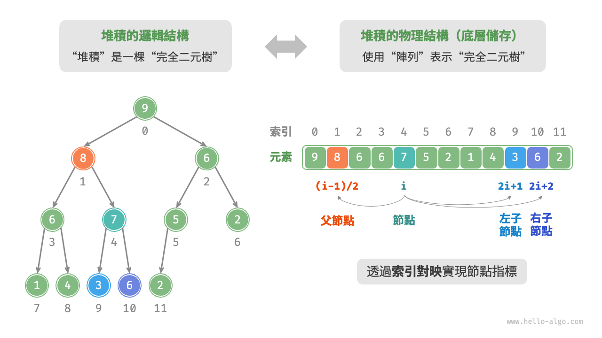

我們可以將索引對映公式封裝成函式，方便後續使用：

```src
[file]{my_heap}-[class]{max_heap}-[func]{parent}
```

### 訪問堆積頂元素

堆積頂元素即為二元樹的根節點，也就是串列的首個元素：

```src
[file]{my_heap}-[class]{max_heap}-[func]{peek}
```

### 元素入堆積

給定元素 `val` ，我們首先將其新增到堆積底。新增之後，由於 `val` 可能大於堆積中其他元素，堆積的成立條件可能已被破壞，**因此需要修復從插入節點到根節點的路徑上的各個節點**，這個操作被稱為「堆積化 heapify」。

考慮從入堆積節點開始，**從底至頂執行堆積化**。如下圖所示，我們比較插入節點與其父節點的值，如果插入節點更大，則將它們交換。然後繼續執行此操作，從底至頂修復堆積中的各個節點，直至越過根節點或遇到無須交換的節點時結束。

=== "<1>"
    

=== "<2>"
    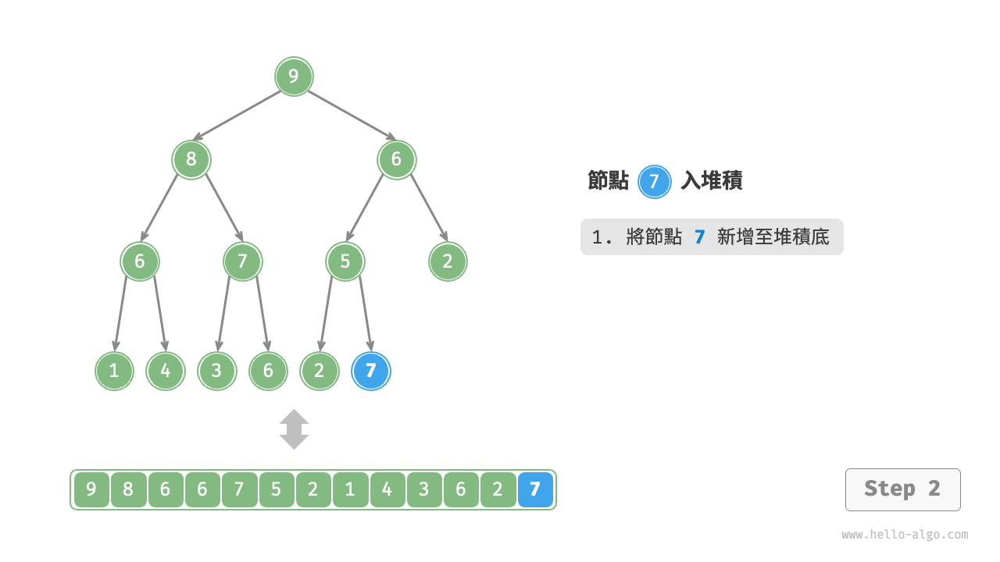

=== "<3>"
    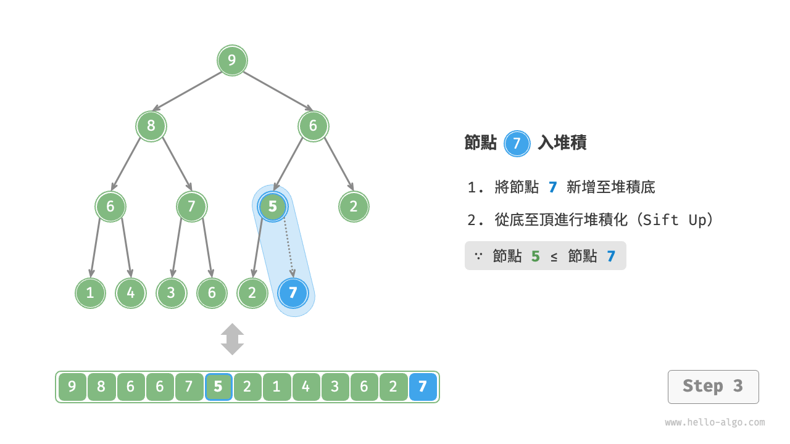

=== "<4>"
    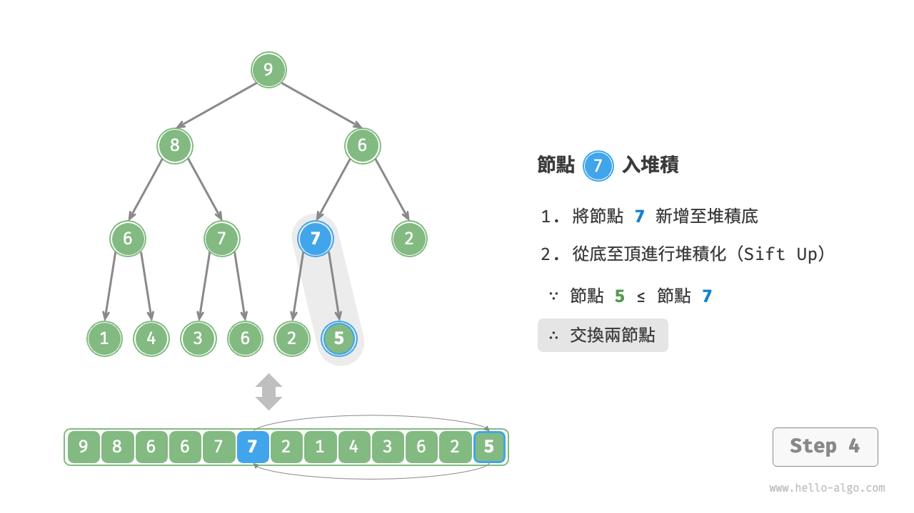

=== "<5>"
    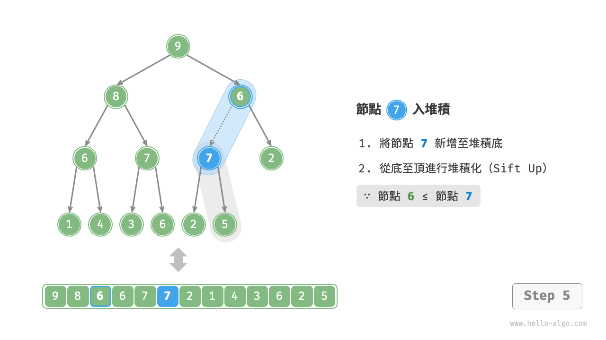

=== "<6>"
    

=== "<7>"
    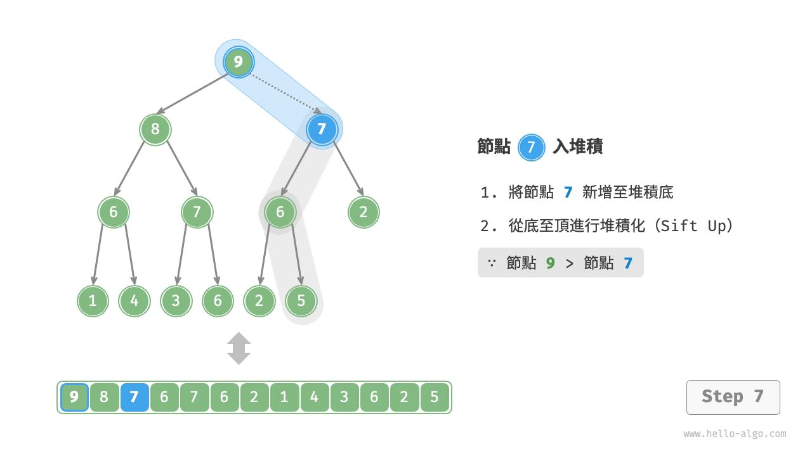

=== "<8>"
    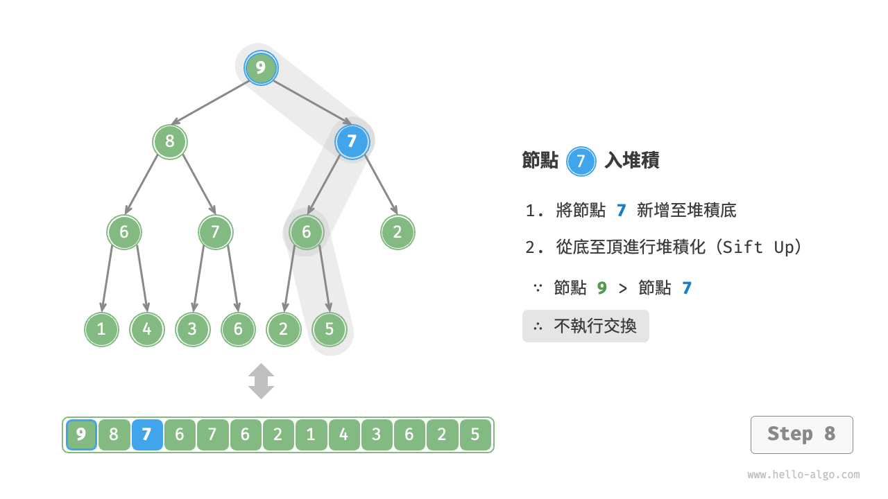

=== "<9>"
    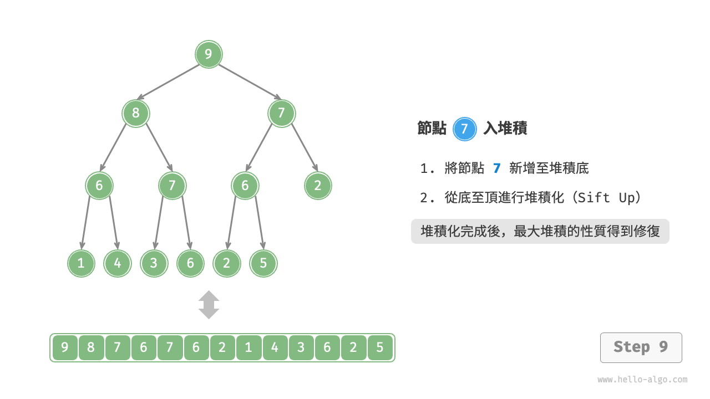

設節點總數為 $n$ ，則樹的高度為 $O(\log n)$ 。由此可知，堆積化操作的迴圈輪數最多為 $O(\log n)$ ，**元素入堆積操作的時間複雜度為 $O(\log n)$** 。程式碼如下所示：

```src
[file]{my_heap}-[class]{max_heap}-[func]{sift_up}
```

### 堆積頂元素出堆積

堆積頂元素是二元樹的根節點，即串列首元素。如果我們直接從串列中刪除首元素，那麼二元樹中所有節點的索引都會發生變化，這將使得後續使用堆積化進行修復變得困難。為了儘量減少元素索引的變動，我們採用以下操作步驟。

1. 交換堆積頂元素與堆積底元素（交換根節點與最右葉節點）。
2. 交換完成後，將堆積底從串列中刪除（注意，由於已經交換，因此實際上刪除的是原來的堆積頂元素）。
3. 從根節點開始，**從頂至底執行堆積化**。

如下圖所示，**“從頂至底堆積化”的操作方向與“從底至頂堆積化”相反**，我們將根節點的值與其兩個子節點的值進行比較，將最大的子節點與根節點交換。然後迴圈執行此操作，直到越過葉節點或遇到無須交換的節點時結束。

=== "<1>"
    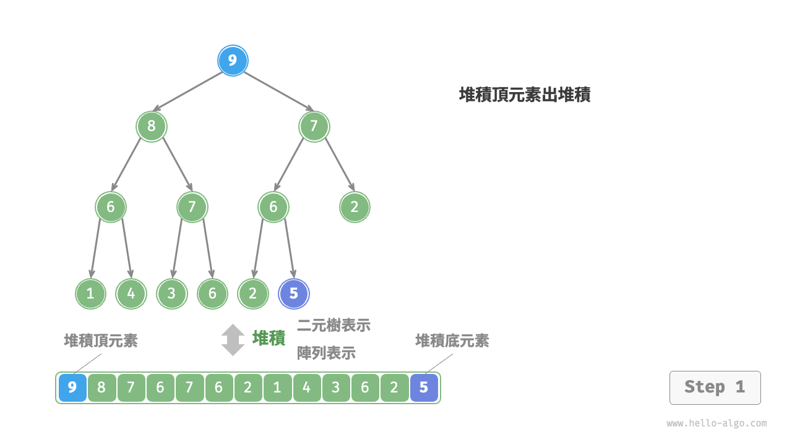

=== "<2>"
    

=== "<3>"
    

=== "<4>"
    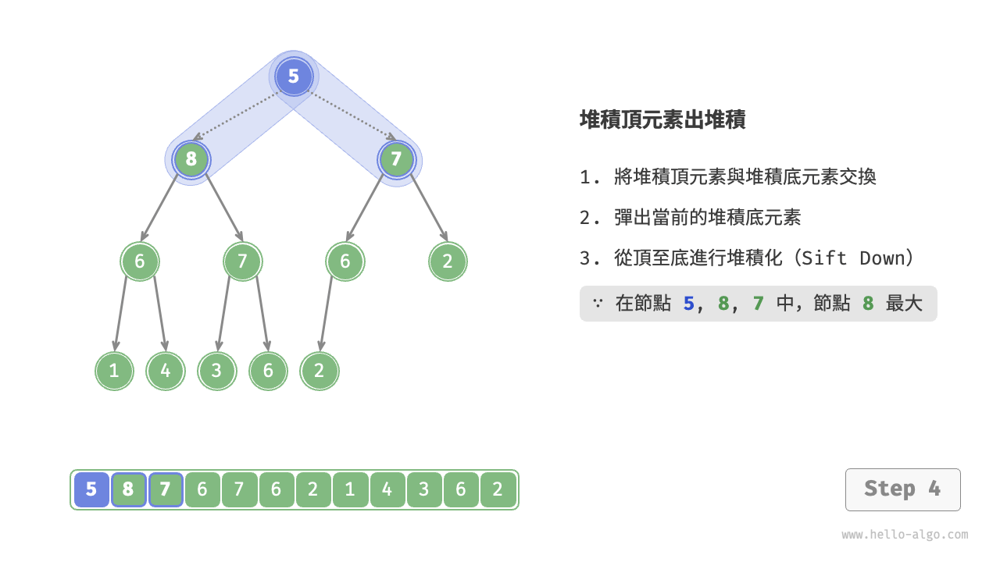

=== "<5>"
    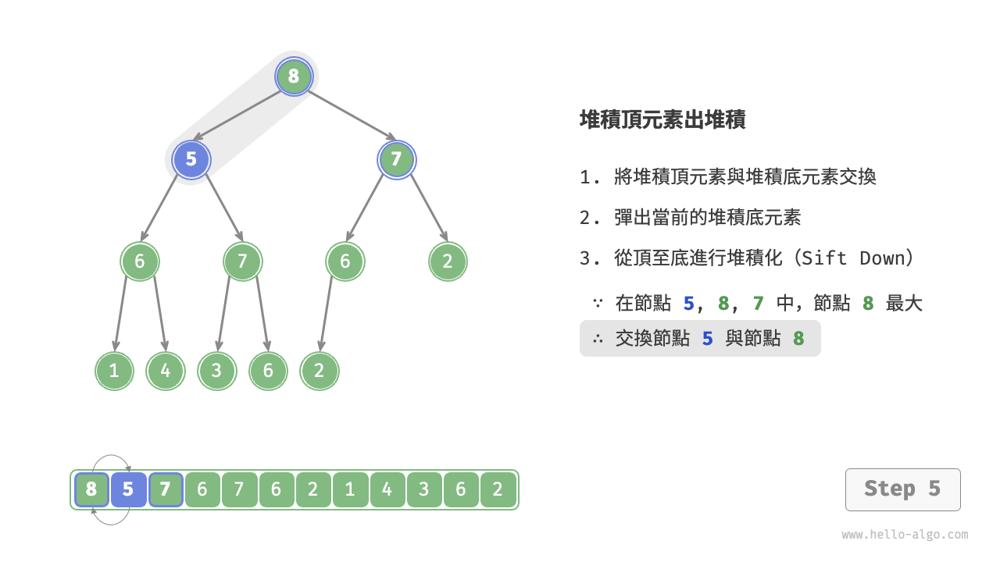

=== "<6>"
    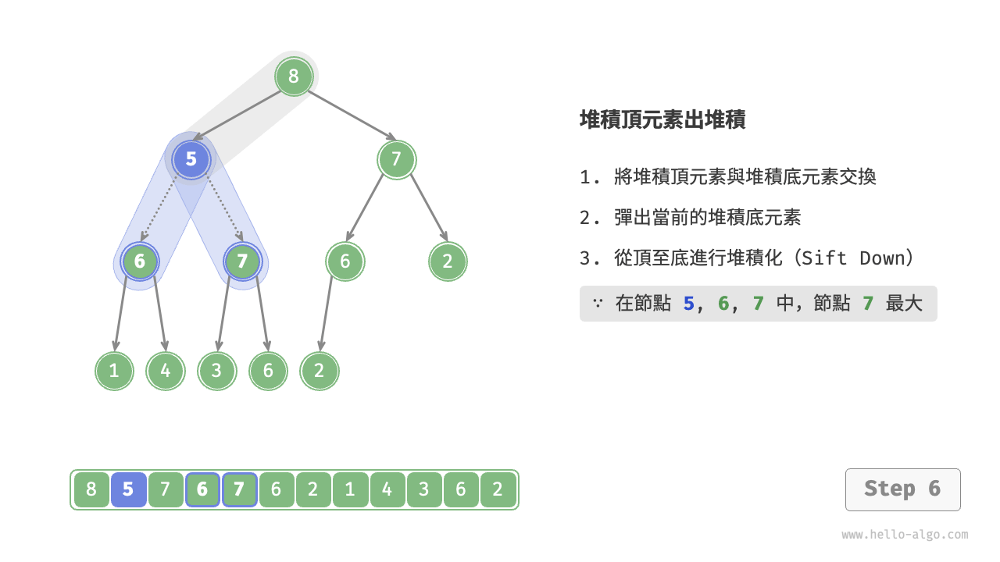

=== "<7>"
    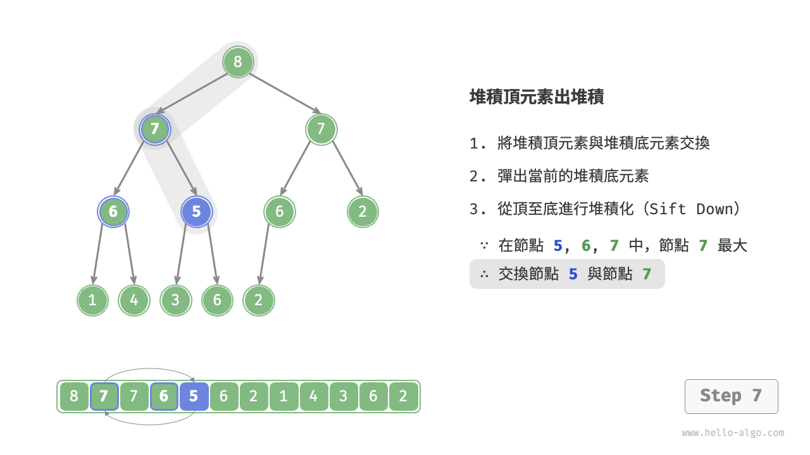

=== "<8>"
    

=== "<9>"
    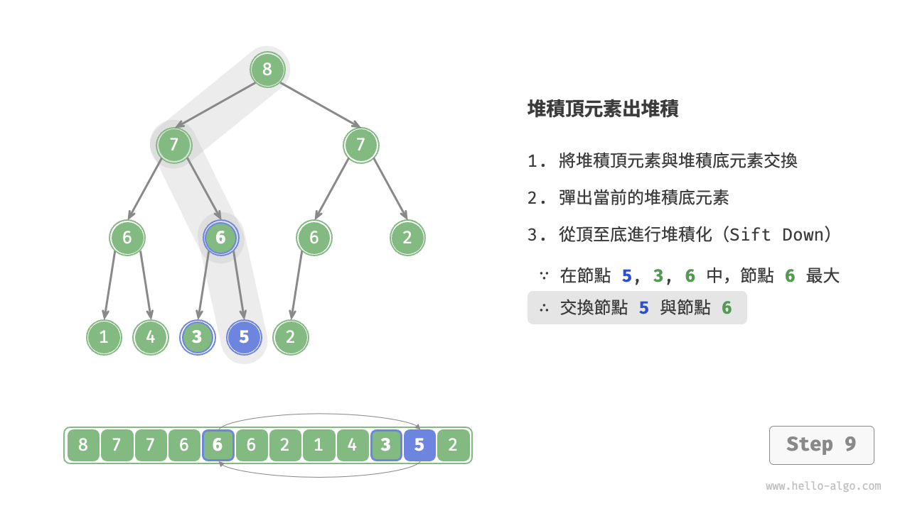

=== "<10>"
    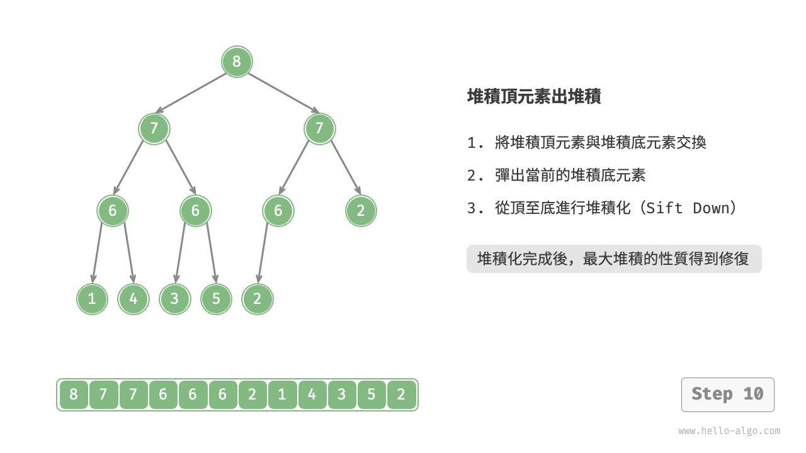

與元素入堆積操作相似，堆積頂元素出堆積操作的時間複雜度也為 $O(\log n)$ 。程式碼如下所示：

```src
[file]{my_heap}-[class]{max_heap}-[func]{sift_down}
```

## 堆積的常見應用

- **優先佇列**：堆積通常作為實現優先佇列的首選資料結構，其入列和出列操作的時間複雜度均為 $O(\log n)$ ，而建隊操作為 $O(n)$ ，這些操作都非常高效。
- **堆積排序**：給定一組資料，我們可以用它們建立一個堆積，然後不斷地執行元素出堆積操作，從而得到有序資料。然而，我們通常會使用一種更優雅的方式實現堆積排序，詳見“堆積排序”章節。
- **獲取最大的 $k$ 個元素**：這是一個經典的演算法問題，同時也是一種典型應用，例如選擇熱度前 10 的新聞作為微博熱搜，選取銷量前 10 的商品等。
