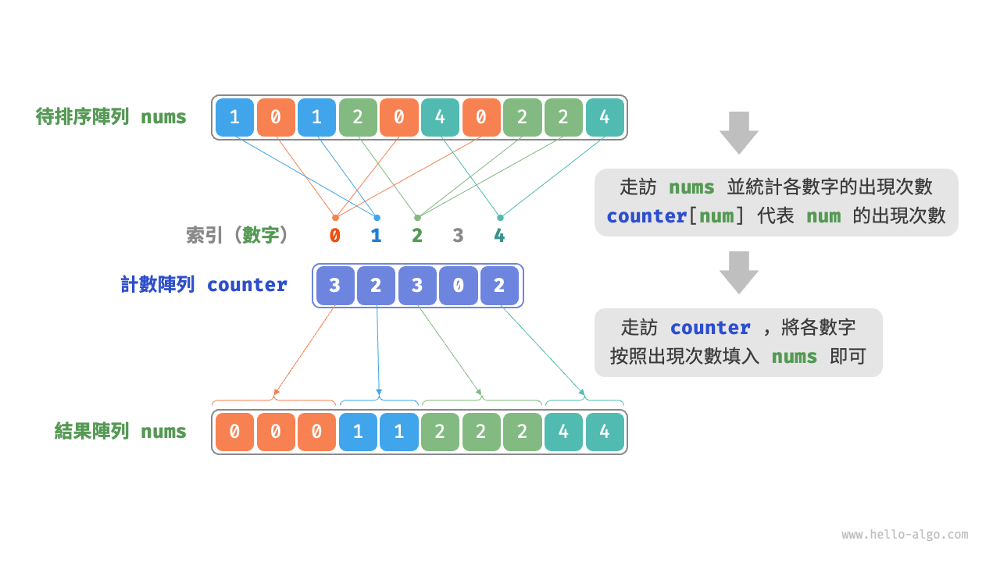
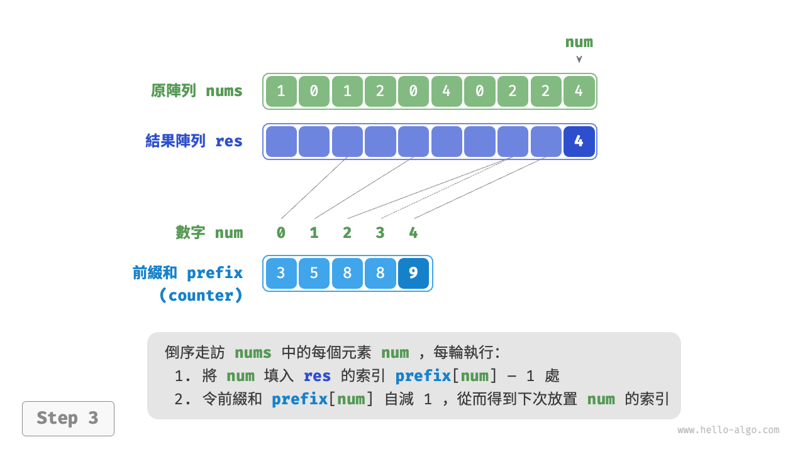
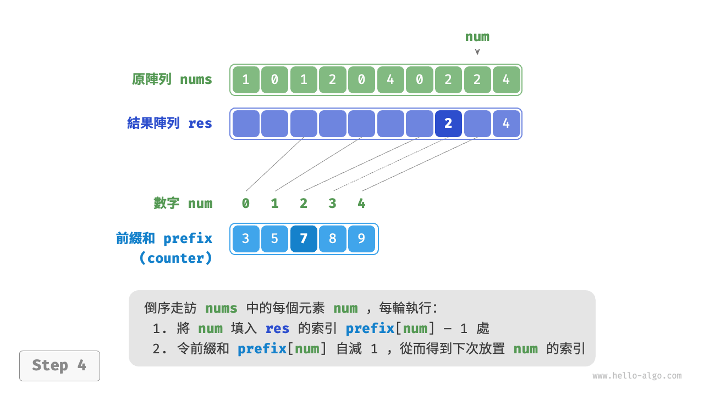
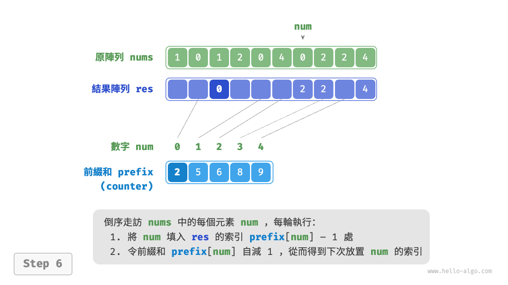
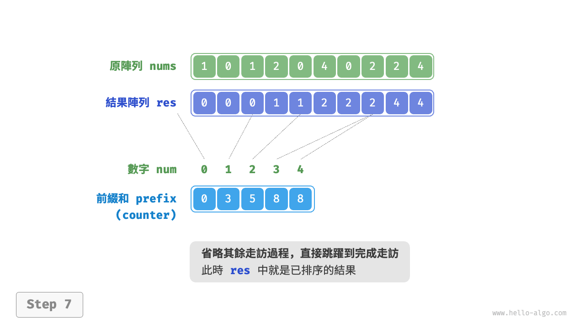

# 計數排序

「計數排序 counting sort」透過統計元素數量來實現排序，通常應用於整數陣列。

## 簡單實現

先來看一個簡單的例子。給定一個長度為 $n$ 的陣列 `nums` ，其中的元素都是“非負整數”，計數排序的整體流程如下圖所示。

1. 走訪陣列，找出其中的最大數字，記為 $m$ ，然後建立一個長度為 $m + 1$ 的輔助陣列 `counter` 。
2. **藉助 `counter` 統計 `nums` 中各數字的出現次數**，其中 `counter[num]` 對應數字 `num` 的出現次數。統計方法很簡單，只需走訪 `nums`（設當前數字為 `num`），每輪將 `counter[num]` 增加 $1$ 即可。
3. **由於 `counter` 的各個索引天然有序，因此相當於所有數字已經排序好了**。接下來，我們走訪 `counter` ，根據各數字出現次數從小到大的順序填入 `nums` 即可。



程式碼如下所示：

```src
[file]{counting_sort}-[class]{}-[func]{counting_sort_naive}
```

!!! note "計數排序與桶排序的關聯"

    從桶排序的角度看，我們可以將計數排序中的計數陣列 `counter` 的每個索引視為一個桶，將統計數量的過程看作將各個元素分配到對應的桶中。本質上，計數排序是桶排序在整型資料下的一個特例。

## 完整實現

細心的讀者可能發現了，**如果輸入資料是物件，上述步驟 `3.` 就失效了**。假設輸入資料是商品物件，我們想按照商品價格（類別的成員變數）對商品進行排序，而上述演算法只能給出價格的排序結果。

那麼如何才能得到原資料的排序結果呢？我們首先計算 `counter` 的“字首和”。顧名思義，索引 `i` 處的字首和 `prefix[i]` 等於陣列前 `i` 個元素之和：

$$
\text{prefix}[i] = \sum_{j=0}^i \text{counter[j]}
$$

**字首和具有明確的意義，`prefix[num] - 1` 代表元素 `num` 在結果陣列 `res` 中最後一次出現的索引**。這個資訊非常關鍵，因為它告訴我們各個元素應該出現在結果陣列的哪個位置。接下來，我們倒序走訪原陣列 `nums` 的每個元素 `num` ，在每輪迭代中執行以下兩步。

1. 將 `num` 填入陣列 `res` 的索引 `prefix[num] - 1` 處。
2. 令字首和 `prefix[num]` 減小 $1$ ，從而得到下次放置 `num` 的索引。

走訪完成後，陣列 `res` 中就是排序好的結果，最後使用 `res` 覆蓋原陣列 `nums` 即可。下圖展示了完整的計數排序流程。

=== "<1>"
    

=== "<2>"
    

=== "<3>"
    

=== "<4>"
    

=== "<5>"
    

=== "<6>"
    

=== "<7>"
    

=== "<8>"
    

計數排序的實現程式碼如下所示：

```src
[file]{counting_sort}-[class]{}-[func]{counting_sort}
```

## 演算法特性

- **時間複雜度為 $O(n + m)$** ：涉及走訪 `nums` 和走訪 `counter` ，都使用線性時間。一般情況下 $n \gg m$ ，時間複雜度趨於 $O(n)$ 。
- **空間複雜度為 $O(n + m)$、非原地排序**：藉助了長度分別為 $n$ 和 $m$ 的陣列 `res` 和 `counter` 。
- **穩定排序**：由於向 `res` 中填充元素的順序是“從右向左”的，因此倒序走訪 `nums` 可以避免改變相等元素之間的相對位置，從而實現穩定排序。實際上，正序走訪 `nums` 也可以得到正確的排序結果，但結果是非穩定的。

## 侷限性

看到這裡，你也許會覺得計數排序非常巧妙，僅透過統計數量就可以實現高效的排序。然而，使用計數排序的前置條件相對較為嚴格。

**計數排序只適用於非負整數**。若想將其用於其他型別的資料，需要確保這些資料可以轉換為非負整數，並且在轉換過程中不能改變各個元素之間的相對大小關係。例如，對於包含負數的整數陣列，可以先給所有數字加上一個常數，將全部數字轉化為正數，排序完成後再轉換回去。

**計數排序適用於資料量大但資料範圍較小的情況**。比如，在上述示例中 $m$ 不能太大，否則會佔用過多空間。而當 $n \ll m$ 時，計數排序使用 $O(m)$ 時間，可能比 $O(n \log n)$ 的排序演算法還要慢。
