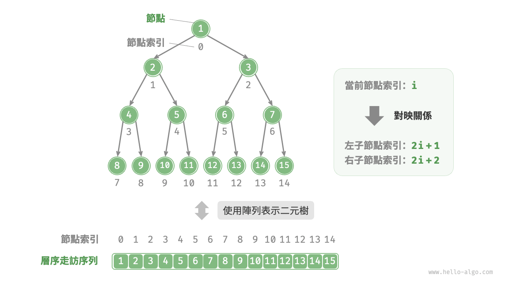
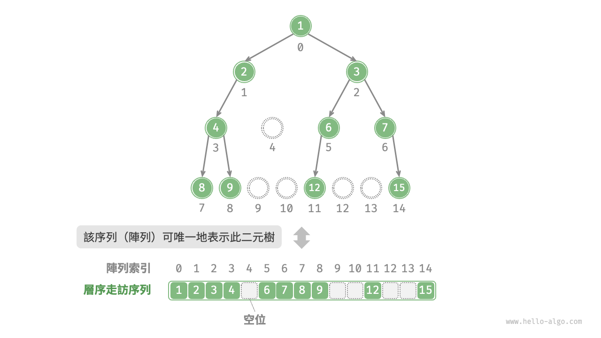

# 二元樹陣列表示

在鏈結串列表示下，二元樹的儲存單元為節點 `TreeNode` ，節點之間透過指標相連線。上一節介紹了鏈結串列表示下的二元樹的各項基本操作。

那麼，我們能否用陣列來表示二元樹呢？答案是肯定的。

## 表示完美二元樹

先分析一個簡單案例。給定一棵完美二元樹，我們將所有節點按照層序走訪的順序儲存在一個陣列中，則每個節點都對應唯一的陣列索引。

根據層序走訪的特性，我們可以推匯出父節點索引與子節點索引之間的“對映公式”：**若某節點的索引為 $i$ ，則該節點的左子節點索引為 $2i + 1$ ，右子節點索引為 $2i + 2$** 。下圖展示了各個節點索引之間的對映關係。



**對映公式的角色相當於鏈結串列中的引用**。給定陣列中的任意一個節點，我們都可以透過對映公式來訪問它的左（右）子節點。

## 表示任意二元樹

完美二元樹是一個特例，在二元樹的中間層通常存在許多 `None` 。由於層序走訪序列並不包含這些 `None` ，因此我們無法僅憑該序列來推測 `None` 的數量和分佈位置。**這意味著存在多種二元樹結構都符合該層序走訪序列**。

如下圖所示，給定一棵非完美二元樹，上述陣列表示方法已經失效。


為了解決此問題，**我們可以考慮在層序走訪序列中顯式地寫出所有 `None`** 。如下圖所示，這樣處理後，層序走訪序列就可以唯一表示二元樹了。示例程式碼如下：

=== "Python"

    ```python title=""
    # 二元樹的陣列表示
    # 使用 None 來表示空位
    tree = [1, 2, 3, 4, None, 6, 7, 8, 9, None, None, 12, None, None, 15]
    ```

=== "C++"

    ```cpp title=""
    /* 二元樹的陣列表示 */
    // 使用 int 最大值 INT_MAX 標記空位
    vector<int> tree = {1, 2, 3, 4, INT_MAX, 6, 7, 8, 9, INT_MAX, INT_MAX, 12, INT_MAX, INT_MAX, 15};
    ```

=== "Java"

    ```java title=""
    /* 二元樹的陣列表示 */
    // 使用 int 的包裝類別 Integer ，就可以使用 null 來標記空位
    Integer[] tree = { 1, 2, 3, 4, null, 6, 7, 8, 9, null, null, 12, null, null, 15 };
    ```

=== "C#"

    ```csharp title=""
    /* 二元樹的陣列表示 */
    // 使用 int? 可空型別 ，就可以使用 null 來標記空位
    int?[] tree = [1, 2, 3, 4, null, 6, 7, 8, 9, null, null, 12, null, null, 15];
    ```

=== "Go"

    ```go title=""
    /* 二元樹的陣列表示 */
    // 使用 any 型別的切片, 就可以使用 nil 來標記空位
    tree := []any{1, 2, 3, 4, nil, 6, 7, 8, 9, nil, nil, 12, nil, nil, 15}
    ```

=== "Swift"

    ```swift title=""
    /* 二元樹的陣列表示 */
    // 使用 Int? 可空型別 ，就可以使用 nil 來標記空位
    let tree: [Int?] = [1, 2, 3, 4, nil, 6, 7, 8, 9, nil, nil, 12, nil, nil, 15]
    ```

=== "JS"

    ```javascript title=""
    /* 二元樹的陣列表示 */
    // 使用 null 來表示空位
    let tree = [1, 2, 3, 4, null, 6, 7, 8, 9, null, null, 12, null, null, 15];
    ```

=== "TS"

    ```typescript title=""
    /* 二元樹的陣列表示 */
    // 使用 null 來表示空位
    let tree: (number | null)[] = [1, 2, 3, 4, null, 6, 7, 8, 9, null, null, 12, null, null, 15];
    ```

=== "Dart"

    ```dart title=""
    /* 二元樹的陣列表示 */
    // 使用 int? 可空型別 ，就可以使用 null 來標記空位
    List<int?> tree = [1, 2, 3, 4, null, 6, 7, 8, 9, null, null, 12, null, null, 15];
    ```

=== "Rust"

    ```rust title=""
    /* 二元樹的陣列表示 */
    // 使用 None 來標記空位
    let tree = [Some(1), Some(2), Some(3), Some(4), None, Some(6), Some(7), Some(8), Some(9), None, None, Some(12), None, None, Some(15)];
    ```

=== "C"

    ```c title=""
    /* 二元樹的陣列表示 */
    // 使用 int 最大值標記空位，因此要求節點值不能為 INT_MAX
    int tree[] = {1, 2, 3, 4, INT_MAX, 6, 7, 8, 9, INT_MAX, INT_MAX, 12, INT_MAX, INT_MAX, 15};
    ```

=== "Zig"

    ```zig title=""

    ```



值得說明的是，**完全二元樹非常適合使用陣列來表示**。回顧完全二元樹的定義，`None` 只出現在最底層且靠右的位置，**因此所有 `None` 一定出現在層序走訪序列的末尾**。

這意味著使用陣列表示完全二元樹時，可以省略儲存所有 `None` ，非常方便。下圖給出了一個例子。


以下程式碼實現了一棵基於陣列表示的二元樹，包括以下幾種操作。

- 給定某節點，獲取它的值、左（右）子節點、父節點。
- 獲取前序走訪、中序走訪、後序走訪、層序走訪序列。

```src
[file]{array_binary_tree}-[class]{array_binary_tree}-[func]{}
```

## 優點與侷限性

二元樹的陣列表示主要有以下優點。

- 陣列儲存在連續的記憶體空間中，對快取友好，訪問與走訪速度較快。
- 不需要儲存指標，比較節省空間。
- 允許隨機訪問節點。

然而，陣列表示也存在一些侷限性。

- 陣列儲存需要連續記憶體空間，因此不適合儲存資料量過大的樹。
- 增刪節點需要透過陣列插入與刪除操作實現，效率較低。
- 當二元樹中存在大量 `None` 時，陣列中包含的節點資料比重較低，空間利用率較低。
